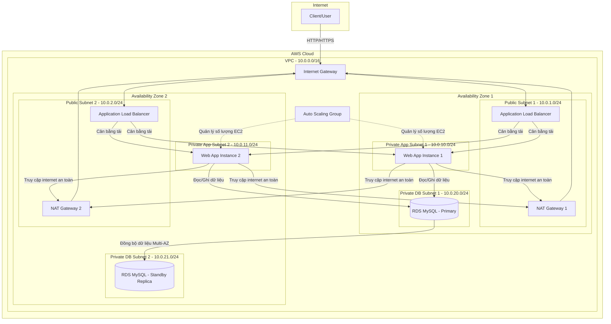

# AWS Capstone Project: Thiết kế kiến trúc 3 lớp (Three-Tier Architecture) độ khả dụng cao

**Khóa học:** AWS Cloud Technical Essentials  
**Chủ đề:** Capstone Project - Practice Assignment  
**Vị trí:** Week 4 - Monitoring & Optimization

---

## 1. Sơ đồ kiến trúc (Architecture Diagram)

Dưới đây là mô hình kiến trúc 3 lớp chuẩn hóa theo các Best Practices của AWS, đảm bảo tính bảo mật, sẵn sàng cao (High Availability) và tự động co giãn (Auto Scaling).

---

## 2. Giải thích lựa chọn các dịch vụ AWS (Service Selection Justification)

Để hỗ trợ ứng dụng hoạt động một cách an toàn và có tính sẵn sàng cao, các dịch vụ AWS sau đã được lựa chọn:

* **Amazon VPC:** Phân chia mạng vật lý của AWS thành các mạng ảo riêng biệt cho khách hàng. Việc sử dụng các **Public Subnet** (cho Load Balancer và NAT Gateway) và **Private Subnet** (cho EC2 và RDS) giúp ngăn chặn hoàn toàn việc truy cập trực tiếp từ internet đến máy chủ ứng dụng và cơ sở dữ liệu, nâng cao tính bảo mật.
* **Elastic Load Balancing (Application Load Balancer - ALB):** Phân phối lưu lượng truy cập HTTP/HTTPS từ internet đến các EC2 instances trong Private Subnets ở cả hai Availability Zones. ALB giúp kiểm tra sức khỏe (Health Check) của các instance và chỉ định tuyến lưu lượng đến các instance hoạt động bình thường, loại bỏ các điểm lỗi đơn lẻ (Single Point of Failure).
* **Amazon EC2 trong Auto Scaling Group (ASG):** ASG đảm bảo số lượng EC2 instance luôn duy trì ở mức mong muốn (ví dụ mong muốn: 2, tối thiểu: 2, tối đa: 4). Nếu một AZ gặp sự cố vật lý hoặc tải CPU tăng đột biến, ASG sẽ tự động khởi tạo các instance mới tại AZ còn lại để duy trì hoạt động liên tục.
* **Amazon RDS MySQL (Multi-AZ Deployment):** Cung cấp cơ sở dữ liệu MySQL được quản lý hoàn toàn bởi AWS. Bằng cách bật tính năng **Multi-AZ**, AWS sẽ tự động đồng bộ hóa dữ liệu (synchronous replication) từ instance Chính (Primary) ở AZ 1 sang một instance dự phòng (Standby) ở AZ 2. Nếu máy chủ chính gặp sự cố, AWS sẽ tự động thực hiện failover sang máy chủ dự phòng mà không làm gián đoạn ứng dụng.
* **NAT Gateway:** Đặt ở Public Subnets giúp các EC2 instances trong Private Subnets tải các bản vá bảo mật, cài đặt thư viện từ internet mà không cần phơi bày IP public ra môi trường ngoài.

---

## 3. Luồng dữ liệu chi tiết (Traffic Flow Description)

Quy trình dữ liệu đi từ Client đến Database và quay trở lại được thực hiện qua các bước sau:

1. **Từ Client đến Load Balancer:** Người dùng cuối gửi yêu cầu truy vấn dữ liệu từ trình duyệt (Client). Yêu cầu này đi qua Internet Gateway của VPC và được tiếp nhận bởi **Application Load Balancer (ALB)** đặt tại các Public Subnets.
2. **Từ Load Balancer đến Web Application:** ALB phân tích yêu cầu và định tuyến nó một cách an toàn đến một trong các máy chủ **Amazon EC2** đang hoạt động khỏe mạnh nằm trong các Private Subnets của AZ 1 hoặc AZ 2.
3. **Từ Web Application đến Database:** Ứng dụng chạy trên EC2 instance tiếp nhận yêu cầu, xử lý logic nghiệp vụ và gửi truy vấn SQL (port 3306) tới địa chỉ Endpoint của **Amazon RDS MySQL Primary**.
4. **Truy xuất dữ liệu từ Database:** Máy chủ RDS Primary xử lý truy vấn, đọc/ghi dữ liệu từ bộ lưu trữ và trả kết quả về cho ứng dụng Web trên EC2.
5. **Trở lại Client:** EC2 instance định dạng lại kết quả (thành HTML hoặc JSON) và gửi trả lại cho ALB. Cuối cùng, ALB chuyển tiếp phản hồi này qua Internet Gateway về trình duyệt của Client để hiển thị kết quả cho người dùng.
