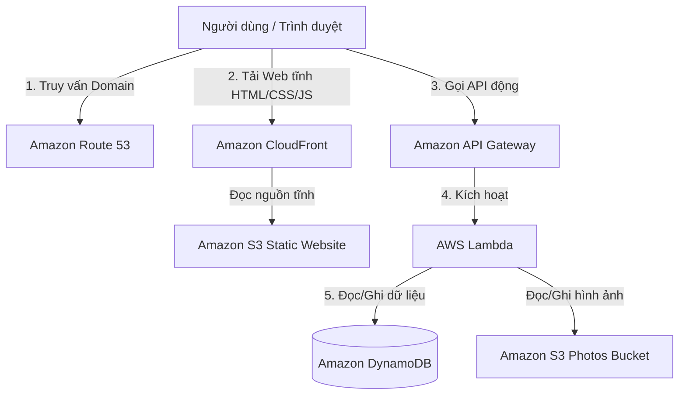

# Tóm tắt: Thiết kế lại ứng dụng Danh bạ Nhân viên theo kiến trúc Serverless

**Khóa học:** AWS Cloud Technical Essentials  
**Chủ đề:** Redesigning the Employee Directory (Serverless Redesign)  
**Vị trí:** Week 4 - Monitoring & Optimization

---

## 1. Kiến trúc hiện tại của ứng dụng (EC2-based Architecture)
Ứng dụng danh bạ nhân viên hiện tại được triển khai theo mô hình 3 lớp chuẩn (Three-Tier Application):
* **Presentation Layer (Tầng giao diện):** HTML, CSS, JavaScript.
* **Application Layer (Tầng logic xử lý):** Web server và logic thêm, sửa, xóa nhân viên.
* **Data Layer (Tầng dữ liệu):** Cơ sở dữ liệu DynamoDB và lưu trữ ảnh trên S3.

Trong kiến trúc này, **cả Presentation và Application Layer đều chạy chung trên các EC2 instances** nằm trong Auto Scaling Group, phân phối lưu lượng bởi ALB. 
* **Hạn chế:** Tốn công sức vận hành (phải vá lỗi bảo mật OS, quản lý kích thước instance, giám sát cấu hình mạng phức tạp như VPC, Subnets, Security Groups...) và các instance có thể bị quá tải khi xử lý nhiều loại request cùng lúc.

---

## 2. Đề xuất Kiến trúc Serverless mới (Serverless Redesign)
Để tối ưu hóa hiệu năng, giảm chi phí vận hành và tăng độ linh hoạt, kiến trúc được thiết kế lại nhằm tách biệt hoàn toàn tầng Giao diện và tầng Logic backend:

### Chi tiết các thành phần trong Kiến trúc Serverless:
1. **Tách biệt Presentation Layer sang Amazon S3:**
   * Thay vì chạy Web Server trên EC2, mã nguồn tĩnh (HTML, CSS, JS) được lưu trữ trên S3 thông qua tính năng **Static Website Hosting**.
   * JavaScript chạy trên trình duyệt client sẽ đảm nhận việc thực hiện các API call để tải dữ liệu động từ backend, giữ cho giao diện luôn sống động mà không cần máy chủ web trung gian.
2. **Chuyển Application Layer sang AWS Lambda & API Gateway:**
   * **Amazon API Gateway:** Đóng vai trò là "cửa ngõ" bảo mật và điều hướng các yêu cầu HTTP từ frontend.
   * **AWS Lambda:** Mã nguồn backend xử lý nghiệp vụ chỉ chạy khi có request kích hoạt từ API Gateway. Chúng ta có thể dùng một Lambda function chung hoặc chia nhỏ mỗi API method một Lambda function riêng biệt.
3. **Giữ nguyên Data Layer (DynamoDB & S3 Photos):**
   * Do thiết kế ứng dụng dạng module, chúng ta có thể thay đổi hoàn toàn cách vận hành của Presentation và Application layer mà **không cần chỉnh sửa bất kỳ dữ liệu nào** trong DynamoDB hay S3 Bucket chứa ảnh nhân viên.
   * Phân quyền giữa các dịch vụ hoàn toàn dựa trên **IAM Roles**.

---

## 3. Hoàn thiện hệ thống với các dịch vụ bổ sung
Để tối ưu hóa trải nghiệm người dùng cuối, kiến trúc mở rộng thêm:
* **Amazon Route 53:** Quản lý tên miền cho trang web.
* **Amazon CloudFront (CDN):** Cache các asset tĩnh (HTML, CSS, JS) tại các Edge Location gần người dùng nhất để giảm thiểu độ trễ tải trang.

---

## 4. Luồng xử lý dữ liệu (Data Flow) khi người dùng truy cập
1. Người dùng nhập tên miền -> Gửi yêu cầu phân giải đến **Route 53**.
2. Trình duyệt tải trang web tĩnh từ **S3** (thông qua cache của **CloudFront**).
3. JavaScript trên trình duyệt thực hiện cuộc gọi API để lấy danh sách nhân viên -> Gửi tới **API Gateway**.
4. **API Gateway** xác thực yêu cầu -> Kích hoạt **AWS Lambda function** tương ứng.
5. **Lambda** truy vấn dữ liệu từ bảng **DynamoDB** -> Trả kết quả về cho **API Gateway** -> Gửi ngược lại cho client dạng JSON -> JavaScript render dữ liệu lên màn hình.

---

## 5. Ưu điểm nổi bật của kiến trúc Serverless
* **Khả năng co giãn cực tốt:** Hệ thống tự động mở rộng theo lượng request mà không cần cấu hình Auto Scaling policy phức tạp.
* **Tối ưu chi phí:** Không mất tiền cho thời gian máy chủ rảnh rỗi (chỉ tính phí trên số lượt gọi và thời gian chạy thực tế của Lambda).
* **Giảm thiểu tối đa chi phí vận hành (No Operational Overhead):** Không còn phải quản lý hạ tầng mạng ảo (VPC, Subnets), không cần cập nhật hệ điều hành hay quản lý file cấu hình AMI.
