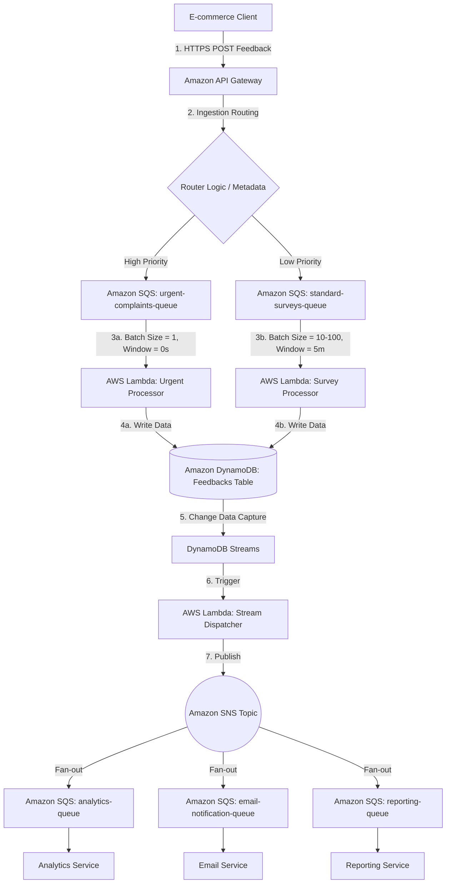

# Customer-Centric Serverless Architecture Design: DataStream Analytics

Tóm tắt chi tiết giải pháp kiến trúc Serverless đề xuất cho DataStream Analytics (CTO Sarah Chen) và kết quả của buổi thảo luận vai (Role Play).

---

## 1. Yêu cầu & Điểm nghẽn Nghiệp vụ (Pain Points)
* **Khách hàng:** DataStream Analytics (Xử lý feedback khách hàng theo thời gian thực cho các công ty e-commerce).
* **Vấn đề cốt lõi:**
  * **Traffic spikes:** Lưu lượng tăng đột biến gây sập hệ thống (monolith cũ bị thắt nút cổ chai).
  * **High Costs:** Chi phí vận hành hạ tầng cao do phải dự phòng tài nguyên dư thừa (overprovisioning).
  * **Tight Coupling:** Một dịch vụ lỗi (ví dụ: email) có thể kéo sập toàn bộ luồng xử lý feedback chính.

---

## 2. Thiết kế Kiến trúc Đề xuất (Cohesive Serverless Architecture)

### Các thành phần chính và Vai trò
1. **Amazon API Gateway:** Tiếp nhận HTTPS requests từ clients, chạy xác thực token và validate dữ liệu đầu vào. Trả về ngay lập tức phản hồi `HTTP 202 Accepted` cho client khi dữ liệu được ghi vào SQS.
2. **Amazon SQS (Buffer / Priority Queues):**
   * Hoạt động theo mô hình **Storage-First** làm vùng đệm chống quá tải.
   * **Dual-Queue Setup:** Tách làm 2 queue (`urgent-complaints-queue` cho khiếu nại khẩn cấp và `standard-surveys-queue` cho khảo sát).
3. **AWS Lambda (Compute Layer):**
   * **Urgent Consumer:** Xử lý đơn lẻ ngay lập tức (`Batch Size = 1`, `Batch Window = 0s`), được gán reserved concurrency để đảm bảo tài nguyên chạy tức thì.
   * **Survey Consumer:** Xử lý gom lô (`Batch Size = 10-100`, `Batch Window` tối đa 5 phút) nhằm tiết kiệm chi phí gọi Lambda.
4. **Amazon DynamoDB (On-demand mode):** Lưu trữ kết quả feedback. Không bị giới hạn số lượng kết nối đồng thời từ Lambda như CSDL quan hệ SQL và tự động mở rộng dung lượng.
5. **DynamoDB Streams & Lambda Dispatcher:** Tự động bắt sự kiện ghi mới vào DB để kích hoạt Lambda Dispatcher đẩy tin nhắn sang SNS Topic.
6. **Amazon SNS Topic (Pub/Sub Fan-out):** Đẩy thông điệp feedback mới đến tất cả các dịch vụ hạ nguồn quan tâm một cách bất đồng bộ.
7. **SNS-to-SQS Pattern (Hạ nguồn):** Đặt hàng đợi SQS trước mỗi dịch vụ hạ nguồn (Analytics, Email, Reporting) để cô lập sự cố (Blast Radius Isolation). Nếu dịch vụ Email bị sập, tin nhắn vẫn được lưu trữ an toàn trong Queue của nó mà không ảnh hưởng tới Analytics hay lõi Ingestion.

---

## 3. Giải pháp Cho Các Mối Quan Ngại của CTO (Sarah Chen)
* **Đảm bảo không mất mát dữ liệu (AWS Outage):** SQS tự động nhân bản dữ liệu qua nhiều Availability Zones (Multi-AZ). Nếu xử lý lỗi, cơ chế **Visibility Timeout** sẽ trả tin nhắn lại queue để retry. Tin nhắn lỗi liên tục sẽ được đưa vào **Dead Letter Queue (DLQ)** để xử lý sau.
* **Thời gian phản hồi client nhanh:** Nhờ cơ chế **Storage-First**, API Gateway phản hồi ngay sau khi ghi vào SQS (độ trễ `< 50ms`), cải thiện tối đa trải nghiệm người dùng.
* **Độ phức tạp vận hành:** Giảm thiểu bằng cách sử dụng **Infrastructure as Code (IaC)** như AWS SAM hoặc Terraform để cấu hình trong một file duy nhất, tự động deploy tự động và giám sát tập trung qua **Amazon CloudWatch**.

---

## 4. Tóm tắt Đánh giá từ Buổi Role Play
* **Điểm mạnh:**
  * Xác định đúng nhu cầu và điểm nghẽn của khách hàng ngay từ đầu.
  * Đưa ra giải pháp dịch vụ cụ thể, giải thích rõ cơ chế hoạt động (bộ đệm SQS, fan-out SNS, DynamoDB Stream).
  * Trình bày kiến trúc mạch lạc, giải quyết triệt để các câu hỏi của Sarah về tính toàn vẹn dữ liệu, độ trễ và khả năng cô lập lỗi.
* **Điểm cần cải thiện (Task 5: Solution Validation):**
  * Cần chủ động tóm tắt lại toàn bộ giải pháp ở cuối buổi và xác nhận lại với khách hàng (Client Buy-in) để thống nhất các bước triển khai tiếp theo (Next Steps) trước khi kết thúc cuộc họp.
