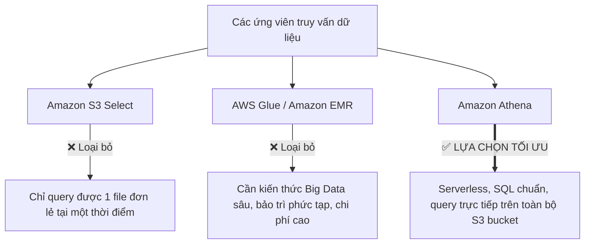
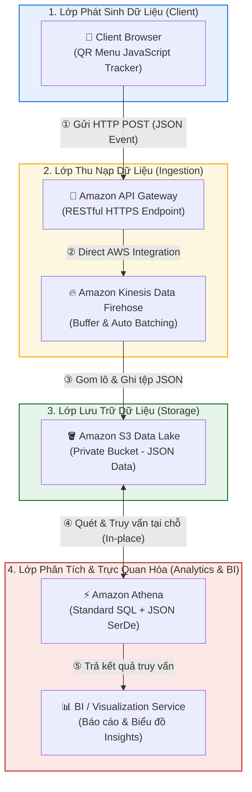

# Tóm tắt bài học: Truy cập & Truy vấn Dữ liệu đã Thu nạp (Accessing the Ingested Data)

**Khóa học:** Course 2 - Architecting Solutions on AWS  
**Chủ đề:** So sánh các công cụ truy vấn dữ liệu trên Amazon S3 (S3 Select vs Glue vs EMR vs Athena) và cấu hình SerDe  
**Vị trí:** Module 2 - Designing a serverless data analytics solution on AWS

---

## 1. So sánh & Loại trừ các công cụ truy vấn dữ liệu trên Amazon S3



| Dịch vụ | Cơ chế hoạt động | Đánh giá kiến trúc theo tình huống |
| :--- | :--- | :--- |
| **Amazon S3 Select** | Lọc dữ liệu bên trong tệp bằng câu lệnh SQL cơ bản. | ❌ **Loại bỏ:** Chỉ cho phép truy vấn **1 file duy nhất cho mỗi truy vấn**, không thể tổng hợp trên hàng nghìn file nhỏ mà Firehose nạp vào. |
| **AWS Glue / Amazon EMR** | Nền tảng Big Data chạy Spark/Hadoop, hỗ trợ ETL và xử lý phân tán quy mô lớn. | ❌ **Loại bỏ:** Tốn công vận hành, đường cong học tập cao (*learning curve*), không phù hợp với đội ngũ ít người. |
| **Amazon Athena** | Dịch vụ truy vấn tương tác **Serverless**, sử dụng **Standard SQL** trực tiếp trên dữ liệu tại S3. | ✅ **LỰA CHỌN SỐ 1:** Không cần quản trị hạ tầng, không cần ETL, chi phí tính theo lượt query (refined usage). |

---

## 2. Các nguyên lý cốt lõi của Amazon Athena

### A. Không nhân bản dữ liệu (No Data Duplication)
* Athena **không sao chép hay di chuyển dữ liệu** về cơ sở dữ liệu riêng.
* Dữ liệu vẫn nằm nguyên vẹn tại **Amazon S3 Data Lake**.
* Khi tạo bảng, ta sử dụng cú pháp:
  ```sql
  CREATE EXTERNAL TABLE clickstream_data (...)
  LOCATION 's3://raf-kinesis-data-bucket/raw-clickstream/'
  ```
  Từ khóa `EXTERNAL` thể hiện dữ liệu nằm ngoài Athena và do S3 quản lý.

### B. SerDe (Serializer / Deserializer)
* **Khái niệm:** SerDe là bộ phân tích cú pháp giúp Athena hiểu cách diễn giải (parse) cấu trúc các file trong S3 thành các cột và hàng của bảng SQL.
* Các định dạng hỗ trợ phổ biến: **JSON, CSV, Parquet, ORC, Regex**.

---

## 3. Cuộc gọi làm rõ Định dạng Dữ liệu (Format Clarification Call)

* **Câu hỏi của Solutions Architect (Raf):** Thư viện JavaScript của khách hàng gửi dữ liệu về ở định dạng nào (CSV, JSON,...)?
* **Xác nhận từ khách hàng (Morgan):** Đội ngũ phát triển xác nhận dữ liệu được gửi dưới dạng **JSON**.
* **Ý nghĩa kiến trúc:** 
  * Cấu hình Athena sử dụng **JSON SerDe** (`org.openx.data.jsonserde.JsonSerDe`).
  * Hệ thống có thể thu nạp và truy vấn dữ liệu nguyên bản (*as-is*) mà **không cần thêm tầng tiền xử lý / chuẩn hóa dữ liệu trung gian**.

---

## 4. Tóm lược luồng dữ liệu hiện tại


