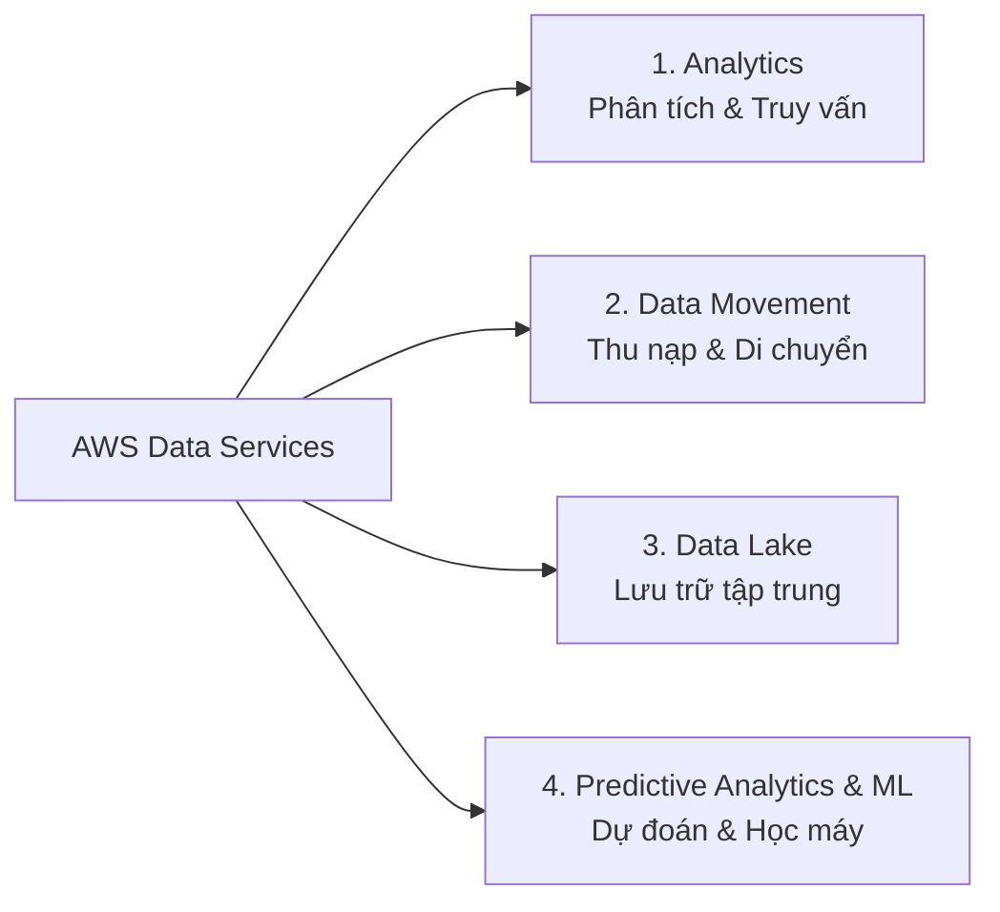

# Tóm tắt bài học: Tổng quan về Phân tích Dữ liệu trên AWS (An Overview of Data Analytics on AWS)

**Khóa học:** Course 2 - Architecting Solutions on AWS  
**Chủ đề:** Khái niệm cơ bản, phân loại dịch vụ và nguyên tắc chọn dịch vụ Data Analytics trên AWS  
**Vị trí:** Module 2 - Designing a serverless data analytics solution on AWS

---

## 1. Mục tiêu cốt lõi của Data Analytics: Tạo ra "Insights"
* **Insights (Thông tin hữu ích):** Chuyển đổi dữ liệu thô thu thập được thành thông tin có giá trị phục vụ việc ra quyết định kinh doanh.
* **Độ phức tạp:**
  * Có thể phức tạp: Phân tích dự đoán, sử dụng Machine Learning (Học máy), xử lý phân tán dữ liệu lớn.
  * Có thể đơn giản & nhanh chóng: Truy vấn trực tiếp bằng SQL trên tệp dữ liệu có cấu trúc/bán cấu trúc.
* **Lợi thế khi kiểm soát nguồn dữ liệu (Data Production):**
  * Trong tình huống bài học, khách hàng tự viết thư viện JavaScript để sinh dữ liệu clickstream $\rightarrow$ cấu trúc dữ liệu đã được chuẩn hóa từ đầu $\rightarrow$ không cần biến đổi dữ liệu (transformation) phức tạp ở khâu thu nạp, chỉ cần thu nạp và lưu trữ nguyên bản (*store data as-is*).

---

## 2. 4 Danh mục Dịch vụ Dữ liệu trên AWS (AWS Data Service Categories)

### Các dịch vụ phân tích tiêu biểu được giới thiệu:

| Dịch vụ AWS | Loại hình | Mô tả & Đặc tính chính | Mô hình chi phí |
| :--- | :--- | :--- | :--- |
| **Amazon Athena** | Interactive Query | Truy vấn tương tác trực tiếp dữ liệu trên **Amazon S3** bằng **SQL tiêu chuẩn**. Không cần nạp vào DB. | **Serverless** - Chỉ tính tiền theo lượng dữ liệu quét qua các câu query ($5 / TB scanned). |
| **AWS Glue** | Serverless ETL | Dịch vụ tích hợp dữ liệu, tự động trích xuất, biến đổi và nạp dữ liệu (ETL), quản lý Data Catalog. | **Serverless** - Trả tiền theo DPU-hour khi job chạy. |
| **Amazon EMR** | Big Data Platform | Nền tảng chạy cụm **Hadoop, Apache Spark, Hive, Presto** được quản lý để xử lý song song khối lượng lớn (Massive Parallel Processing - MPP). | Tính theo giờ chạy của EC2 instances trong cluster. |

---

## 3. Nguyên tắc vàng: "Use the Right Tool for the Job"
Trên AWS có rất nhiều dịch vụ dữ liệu, việc lựa chọn dịch vụ chính xác giúp **tối ưu hiệu năng** và **tiết kiệm chi phí**.

### 🔍 Bộ câu hỏi định hướng của Solutions Architect khi chọn dịch vụ:
1. **Yêu cầu về độ trễ (Latency):**
   * Hệ thống cần xử lý theo thời gian thực (**Real-time**), cận thời gian thực (**Near real-time**), hay xử lý theo lô định kỳ (**Batch processing**)?
2. **Nguồn gốc dữ liệu (Data Source):**
   * Dữ liệu đến từ đâu? (Clickstream web/mobile, di chuyển Database, file tải lên hàng loạt, hay IoT telemetry)?
3. **Mức độ biến đổi dữ liệu (Transformation Needs):**
   * Dữ liệu có cần làm sạch/chuyển đổi định dạng phức tạp ngay khi vào pipeline không?
4. **Tích hợp & Bản quyền hiện có (Integration & Licensing):**
   * Khách hàng có muốn tận dụng giấy phép phần mềm sẵn có không?
   * Có cần kết nối với hệ thống định danh (**Identity Provider / Credential Federation**) của doanh nghiệp không?
