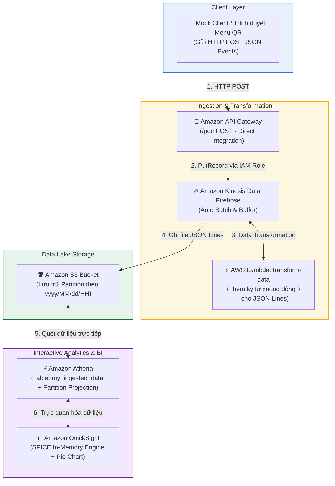

# Hướng dẫn Lab Chi tiết: Xây dựng PoC Phân tích Dữ liệu Thực tế (Challenge: Building a Proof of Concept for Data Analytics)

**Khóa học:** Course 2 - Architecting Solutions on AWS  
**Chủ đề:** Hướng dẫn thực hành toàn diện từ A-Z xây dựng giải pháp Serverless Clickstream Data Analytics trên AWS  
**Vị trí:** Module 2 - Designing a serverless data analytics solution on AWS  
**Region triển khai:** `us-east-1` (US East - N. Virginia)

---

## 1. Sơ đồ Kiến trúc Toàn diện của Bài Lab (Lab Architecture Diagram)



---

## 2. Các Bước Thực Hành Từng Nhiệm Vụ (Task by Task)

---

### 🟢 Task 1: Thiết lập IAM Policy & IAM Role cho API Gateway

#### Bước 1.1: Tạo IAM Policy `API-Firehose`
1. Vào **IAM Console** $\rightarrow$ **Policies** $\rightarrow$ **Create policy**.
2. Chọn tab **JSON**, dán nội dung chính sách:
```json
{
    "Version": "2012-10-17",
    "Statement": [
        {
            "Sid": "VisualEditor0",
            "Effect": "Allow",
            "Action": "firehose:PutRecord",
            "Resource": "*"
        }
    ]
}
```
3. Nhấn **Next** $\rightarrow$ Đặt tên policy: `API-Firehose` $\rightarrow$ Nhấn **Create policy**.

#### Bước 1.2: Tạo IAM Role `APIGateway-Firehose`
1. Vào **IAM Console** $\rightarrow$ **Roles** $\rightarrow$ **Create role**.
2. **Trusted entity type:** Chọn **AWS service**.
3. **Use case:** Chọn **API Gateway** $\rightarrow$ Nhấn **Next** $\rightarrow$ Nhấn **Next**.
4. **Role name:** Đặt tên `APIGateway-Firehose` $\rightarrow$ Nhấn **Create role**.
5. Mở Role `APIGateway-Firehose` vừa tạo $\rightarrow$ Mục **Permissions policies** $\rightarrow$ Chọn **Add permissions** $\rightarrow$ **Attach policies**.
6. Tìm và tích chọn policy `API-Firehose` $\rightarrow$ Nhấn **Add permissions**.
7. **Sao chép và lưu lại APIGateway-Firehose ARN** (dạng: `arn:aws:iam::<Account-ID>:role/APIGateway-Firehose`).

---

### 🟢 Task 2: Tạo Amazon S3 Bucket Lưu Trữ Data Lake

1. Vào **Amazon S3 Console** $\rightarrow$ Nhấn **Create bucket**.
2. **Bucket name:** Nhập tên duy nhất toàn cầu (ví dụ: `architecting-week2-<initials>` hoặc `testbucket-analytics-<so_ngau_nhien>`).
3. **AWS Region:** Đảm bảo chọn `us-east-1` (US East - N. Virginia).
4. Giữ nguyên mặc định **Block all public access = ON**.
5. Nhấn **Create bucket**.
6. Mở chi tiết bucket $\rightarrow$ Tab **Properties** $\rightarrow$ **Sao chép lại Bucket ARN** (dạng: `arn:aws:s3:::<Bucket-Name>`).

---

### 🟢 Task 3: Tạo AWS Lambda Function Biến Đổi Dữ Liệu (`transform-data`)

1. Vào **AWS Lambda Console** $\rightarrow$ **Create function**.
2. Chọn **Use a blueprint** $\rightarrow$ Gõ tìm kiếm `Kinesis`.
3. Chọn blueprint: **Process records sent to a Kinesis Firehose stream (Python 3.8)** $\rightarrow$ Nhấn **Configure**.
4. **Function name:** Đặt tên `transform-data`. Giữ nguyên các thiết lập mặc định $\rightarrow$ Nhấn **Create function**.
5. Trong tab **Code**, thay thế toàn bộ mã mặc định bằng đoạn mã sau:

```python
import json
import boto3
import base64

output = []

def lambda_handler(event, context):
    for record in event['records']:
        # 1. Giải mã payload từ base64
        payload = base64.b64decode(record['data']).decode('utf-8')
        
        # 2. Thêm ký tự xuống dòng \n để Athena có thể parse theo từng dòng
        row_w_newline = payload + "\n"
        row_w_newline = base64.b64encode(row_w_newline.encode('utf-8')).decode('utf-8')
        
        # 3. Đóng gói kết quả trả về Firehose
        output_record = {
            'recordId': record['recordId'],
            'result': 'Ok',
            'data': row_w_newline
        }
        output.append(output_record)
        
    return {'records': output}
```

6. Nhấn **Deploy**.
7. Chuyển sang tab **Configuration** $\rightarrow$ **General configuration** $\rightarrow$ **Edit** $\rightarrow$ Đổi **Timeout** thành **10 seconds** $\rightarrow$ **Save**.
8. **Sao chép lại Function ARN** (dạng: `arn:aws:lambda:us-east-1:<Account-ID>:function:transform-data`).

---

### 🟢 Task 4: Tạo Kinesis Data Firehose Delivery Stream

#### Bước 4.1: Khởi tạo Delivery Stream
1. Vào **Amazon Kinesis Console** $\rightarrow$ Chọn **Kinesis Data Firehose** $\rightarrow$ **Create delivery stream**.
2. **Source & Destination:**
   * **Source:** `Direct PUT`
   * **Destination:** `Amazon S3`
3. **Transform and convert records:**
   * **Enable data transformation:** Chọn **Enabled**.
   * **AWS Lambda function:** Chọn hàm `transform-data` (ARN ở Task 3).
   * **Version and alias:** `$LATEST`.
4. **Destination settings:** Chọn **Browse** $\rightarrow$ Chọn đúng S3 Bucket đã tạo ở Task 2.
5. Nhấn **Create delivery stream** (chờ 1 - 3 phút để trạng thái chuyển sang **Active**).

#### Bước 4.2: Lấy IAM Role ARN của Firehose
1. Mở chi tiết Delivery Stream vừa tạo $\rightarrow$ Tab **Configuration**.
2. Tại mục **Permissions / Service access**, nhấp vào liên kết **IAM Role**.
3. **Sao chép lại Firehose IAM Role ARN** (dạng: `arn:aws:iam::<Account-ID>:role/service-role/KinesisFirehoseServiceRole-...`).

---

### 🟢 Task 5: Cấp Quyền S3 Bucket Policy cho Kinesis Firehose

1. Vào **Amazon S3 Console** $\rightarrow$ Mở bucket của bạn $\rightarrow$ Tab **Permissions**.
2. Cuộn xuống **Bucket policy** $\rightarrow$ Nhấn **Edit** $\rightarrow$ Dán JSON sau:

```json
{
    "Version": "2012-10-17",
    "Id": "PolicyID",
    "Statement": [
        {
            "Sid": "StmtID",
            "Effect": "Allow",
            "Principal": {
                "AWS": "<FIREHOSE_ROLE_ARN>"
            },
            "Action": [
                "s3:AbortMultipartUpload",
                "s3:GetBucketLocation",
                "s3:GetObject",
                "s3:ListBucket",
                "s3:ListBucketMultipartUploads",
                "s3:PutObject",
                "s3:PutObjectAcl"
            ],
            "Resource": [
                "<S3_BUCKET_ARN>",
                "<S3_BUCKET_ARN>/*"
            ]
        }
    ]
}
```
*(Thay thế `<FIREHOSE_ROLE_ARN>` từ Task 4.2 và `<S3_BUCKET_ARN>` từ Task 2).*  
3. Nhấn **Save changes**.

---

### 🟢 Task 6: Xây Dựng REST API trên Amazon API Gateway

1. Vào **API Gateway Console** $\rightarrow$ Tại thẻ REST API (Public), nhấn **Build**.
2. **Tạo API mới:**
   * Protocol: `REST`
   * Create new API: `New API`
   * API name: `clickstream-ingest-poc`
   * Endpoint Type: `Regional` $\rightarrow$ Nhấn **Create API**.
3. **Tạo Resource:** Nhấn **Actions** $\rightarrow$ **Create Resource** $\rightarrow$ Resource Name: `poc` $\rightarrow$ Nhấn **Create Resource**.
4. **Tạo Method:** Nhấn **Actions** $\rightarrow$ **Create Method** $\rightarrow$ Chọn **POST** $\rightarrow$ Nhấn dấu tick.
5. **Cấu hình Method POST:**
   * Integration type: `AWS Service`
   * AWS Region: `us-east-1`
   * AWS Service: `Firehose`
   * HTTP method: `POST`
   * Action Type: `Use action name`
   * Action: `PutRecord`
   * Execution role: Dán ARN của `APIGateway-Firehose` (từ Task 1.2).
   * Content Handling: `Passthrough` $\rightarrow$ Nhấn **Save**.
6. **Cấu hình VTL Mapping Template:**
   * Chọn **Integration Request** $\rightarrow$ Mở rộng **Mapping Templates**.
   * Request body passthrough: Chọn *When there are no templates defined (recommended)*.
   * Nhấn **Add mapping template** $\rightarrow$ Content-Type: `application/json` $\rightarrow$ Lưu.
   * Dán đoạn template VTL:
```json
{
    "DeliveryStreamName": "<TEN_DELIVERY_STREAM_CUA_BAN>",
    "Record": {
        "Data": "$util.base64Encode($util.escapeJavaScript($input.json('$')).replace('\\', ''))"
    }
}
```
*(Thay `<TEN_DELIVERY_STREAM_CUA_BAN>` bằng tên chính xác của Kinesis Delivery Stream).* $\rightarrow$ Nhấn **Save**.

7. **Kiểm thử API (Mock Data Injection):**
   * Quay lại **Method Execution** $\rightarrow$ Nhấn **Test**.
   * Gửi lần lượt các payload JSON sau và kiểm tra Response trả về **Status 200 OK**:

**Event 1 (Entree 1):**
```json
{ "element_clicked":"entree_1", "time_spent":67, "source_menu":"restaurant_name", "created_at":"2022–09–11 23:00:00" }
```
**Event 2 (Entree 1):**
```json
{ "element_clicked":"entree_1", "time_spent":12, "source_menu":"restaurant_name", "created_at":"2022–09–11 23:00:00" }
```
**Event 3 (Entree 4):**
```json
{ "element_clicked":"entree_4", "time_spent":32, "source_menu":"restaurant_name", "created_at":"2022–09–11 23:00:00" }
```
**Event 4 (Drink 1):**
```json
{ "element_clicked":"drink_1", "time_spent":15, "source_menu":"restaurant_name", "created_at":"2022–09–11 23:00:00" }
```
**Event 5 (Drink 3):**
```json
{ "element_clicked":"drink_3", "time_spent":14, "source_menu":"restaurant_name", "created_at":"2022–09–11 23:00:00" }
```

---

### 🟢 Task 7: Tạo Bảng & Truy Vấn SQL với Amazon Athena

1. Vào **Amazon Athena Console** $\rightarrow$ **Query editor**.
2. **Cài đặt Query Result Location (Bắt buộc):**
   * Vào tab **Settings** $\rightarrow$ **Manage** $\rightarrow$ Browse chọn đúng S3 bucket của bạn $\rightarrow$ Lưu.
3. **Tạo Bảng với Partition Projection:**
   * Quay lại tab **Editor**, dán và chạy câu lệnh DDL sau:

```sql
CREATE EXTERNAL TABLE my_ingested_data (
    element_clicked STRING,
    time_spent INT,
    source_menu STRING,
    created_at STRING
)
PARTITIONED BY (
    datehour STRING
)
ROW FORMAT SERDE 'org.openx.data.jsonserde.JsonSerDe'
WITH SERDEPROPERTIES (
    'paths'='element_clicked, time_spent, source_menu, created_at'
)
LOCATION "s3://<TEN_S3_BUCKET_CUA_BAN>/"
TBLPROPERTIES (
    "projection.enabled" = "true",
    "projection.datehour.type" = "date",
    "projection.datehour.format" = "yyyy/MM/dd/HH",
    "projection.datehour.range" = "2021/01/01/00,NOW",
    "projection.datehour.interval" = "1",
    "projection.datehour.interval.unit" = "HOURS",
    "storage.location.template" = "s3://<TEN_S3_BUCKET_CUA_BAN>/${datehour}/"
);
```
*(Thay thế `<TEN_S3_BUCKET_CUA_BAN>` bằng tên S3 bucket của bạn).*

4. Mở tab truy vấn mới, chạy lệnh:
```sql
SELECT * FROM my_ingested_data;
```
$\rightarrow$ Xác nhận kết quả hiển thị danh sách các món ăn (`entree_1`, `entree_4`, `drink_1`, `drink_3`) và thời gian tương tác.

---

### 🟢 Task 8: Trực Quan Hóa Dữ Liệu với Amazon QuickSight

1. Vào **Amazon QuickSight Console** $\rightarrow$ Chọn biểu tượng User (góc trên phải) $\rightarrow$ **Manage QuickSight**.
2. Chọn **Security & permissions** $\rightarrow$ Tại *QuickSight access to AWS services*, chọn **Manage**.
3. Tích chọn **Amazon S3** (chọn đúng S3 bucket của bài lab) và đánh dấu chọn **Write permission for Athena Workgroup** $\rightarrow$ **Finish** $\rightarrow$ **Save**.
4. Trở lại trang chủ QuickSight $\rightarrow$ **Analyses** $\rightarrow$ **New dataset** $\rightarrow$ Chọn **Athena**.
   * Data source name: `poc-clickstream`
   * Athena workgroup: `[primary]` $\rightarrow$ **Create data source**.
5. Chọn bảng `my_ingested_data` $\rightarrow$ Nhấn **Select**.
6. Chọn **Import to SPICE for quicker analytics** $\rightarrow$ **Visualize**.
7. Chọn kiểu biểu đồ **Pie chart** và chọn trường `element_clicked` để trực quan hóa tỷ lệ món ăn được click.

---

### 🟢 Task 9: Dọn Dẹp Tài Nguyên Sau Khi Hoàn Thành (Clean-up)

Để tránh phát sinh chi phí ngoài ý muốn, xóa tài nguyên theo đúng thứ tự:
1. **QuickSight:** Xóa Analyses $\rightarrow$ Xóa Datasets $\rightarrow$ *(Tùy chọn: Xóa Account QuickSight trong Account settings nếu không dùng tiếp)*.
2. **Amazon Athena:** Chạy lệnh `DROP TABLE my_ingested_data;` $\rightarrow$ Xóa đường dẫn trong tab *Settings*.
3. **Amazon API Gateway:** Xóa REST API `clickstream-ingest-poc`.
4. **Amazon Kinesis:** Xóa Kinesis Data Firehose Delivery Stream.
5. **AWS Lambda:** Xóa Function `transform-data`.
6. **Amazon S3:** Empty toàn bộ objects trong Bucket $\rightarrow$ Xóa S3 Bucket.
7. **IAM:** Xóa Role `APIGateway-Firehose` và Policy `API-Firehose`.
