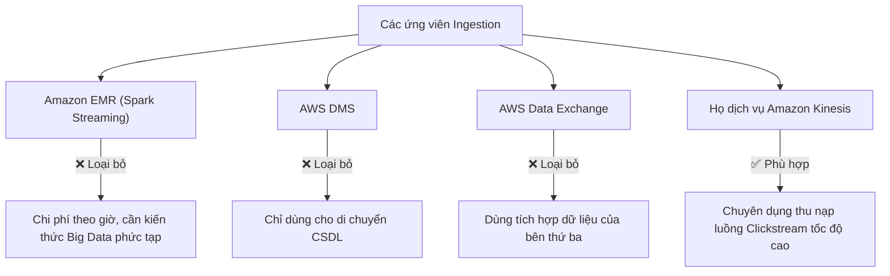
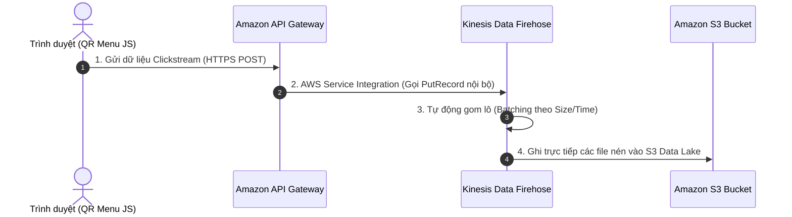

# Tóm tắt bài học: Lựa chọn Dịch vụ Thu nạp Dữ liệu (Choosing a Service for Data Ingestion)

**Khóa học:** Course 2 - Architecting Solutions on AWS  
**Chủ đề:** Đánh giá, so sánh và lựa chọn dịch vụ thu nạp dữ liệu Clickstream vào Amazon S3  
**Vị trí:** Module 2 - Designing a serverless data analytics solution on AWS

---

## 1. Quá trình đánh giá và loại trừ các dịch vụ Ingestion (Service Elimination)

---

## 2. So sánh chuyên sâu trong gia đình Amazon Kinesis

| Dịch vụ Kinesis | Mục đích & Đặc điểm | Đánh giá theo yêu cầu khách hàng |
| :--- | :--- | :--- |
| **Kinesis Data Analytics** | Xử lý, tổng hợp, lọc dữ liệu luồng theo thời gian thực (bằng SQL/Apache Flink). | ❌ **Không cần thiết:** Do khách hàng đã chuẩn hóa cấu trúc dữ liệu từ thư viện JavaScript, không cần transform lúc ingest. |
| **Kinesis Data Streams** | Thu nạp dữ liệu luồng độ trễ cực thấp (< 1 giây). | ❌ **Phức tạp:** Phải tự viết code quản lý Producer & Consumer, cấu hình Shards thủ công. |
| **Amazon Kinesis Data Firehose** | Dịch vụ **Serverless Delivery Stream** nạp trực tiếp dữ liệu vào S3, Redshift, OpenSearch mà **không cần viết code Consumer**. | ✅ **LỰA CHỌN TỐI ƯU:** Cực kỳ tiện lợi (*Convenience*), không cần quản trị hạ tầng, tự động co giãn. |

---

## 3. Cuộc gọi làm rõ về yêu cầu Độ trễ (Latency Clarification Call)

* **Vấn đề cần làm rõ:** Khách hàng có yêu cầu xem dữ liệu theo thời gian thực tức thì (*sub-second latency*) hay không?
* **Phản hồi từ khách hàng (Morgan):**
  * Hệ thống chỉ phục vụ phân tích bất đồng bộ (**Asynchronous Analytics**).
  * **Không** có dashboard giám sát real-time.
  * Độ trễ vài phút (1 - 5 phút) để dữ liệu cập bến S3 là **hoàn toàn chấp nhận được**.
* **Quyết định kiến trúc:** Chọn **Amazon Kinesis Data Firehose** vì ưu tiên **Sự tiện lợi và Tối giản vận hành** (*Convenience over Control*).

---

## 4. Giải pháp tạo cổng RESTful HTTPS: Amazon API Gateway

### Tại sao cần Amazon API Gateway phía trước Kinesis?
1. **Rào cản API & Xác thực:**
   * Kinesis yêu cầu gọi AWS API (`PutRecord`) kèm chứng thực IAM / AWS Signature V4.
   * Thư viện JavaScript của khách hàng chỉ hỗ trợ gửi chuẩn **RESTful HTTP POST**.
2. **Không dùng Amazon Cognito:** Vì sẽ bắt buộc client tải AWS SDK và cấu hình Identity Pool phức tạp.
3. **AWS Service Integration của API Gateway:**
   * Đóng vai trò là HTTPS Proxy công khai tiếp nhận HTTP POST từ trình duyệt.
   * Tự động ký quyền IAM và đẩy dữ liệu thẳng vào Kinesis Data Firehose mà **không cần thông qua AWS Lambda trung gian** $\rightarrow$ Giảm độ trễ, tiết kiệm chi phí và tránh phơi bày Kinesis trực tiếp ra Internet.
