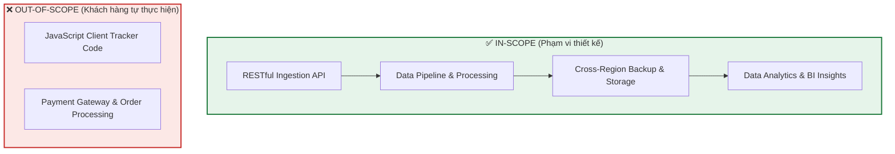

# Tóm tắt bài học: Customer #2 - Requirements Breakdown

**Khóa học:** Course 2 - Architecting Solutions on AWS  
**Chủ đề:** Phân tích, phân loại và bóc tách các yêu cầu kỹ thuật của khách hàng  
**Vị trí:** Module 2 - Designing a serverless data analytics solution on AWS

---

## 1. Tổng quan hiện trạng khách hàng (Current State Summary)
* **S3 Static Website Hosting:** Lưu trữ và phân phối trang HTML, CSS, hình ảnh, và JavaScript menu trực tiếp qua giao thức web.
* **Hệ thống quản trị menu:** Cho phép quản lý nhà hàng tự tải lên và cập nhật thông tin thực đơn (giá cả, món ăn, mô tả) trong S3 bucket.
* **Hệ thống tạo mã QR:** Tự động sinh mã QR trỏ đến bucket để in và đặt tại từng bàn ăn.
* **Client-side Tracker:** Khách hàng đã tự phát triển thư viện JavaScript trên trình duyệt để thu thập dữ liệu hành vi (clickstream).

---

## 2. Bóc tách 5 yêu cầu kỹ thuật cốt lõi (5 Key Requirements)

### 📌 Yêu cầu 1: RESTful HTTPS Ingestion Endpoint
* **Chi tiết:** Cần một endpoint chuẩn HTTPS để nhận các yêu cầu HTTP POST gửi dữ liệu clickstream từ JavaScript client.
* **Lợi ích:** 
  * Cho phép linh hoạt thay đổi kiến trúc xử lý dữ liệu phía sau mà không cần sửa code ở Client.
  * Tách biệt logic xác thực (authentication) và phân luồng dữ liệu.

### 📌 Yêu cầu 2: Ưu tiên Managed Services (Giảm gánh nặng vận hành)
* **Chi tiết:** Do công ty có đội ngũ nhân sự mỏng (*reduced staff*), kiến trúc phải tối giản tối đa công việc bảo trì, quản lý hệ thống.
* **Định hướng:** Sử dụng **Amazon API Gateway** làm cổng tiếp nhận dữ liệu thay vì tự dựng server.

### 📌 Yêu cầu 3: Tối ưu chi phí theo lượng dùng thực tế (Pay-per-refined-use)
* **Chi tiết:** Tính tiền theo mức độ sử dụng thực tế (theo request, lượng dữ liệu lưu trữ), không trả phí cố định theo thời gian máy chủ chạy (*bill per time*).
* **Định hướng:** **Loại bỏ hoàn toàn kiến trúc dùng EC2**, tập trung 100% vào **Serverless & Managed Services** (ví dụ: Amazon S3 chỉ tính phí theo dung lượng data lưu trữ chứ không tính tiền theo số giờ bucket tồn tại).

### 📌 Yêu cầu 4: Độ bền vững & Sao lưu đa vùng (Data Durability & Cross-Region Backup)
* **Chi tiết:** Toàn bộ dữ liệu thu nạp cần được tự động sao lưu sang một **AWS Region khác** để phòng chống rủi ro thảm họa (Disaster Recovery).
* **Định hướng:** Sử dụng tính năng sao lưu tích hợp sẵn của các dịch vụ Managed/Serverless (như S3 Cross-Region Replication).

### 📌 Yêu cầu 5: Mã hóa toàn diện (End-to-End Encryption)
* **Chi tiết:** Bảo mật dữ liệu ở cả 2 trạng thái:
  * **Encryption in transit:** Bắt buộc HTTPS/TLS khi truyền tải qua mạng.
  * **Encryption at rest:** Mã hóa dữ liệu khi ghi vào hệ thống lưu trữ (dùng AWS KMS / S3 Server-Side Encryption).

---

## 3. Quản lý phạm vi dự án (Scope Management Best Practice)

> [!TIP]
> **Kinh nghiệm tư vấn kiến trúc (Consulting Best Practice):**  
> Việc xác định và văn bản hóa rõ ràng những gì thuộc phạm vi (**In-scope**) và không thuộc phạm vi (**Out-of-scope**) giúp đồng bộ hóa kỳ vọng của khách hàng, tránh phát sinh khối lượng công việc ngoài dự kiến và đảm bảo bàn giao đúng mục tiêu cam kết.
