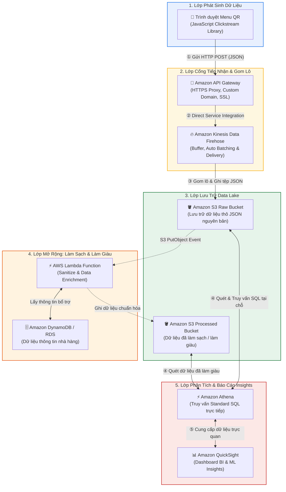

# Tóm tắt bài học: Tổng quan Giải pháp Khách hàng #2 (Customer #2: Solution Overview)

**Khóa học:** Course 2 - Architecting Solutions on AWS  
**Chủ đề:** Buổi thuyết trình kiến trúc hoàn chỉnh giữa Solutions Architect (Raf) và Khách hàng (Morgan)  
**Vị trí:** Module 2 - Designing a serverless data analytics solution on AWS

---

## 1. Sơ đồ Kiến trúc Tổng thể (End-to-End Serverless Architecture)

---

## 2. Vai trò & Lý do Lựa chọn 5 Dịch vụ AWS Cốt lõi

| Dịch vụ AWS | Vai trò trong Kiến trúc | Lý do lựa chọn & Lợi ích mang lại |
| :--- | :--- | :--- |
| **Amazon API Gateway** | **HTTPS Ingestion Proxy** | • Tiếp nhận các cuộc gọi `HTTP POST` từ thư viện JS của khách hàng. • Hỗ trợ Custom Domain Name và chứng chỉ SSL riêng. • Tích hợp Direct AWS Service Integration với Firehose mà không cần phơi bày API nội bộ ra Internet. |
| **Amazon Kinesis Data Firehose** | **Streaming Delivery Engine** | • Hoàn toàn Serverless, tự động mở rộng theo tải. • Tự động gom các sự kiện nhỏ lẻ thành các tệp JSON lớn trước khi ghi xuống S3 $\rightarrow$ tối ưu số lượng I/O và chi phí. |
| **Amazon S3** | **Decoupled Data Lake** | • Tách rời hoàn toàn Lưu trữ (*Storage*) và Tính toán (*Compute*). • Độ bền 11 số 9 ($99.999999999\%$), dễ dàng kích hoạt sao lưu đa vùng (CRR). |
| **Amazon Athena** | **Serverless SQL Analytics** | • Truy vấn trực tiếp tại chỗ trên các tệp trong S3 bằng **Standard SQL** mà không cần nạp DB hay chạy job ETL phức tạp. • Tính phí theo lượng dữ liệu được quét. |
| **Amazon QuickSight** | **Cloud Business Intelligence** | • Tận dụng giấy phép và kỹ năng sẵn có của đội ngũ BI của khách hàng (*Zero Learning Curve*). • Kết nối nguyên bản với Athena, tích hợp bộ nhớ **SPICE In-Memory** và ML Insights. |

---

## 3. Xử lý Tình huống Thực tế: Dữ liệu Sai lệch & Làm giàu Dữ liệu

### A. Bài toán dữ liệu gửi sai định dạng (Malformed Data)
* **Câu hỏi của khách hàng:** Hàng ngàn nhà hàng gửi clickstream, nếu có website bị lỗi gửi sai format thì xử lý thế nào?
* **Giải pháp kiến trúc:**
  1. Kích hoạt tính năng **Data Transformation trong Kinesis Data Firehose** kết hợp **AWS Lambda**.
  2. Hoặc sử dụng **S3 Event Notifications** (kích hoạt Lambda khi có sự kiện `PutObject` từ Firehose) để làm sạch (*sanitize*), loại bỏ trường rác hoặc cách ly bản ghi lỗi.
  3. **Ưu điểm về chi phí:** Nhờ Firehose đã gom lô thành từng file lớn, Lambda chỉ chạy theo từng file tệp được tạo thay vì chạy liên tục cho từng click của khách.

### B. Mở rộng chiến lược 2 Bucket (Dual S3 Buckets)
* **Raw S3 Bucket:** Lưu dữ liệu thô ban đầu để đảm bảo an toàn.
* **Processed S3 Bucket:** Lưu dữ liệu sau khi Lambda làm sạch và **làm giàu dữ liệu (*Data Enrichment*)** bằng cách truy vấn thêm thông tin chi tiết nhà hàng từ DynamoDB / RDS.

---

## 4. Tổng kết Tối ưu Chi phí & Vận hành (Business Value)
* **100% Serverless & Zero Administration:** Không quản lý bất kỳ cụm EC2 hay hệ điều hành nào, rất phù hợp với đội ngũ nhân sự mỏng (*reduced staff*).
* **Mô hình tính phí Pay-per-use:**
  * Ban đêm (2h - 4h sáng) khi nhà hàng đóng cửa $\rightarrow$ Không có clickstream phát sinh $\rightarrow$ Không có truy vấn Athena $\rightarrow$ **Chi phí gần như bằng 0**.
* **Đúng mục tiêu kinh doanh:** Bổ sung tính năng phân tích hành vi thực khách giúp nhà hàng tối ưu thực đơn và tăng sức cạnh tranh trên thị trường.
