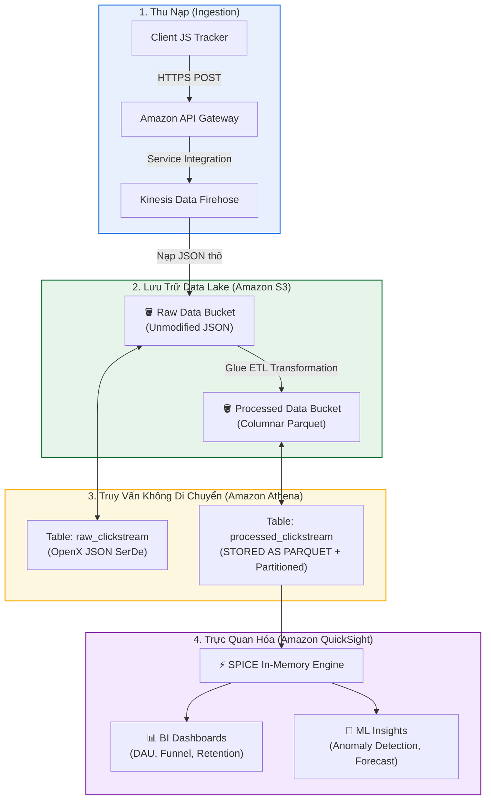

# Tóm tắt phiên đối thoại: Thiết kế Kiến trúc Data Lake Toàn diện (Designing a Customer Data Lake)

**Khóa học:** Course 2 - Architecting Solutions on AWS  
**Chủ đề:** Tổng hợp quy trình từ khảo sát yêu cầu đến hoàn thiện kiến trúc phân tích dữ liệu Serverless trên AWS  
**Vị trí:** Module 2 - Designing a serverless data analytics solution on AWS

---

## 1. Khung Ra Quyết Định Kiến Trúc (Architectural Decision Framework)

### A. Thu nạp dữ liệu luồng Clickstream (Ingestion)
* **Dịch vụ lựa chọn:** **Amazon Kinesis Data Firehose** (phía trước là **Amazon API Gateway**).
* **Lý do tối ưu:**
  * Hoàn toàn **Serverless**, tự động co giãn (*auto-scale*) theo lưu lượng truy cập.
  * Tự động gom lô (*batching*), nén và nạp dữ liệu trực tiếp vào Amazon S3 mà **không cần viết code Consumer**.

### B. Chiến lược lưu trữ dữ liệu kép (Dual Storage Strategy on Amazon S3)
* **Phân tách 2 vùng lưu trữ:**
  * **Raw Data (Dữ liệu thô):** Lưu toàn bộ luồng JSON nguyên bản phục vụ kiểm toán, sao lưu và xử lý lại khi cần.
  * **Processed Data (Dữ liệu đã xử lý):** Lưu trữ dữ liệu đã làm sạch, chuyển đổi sang định dạng nén dạng cột **Apache Parquet**.
* **Nguyên tắc tổ chức dữ liệu:**
  * Phân vùng theo thời gian theo chuẩn Hive: `year=YYYY/month=MM/day=DD/` để tối ưu hóa truy vấn.
  * Thiết lập **S3 Lifecycle Rules** chuyển dữ liệu thô cũ sang *S3 Glacier* để tối ưu chi phí.
  * Kích hoạt **S3 Cross-Region Replication (CRR)** để dự phòng thảm họa (Disaster Recovery).

---

## 2. Thiết kế Đường Ống Dữ Liệu Chi Tiết (Data Pipeline Design)



### Chi tiết câu lệnh DDL trong Amazon Athena:

#### 1. Bảng dữ liệu thô (Raw JSON Table):
```sql
CREATE EXTERNAL TABLE IF NOT EXISTS raw_clickstream (
    event_id string,
    customer_id string,
    session_id string,
    page_url string,
    timestamp string,
    action string
)
ROW FORMAT SERDE 'org.openx.data.jsonserde.JsonSerDe'
LOCATION 's3://raw-data-bucket/clickstream/';
```

#### 2. Bảng dữ liệu đã xử lý (Processed Parquet Table):
```sql
CREATE EXTERNAL TABLE IF NOT EXISTS processed_clickstream (
    event_id string,
    customer_id string,
    session_id string,
    page_url string,
    timestamp timestamp,
    action string
)
PARTITIONED BY (year string, month string, day string)
STORED AS PARQUET
LOCATION 's3://processed-data-bucket/clickstream/';
```

---

## 3. Lớp Trực quan hóa Dữ liệu (Amazon QuickSight)
* **Tích hợp:** Kết nối trực tiếp vào Amazon Athena, trỏ tới bảng `processed_clickstream`.
* **Tăng tốc với SPICE Engine:** Import dữ liệu vào bộ nhớ đệm In-Memory để tối ưu tốc độ hiển thị dashboard và giảm thiểu chi phí scan query trên Athena.
* **Theo dõi chỉ số:** Tạo các biểu đồ theo dõi người dùng hoạt động hàng ngày (**Daily Active Users - DAU**), tỷ lệ chuyển đổi, món ăn phổ biến.
* **Machine Learning Insights:** Tự động phát hiện bất thường (*Anomaly Detection*) và dự báo xu hướng (*Forecasting*).

---

## 4. Kế hoạch Triển khai & Quản trị Thực tế (Implementation Planning)

| Trụ cột | Thách thức thực tế | Giải pháp & Best Practices |
| :--- | :--- | :--- |
| **Bảo mật & Mã hóa (Security)** | Nguy cơ lộ dữ liệu nhạy cảm hoặc cấp quyền quá mức. | • Mã hóa In-transit (TLS 1.2+) và At-rest (SSE-KMS).<br/>• Phân quyền IAM theo nguyên tắc đặc quyền tối thiểu (*Least Privilege*).<br/>• Áp dụng **Row-Level Security (RLS)** & **Column-Level Security (CLS)** trên QuickSight để ẩn dữ liệu định danh cá nhân (PII). |
| **Quản trị dữ liệu (Governance)** | Sự thay đổi cấu trúc dữ liệu từ Frontend (*Schema Drift*) và bản ghi lỗi cú pháp. | • Quản lý phiên bản Schema tập trung với **AWS Glue Data Catalog**.<br/>• Cấu hình tiền tố lỗi (*Error Logging Prefix / DLQ*) trên Kinesis Firehose để hứng và xử lý lại các record lỗi. |
| **Kiểm soát chi phí (Cost Governance)** | Câu truy vấn `SELECT *` không tối ưu làm bùng nổ chi phí quét Athena. | • Thiết lập hạn mức quét dữ liệu (*Per-query limit*) trên **Athena Workgroups**.<br/>• Bắt buộc lọc theo các trường phân vùng ngày tháng (`WHERE year=... AND month=...`). |
