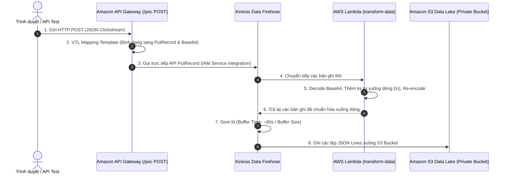

# Hướng dẫn thực hành: Xây dựng PoC Phân tích Dữ liệu - Phần 1 (Exercise 2 Walkthrough Part 1)

**Khóa học:** Course 2 - Architecting Solutions on AWS  
**Chủ đề:** Hướng dẫn từng bước xây dựng Proof of Concept (PoC) cho luồng Ingestion & Storage (API Gateway $\rightarrow$ Kinesis Data Firehose $\rightarrow$ Lambda Transform $\rightarrow$ Amazon S3)  
**Vị trí:** Module 2 - Designing a serverless data analytics solution on AWS

---

## 1. Sơ đồ Luồng Thực hành Phần 1 (Part 1 Architecture Pipeline)



---

## 2. Hướng dẫn Triển khai Từng bước (Step-by-Step Implementation)

### 🔹 Bước 1: Chuẩn bị IAM Role cho API Gateway (`API-Firehose`)
1. Truy cập **IAM Console** $\rightarrow$ **Roles** $\rightarrow$ Tạo hoặc kiểm tra Role `API-Firehose`.
2. Gắn 2 Policies:
   * **`API-Firehose` (Customer-managed):** Cho phép quyền `firehose:PutRecord` đối với tài nguyên Firehose.
   * **`AmazonAPIGatewayPushToCloudWatchLogs` (AWS-managed):** Cho phép API Gateway ghi log giám sát.
3. Sao chép lại **Role ARN** để dùng cấu hình ở Bước 6.

---

### 🔹 Bước 2: Tạo Amazon S3 Bucket (Private Data Lake)
1. Truy cập **Amazon S3 Console** $\rightarrow$ Nhấn **Create bucket**.
2. Đặt tên duy nhất toàn cầu (ví dụ: `testbucket-morgan-2022-1234`), chọn Region `us-east-1`.
3. Giữ mặc định cấu hình bảo mật: **Block all public access = ON** (Private Bucket).
4. Nhấn **Create bucket**, vào tab **Properties** và sao chép lại **Bucket ARN**.

---

### 🔹 Bước 3: Tạo AWS Lambda Function biến đổi dữ liệu (`transform-data`)
1. Truy cập **AWS Lambda Console** $\rightarrow$ **Create function** $\rightarrow$ Chọn **Use a blueprint**.
2. Tìm kiếm blueprint: *"Process records sent to a Kinesis Firehose stream"* (chọn runtime **Python 3.8**).
3. Đặt tên hàm: `transform-data` $\rightarrow$ Nhấn **Create function**.
4. **Mục đích của Lambda Transform:**
   > [!IMPORTANT]
   > Amazon Athena yêu cầu mỗi bản ghi JSON phải nằm trên một dòng riêng biệt (**JSON Lines / Newline-delimited JSON**). Mặc định Kinesis Firehose sẽ ghép dính các bản ghi trên cùng 1 dòng. Hàm Lambda này sẽ giải mã dữ liệu, nối thêm ký tự xuống dòng `\n` vào cuối mỗi record và mã hóa lại base64.
5. Cập nhật mã nguồn Python trong Code Source:

```python
import base64
import json

def lambda_handler(event, context):
    output = []
    for record in event['records']:
        # 1. Giải mã payload từ base64
        payload = base64.b64decode(record['data']).decode('utf-8')
        
        # 2. Thêm ký tự xuống dòng (\n) vào cuối mỗi bản ghi JSON
        formatted_payload = payload + "\n"
        
        # 3. Mã hóa lại base64
        output_record = {
            'recordId': record['recordId'],
            'result': 'Ok',
            'data': base64.b64encode(formatted_payload.encode('utf-8')).decode('utf-8')
        }
        output.append(output_record)
        
    return {'records': output}
```

6. Nhấn **Deploy**.
7. Vào tab **Configuration** $\rightarrow$ **General configuration** $\rightarrow$ Chỉnh **Timeout** lên **10 giây** để tránh lỗi ngắt quãng khi xử lý batch.
8. Sao chép lại **Function ARN**.

---

### 🔹 Bước 4: Tạo Kinesis Data Firehose Delivery Stream
1. Truy cập **Amazon Kinesis Console** $\rightarrow$ **Delivery streams** $\rightarrow$ **Create delivery stream**.
2. **Source:** Chọn **Direct PUT**.
3. **Destination:** Chọn **Amazon S3**.
4. **Data transformation:** Bật **Enabled** $\rightarrow$ Chọn Lambda function `transform-data` (phiên bản `$LATEST`).
5. **Destination settings:** Chọn S3 Bucket đã tạo ở Bước 2.
6. Nhấn **Create delivery stream** (chờ 1 - 2 phút để trạng thái chuyển sang **Active**).
7. Vào tab **Configuration** $\rightarrow$ **Permissions** $\rightarrow$ Nhấp vào **IAM Role ARN** của Firehose để copy ARN.

---

### 🔹 Bước 5: Cấu hình S3 Bucket Policy cho phép Firehose ghi dữ liệu
1. Quay lại **Amazon S3 Console** $\rightarrow$ Chọn bucket đã tạo $\rightarrow$ Tab **Permissions** $\rightarrow$ **Bucket policy** $\rightarrow$ **Edit**.
2. Dán chính sách cấp quyền cho IAM Role của Firehose:

```json
{
    "Version": "2012-10-17",
    "Statement": [
        {
            "Sid": "AllowFirehoseDelivery",
            "Effect": "Allow",
            "Principal": {
                "AWS": "<FIREHOSE_ROLE_ARN>"
            },
            "Action": [
                "s3:AbortMultipartUpload",
                "s3:GetBucketLocation",
                "s3:GetObject",
                "s3:ListBucket",
                "s3:ListBucketMultipartUploads",
                "s3:PutObject",
                "s3:PutObjectAcl"
            ],
            "Resource": [
                "arn:aws:s3:::<BUCKET_NAME>",
                "arn:aws:s3:::<BUCKET_NAME>/*"
            ]
        }
    ]
}
```
*(Thay thế `<FIREHOSE_ROLE_ARN>` và `<BUCKET_NAME>` bằng giá trị thực tế).*

---

### 🔹 Bước 6: Tạo REST API trên Amazon API Gateway
1. Truy cập **API Gateway Console** $\rightarrow$ **Create API** $\rightarrow$ Chọn **REST API** $\rightarrow$ **Build**.
2. Đặt tên API: `clickstream-ingest-poc`, Endpoint Type: **Regional** $\rightarrow$ **Create API**.
3. **Tạo Resource:** Nhấn **Actions** $\rightarrow$ **Create Resource** $\rightarrow$ Đặt tên Resource Name là `poc` $\rightarrow$ **Create Resource**.
4. **Tạo Method:** Nhấn **Actions** $\rightarrow$ **Create Method** $\rightarrow$ Chọn **POST** $\rightarrow$ Nhấn dấu tick xác nhận.
5. **Cấu hình Integration:**
   * **Integration type:** Chọn **AWS Service**.
   * **AWS Region:** `us-east-1`.
   * **AWS Service:** **Firehose**.
   * **HTTP method:** `POST`.
   * **Action Type:** `Use action name` $\rightarrow$ Điền `PutRecord`.
   * **Execution role:** Dán ARN của Role `API-Firehose` (từ Bước 1).
   * Nhấn **Save**.

---

### 🔹 Bước 7: Cấu hình VTL Mapping Template trong API Gateway
1. Nhấp vào **Integration Request** $\rightarrow$ Cuộn xuống mục **Mapping Templates**.
2. Chọn *"When there are no templates defined (recommended)"*.
3. Nhấn **Add mapping template** $\rightarrow$ Nhập Content-Type: `application/json` $\rightarrow$ Lưu.
4. Dán đoạn mã VTL (Velocity Template Language) để ánh xạ payload HTTP POST sang tham số `PutRecord` của Firehose:

```json
{
    "DeliveryStreamName": "<TEN_FIREHOSE_DELIVERY_STREAM>",
    "Record": {
        "Data": "$util.base64Encode($input.json('$'))"
    }
}
```
*(Thay `<TEN_FIREHOSE_DELIVERY_STREAM>` bằng tên Firehose Delivery Stream đã tạo ở Bước 4).*  
5. Nhấn **Save**.

---

### 🔹 Bước 8: Kiểm thử API và Mô phỏng Dữ liệu Clickstream
1. Quay lại trang **Method Execution** của phương thức POST $\rightarrow$ Nhấn **Test**.
2. Trong khung **Request Body**, dán mẫu JSON mô phỏng hành vi lướt menu:

```json
{
    "element_clicked": "Spaghetti Carbonara",
    "time_spent": 45,
    "restaurant_name": "Mario Italian Bistro",
    "created_at": "2026-08-15T09:10:00Z"
}
```

3. Nhấn nút **Test** $\rightarrow$ Kiểm tra Logs trả về **Status: 200 OK**.
4. Tiến hành đổi tên món ăn (`element_clicked`), số giây (`time_spent`) và gửi thêm **7 - 8 request** khác nhau.
5. **Kiểm tra kết quả:** Sau khoảng 60 giây (thời gian buffer của Firehose), vào lại S3 Bucket để kiểm tra các file dữ liệu JSON Lines đã được ghi thành công vào Data Lake.
*(Hết Phần 1 - Chuyển sang Phần 2 để cấu hình Athena và QuickSight).*
