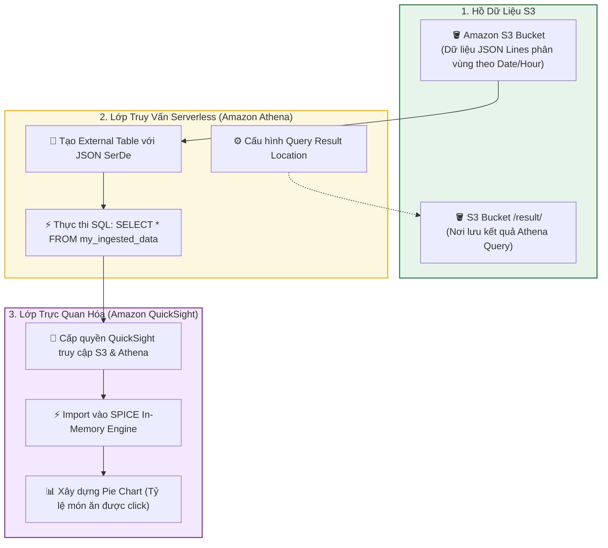

# Hướng dẫn thực hành: Xây dựng PoC Phân tích Dữ liệu - Phần 2 (Exercise 2 Walkthrough Part 2)

**Khóa học:** Course 2 - Architecting Solutions on AWS  
**Chủ đề:** Cấu hình Athena truy vấn dữ liệu tại chỗ, xây dựng Dashboard QuickSight với SPICE, dọn dẹp tài nguyên và cẩm nang xử lý sự cố  
**Vị trí:** Module 2 - Designing a serverless data analytics solution on AWS

---

## 1. Sơ đồ Luồng Thực hành Phần 2 (Part 2 Analytics & BI Pipeline)



---

## 2. Hướng dẫn Triển khai Từng bước (Step-by-Step Implementation)

### 🔹 Bước 1: Cấu hình Amazon Athena Query Result Location
> [!IMPORTANT]
> Bạn **bắt buộc** phải cấu hình vị trí lưu kết quả truy vấn trước khi có thể chạy bất kỳ câu lệnh SQL/DDL nào trong Amazon Athena.

1. Truy cập **Amazon Athena Console** $\rightarrow$ Chọn tab **Settings** $\rightarrow$ Nhấn **Manage**.
2. Tại mục **Query result location**, chọn **Browse S3** và trỏ đến S3 bucket đã tạo ở Phần 1 kèm hậu tố `/result/` (ví dụ: `s3://testbucket-morgan-2022-1234/result/`).
3. Nhấn **Save**.

---

### 🔹 Bước 2: Tạo Athena Table & Thực thi Truy vấn SQL
1. Quay lại tab **Editor**, dán câu lệnh DDL tạo bảng:

```sql
CREATE EXTERNAL TABLE IF NOT EXISTS `my_ingested_data` (
  `element_clicked` string,
  `time_spent` int,
  `restaurant_name` string,
  `created_at` string
)
ROW FORMAT SERDE 'org.openx.data.jsonserde.JsonSerDe'
WITH SERDEPROPERTIES (
  'ignore.malformed.json' = 'TRUE'
)
LOCATION 's3://<TEN_S3_BUCKET_CUA_BAN>/'
TBLPROPERTIES ('has_encrypted_data'='false');
```
*(Thay thế `<TEN_S3_BUCKET_CUA_BAN>` bằng tên bucket thực tế của bạn).*

2. Nhấn **Run** để khởi tạo bảng.
3. Mở tab truy vấn mới và kiểm tra dữ liệu bằng lệnh SQL:
```sql
SELECT * 
FROM my_ingested_data;
```
4. **Kết quả:** Athena quét trực tiếp các tệp trong S3 và trả về đầy đủ các bản ghi clickstream đã gửi thử nghiệm từ API Gateway.

---

### 🔹 Bước 3: Cấu hình Phân quyền cho Amazon QuickSight
1. Truy cập **Amazon QuickSight Console** (đăng nhập hoặc đăng ký tài khoản Standard/Enterprise).
2. Nhấp vào biểu tượng tài khoản góc trên bên phải $\rightarrow$ Chọn **Manage QuickSight**.
3. Chọn **Security & permissions** $\rightarrow$ Tại mục *QuickSight access to AWS services*, nhấn **Manage**.
4. Đánh dấu chọn **Amazon S3** $\rightarrow$ Tích chọn đúng S3 Bucket của bạn và đánh dấu chọn **Write permission for Athena Workgroup**.
5. Nhấn **Finish** $\rightarrow$ Nhấn **Save**.

---

### 🔹 Bước 4: Tạo Dataset & Xây dựng Dashboard trên QuickSight
1. Quay lại trang chủ QuickSight $\rightarrow$ Chọn **Datasets** $\rightarrow$ **New dataset**.
2. Chọn nguồn dữ liệu **Athena** $\rightarrow$ Đặt Data source name: `POC Clickstream` $\rightarrow$ Nhấn **Create data source**.
3. Chọn Database `default` và chọn bảng `my_ingested_data` $\rightarrow$ Nhấn **Select**.
4. Chọn tùy chọn **Import to SPICE for quicker analytics** $\rightarrow$ Nhấn **Visualize**.
5. **Tạo Biểu đồ:**
   * Tại thanh công cụ *Visual types* góc dưới bên trái, chọn biểu đồ **Pie chart** (Biểu đồ tròn).
   * Từ danh sách trường dữ liệu (*Field list*), kéo thả trường `element_clicked` vào biểu đồ.
   * QuickSight tự động tổng hợp và hiển thị tỷ lệ số lần click của từng món ăn trong thực đơn.

---

## 3. Quy trình Dọn dẹp Tài nguyên Tránh Phát sinh Chi phí (Resource Clean-Up)

Thực hiện xóa tài nguyên theo thứ tự ngược lại:

| Thứ tự | Dịch vụ | Thao tác thực hiện |
| :---: | :--- | :--- |
| **1** | **Amazon QuickSight** | Xóa Analysis $\rightarrow$ Xóa Dataset `my_ingested_data`. |
| **2** | **Amazon Athena** | Chạy lệnh `DROP TABLE my_ingested_data;` và đóng các tab query. |
| **3** | **Amazon API Gateway** | Chọn REST API `clickstream-ingest-poc` $\rightarrow$ Actions $\rightarrow$ **Delete**. |
| **4** | **Kinesis Data Firehose** | Chọn Delivery Stream $\rightarrow$ Nhấn **Delete** $\rightarrow$ Nhập tên xác nhận. |
| **5** | **AWS Lambda** | Chọn Function `transform-data` $\rightarrow$ Actions $\rightarrow$ **Delete**. |
| **6** | **Amazon S3** | Vào Bucket $\rightarrow$ Chọn **Empty** (nhập `permanently delete`) $\rightarrow$ Chọn **Delete Bucket**. |
| **7** | **IAM** | Xóa Role `API-Firehose` nếu không còn sử dụng. |

---

## 4. Cẩm nang Khắc phục Sự cố Thực tế (Troubleshooting Guide)

> [!TIP]
> **90% lỗi trong kiến trúc Data Pipeline xuất phát từ Phân quyền (IAM Permissions):**
> * **API Gateway không gửi được vào Firehose:** Kiểm tra IAM Role gán cho API Gateway có quyền `firehose:PutRecord` hay chưa.
> * **Firehose không nạp được dữ liệu xuống S3:** Kiểm tra S3 Bucket Policy có cấp quyền `s3:PutObject` cho đúng IAM Role của Firehose không.
> * **Athena báo lỗi khi chạy query:** Kiểm tra đã thiết lập đường dẫn *Query Result Location* trong Settings chưa.
> * **QuickSight không thấy bảng hoặc báo lỗi Permission Denied:** Kiểm tra cấu hình *Security & Permissions* trong QuickSight đã tích chọn S3 Bucket và quyền ghi Athena Workgroup chưa.
