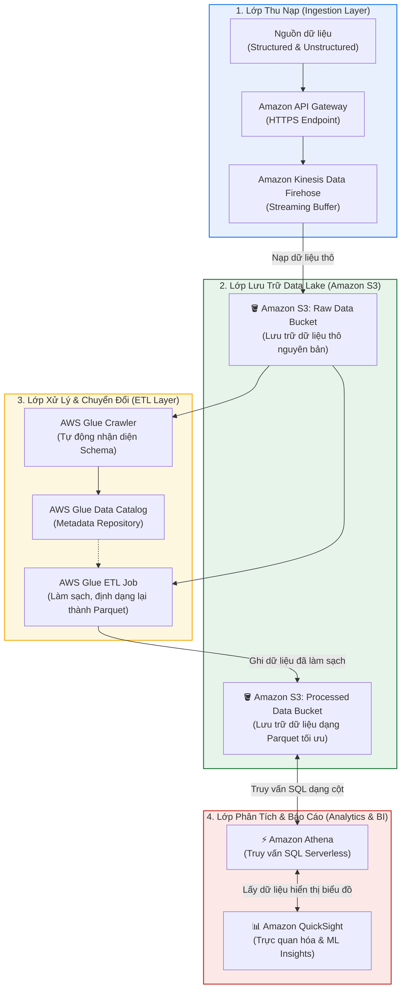

# Bài tập tình huống: Thiết kế Kiến trúc Data Lake & Analytics trên AWS (Data Lake Architecture Design)

**Khóa học:** Course 2 - Architecting Solutions on AWS  
**Chủ đề:** Đề xuất giải pháp kiến trúc Serverless Data Lake toàn diện đáp ứng yêu cầu lưu trữ dữ liệu thô/đã xử lý, ETL và phân tích  
**Vị trí:** Module 2 - Designing a serverless data analytics solution on AWS

---

## 1. Phân tích yêu cầu bài toán (Scenario Requirements)

| Tiêu chí | Yêu cầu của khách hàng |
| :--- | :--- |
| **Data Lake** | Khả năng mở rộng không giới hạn (*Scalable*), tính sẵn sàng cao (*Highly Available*). |
| **Định dạng dữ liệu** | Chứa được cả dữ liệu có cấu trúc (*Structured* như CSV, JSON, Parquet) và phi cấu trúc (*Unstructured* như hình ảnh, log, audio). |
| **Phân vùng lưu trữ** | • Lưu trữ dữ liệu thô nguyên bản không qua chỉnh sửa (**Raw Data as-is**). • Lưu trữ dữ liệu đã qua xử lý ở một vị trí riêng biệt (**Processed Data**). |
| **Chuyển đổi dữ liệu (ETL)** | Tự động biến đổi dữ liệu sang các định dạng tối ưu cho phân tích (như nén, chuẩn hóa schema, chuyển sang Parquet/ORC). |
| **Phân tích & Insights** | Khả năng truy vấn linh hoạt và trực quan hóa dữ liệu để rút ra thông tin kinh doanh hữu ích. |

---

## 2. Kiến trúc Giải pháp Đề xuất (Proposed Architecture)

---

## 3. Vai trò & Phạm vi của từng Dịch vụ AWS trong Kiến trúc

### 🔹 1. Lớp Thu nạp (Data Ingestion): Amazon API Gateway & Amazon Kinesis Data Firehose
* **Phạm vi:** Cung cấp cổng tiếp nhận chuẩn RESTful HTTPS và tự động gom lô (*batching*), nạp luồng dữ liệu vào Data Lake.
* **Cách hoạt động:** Các ứng dụng phía client gửi dữ liệu thô qua HTTP POST đến **Amazon API Gateway**. API Gateway sử dụng cơ chế Direct Service Integration để chuyển tiếp dữ liệu đến **Amazon Kinesis Data Firehose**. Firehose tự động mở rộng theo lưu lượng và truyền tải dữ liệu trực tiếp vào S3 Raw Bucket mà không cần quản lý máy chủ.

### 🔹 2. Lớp Lưu trữ Hồ Dữ liệu (Data Lake Storage): Amazon S3
* **Phạm vi:** Nền tảng lưu trữ đối tượng trung tâm có độ bền vững 11 số 9 ($99.999999999\%$) và tính sẵn sàng cao trên đa AZ.
* **Cách tổ chức:**
  * **Raw Data S3 Bucket:** Lưu trữ toàn bộ dữ liệu thô nguyên bản (cả structured JSON/CSV và unstructured logs/media) làm nguồn tham chiếu chuẩn xác (*Single Source of Truth*).
  * **Processed Data S3 Bucket:** Lưu trữ dữ liệu đã được làm sạch, khử trùng lặp và chuyển đổi sang định dạng Parquet theo các phân vùng (*Partitioning by Year/Month/Day*).

### 🔹 3. Lớp Xử lý & Biến đổi Dữ liệu (ETL & Catalog): AWS Glue
* **Phạm vi:** Dịch vụ tích hợp dữ liệu Serverless thực hiện khám phá metadata và xử lý biến đổi dữ liệu theo lô hoặc luồng.
* **Cách hoạt động:**
  1. **AWS Glue Crawler** quét dữ liệu trong Raw Bucket để tự động suy luận schema và lưu thông tin vào **AWS Glue Data Catalog**.
  2. **AWS Glue ETL Job** (dựa trên Apache Spark Serverless) đọc dữ liệu thô, thực hiện chuẩn hóa, làm giàu dữ liệu, chuyển đổi sang định dạng **Apache Parquet (Columnar Storage)** có nén Snappy, sau đó ghi sang Processed Data S3 Bucket.

### 🔹 4. Lớp Truy vấn & Phân tích Tương tác: Amazon Athena
* **Phạm vi:** Công cụ truy vấn Serverless sử dụng SQL tiêu chuẩn trực tiếp trên Amazon S3.
* **Cách hoạt động:** Athena kết nối với AWS Glue Data Catalog và thực hiện truy vấn trực tiếp trên các tệp Parquet trong Processed Bucket. Nhờ định dạng cột và phân vùng, Athena chỉ quét đúng các cột/dòng cần thiết, mang lại tốc độ truy vấn tính bằng giây và tiết kiệm tới 90% chi phí quét dữ liệu.

### 🔹 5. Lớp Trực quan hóa & Báo cáo: Amazon QuickSight
* **Phạm vi:** Nền tảng Business Intelligence (BI) đám mây phục vụ xây dựng báo cáo và bảng điều khiển tương tác.
* **Cách hoạt động:** QuickSight kết nối trực tiếp với Amazon Athena (sử dụng bộ nhớ **SPICE In-Memory** để tăng tốc), giúp các nhà phân tích dữ liệu và lãnh đạo doanh nghiệp trực quan hóa các chỉ số kinh doanh, theo dõi xu hướng và tận dụng tính năng Machine Learning (*Anomaly Detection, Forecasting*) để đưa ra các quyết định chiến lược.

---

## 4. Tóm lược Đoạn văn Đề xuất Giải pháp (Executive Summary)

> *"To meet the customer's requirements for a scalable, highly available, and cost-effective data lake architecture, we propose a fully serverless solution leveraging **Amazon S3, Amazon Kinesis Data Firehose, AWS Glue, Amazon Athena, and Amazon QuickSight**.*
> 
> *The ingestion pipeline uses **Amazon API Gateway** paired with **Amazon Kinesis Data Firehose** to continuously collect structured and unstructured data and deliver it as-is into a dedicated **Raw Data S3 Bucket**. Amazon S3 guarantees 11 nines of durability and high availability while decoupling storage from compute.*
> 
> *To transform raw data for optimized analytics, **AWS Glue** crawlers infer the metadata schema into the **AWS Glue Data Catalog**, and Glue ETL jobs clean, partition, and convert the data into columnar **Apache Parquet** format, storing results in a separate **Processed Data S3 Bucket**.*
> 
> *Finally, analysts use **Amazon Athena** to perform ad-hoc standard SQL queries directly against the processed data with minimal scan costs, while **Amazon QuickSight** provides interactive BI dashboards, SPICE-accelerated visualizations, and ML-powered business insights. This entire architecture operates with zero server management and follows a pay-per-use cost model."*
