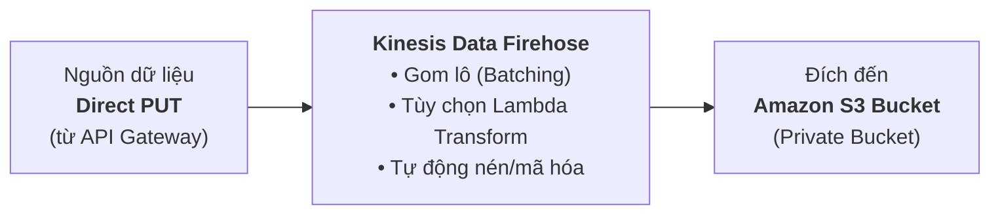

# Tóm tắt bài học: Thực hành & Khám phá Amazon Kinesis (Exploring Amazon Kinesis)

**Khóa học:** Course 2 - Architecting Solutions on AWS  
**Chủ đề:** Hướng dẫn từng bước cấu hình Amazon Kinesis Data Firehose Delivery Stream nạp dữ liệu vào Amazon S3  
**Vị trí:** Module 2 - Designing a serverless data analytics solution on AWS

---

## 1. Tổng quan về Amazon Kinesis Console
* **Kinesis Management Console:** Đóng vai trò là trung tâm (*Hub*) điều phối các dịch vụ streaming gồm:
  * **Kinesis Data Streams:** Thu nạp và lưu đệm dữ liệu luồng tốc độ cao.
  * **Kinesis Data Firehose:** Dịch vụ nạp dữ liệu tự động (*Delivery Stream*) vào các điểm lưu trữ.
  * **Kinesis Data Analytics:** Xử lý và phân tích luồng dữ liệu thời gian thực.
  * **Kinesis Video Streams:** Thu nạp và phân tích luồng video/âm thanh.

---

## 2. Quy trình thiết lập Kinesis Data Firehose Delivery Stream

---

## 3. Các bước cấu hình chi tiết (Step-by-step Setup)

### 🔹 Bước 1: Chọn Nguồn (Source) và Đích (Destination)
1. Trong Kinesis Console, chọn **Create delivery stream**.
2. **Source:** Chọn **Direct PUT** (dữ liệu được đẩy trực tiếp từ API Gateway thông qua AWS Service Integration).
   *(Ngoài ra, Firehose cũng hỗ trợ lấy nguồn từ một Kinesis Data Stream khác).*
3. **Destination:** Chọn **Amazon S3** (ngoài ra còn hỗ trợ Amazon Redshift, Amazon OpenSearch Service, Datadog, Splunk,...).

### 🔹 Bước 2: Cấu hình S3 Destination Bucket
* Chọn bucket có sẵn hoặc tạo mới một bucket riêng (ví dụ: `raf-kinesis-data-bucket`).
* ⚠️ **Lưu ý bảo mật quan trọng:** Khác với bucket menu web tĩnh (public), bucket lưu trữ dữ liệu clickstream này **bắt buộc phải là Private Bucket** (bật tính năng *Block all public access*).

### 🔹 Bước 3: Cấu hình tiền tố & Tùy chọn nâng cao (Advanced Settings)
* **S3 bucket prefix:** Thiết lập tiền tố đường dẫn thư mục cho các file dữ liệu được Firehose tạo ra (ví dụ: `clickstream-raw/year=!{timestamp:yyyy}/month=!{timestamp:MM}/`).
* **Data transformation:** Cho phép bật tùy chọn kích hoạt **AWS Lambda** để chuyển đổi định dạng, làm sạch hoặc nén dữ liệu trước khi ghi xuống S3.
* **Server-side encryption:** Tự động kích hoạt mã hóa dữ liệu khi lưu trữ (at-rest).

### 🔹 Bước 4: Khởi tạo và Giám sát
* Nhấn **Create delivery stream**. Quá trình khởi tạo mất khoảng 1 - 2 phút trước khi trạng thái chuyển sang **Active**.
* Tích hợp sẵn **Amazon CloudWatch** để giám sát các chỉ số: Số lượng bản ghi (*IncomingRecords*), dung lượng dữ liệu (*IncomingBytes*), độ trễ ghi và tỷ lệ ghi thành công (*DeliveryToS3.Success*).
