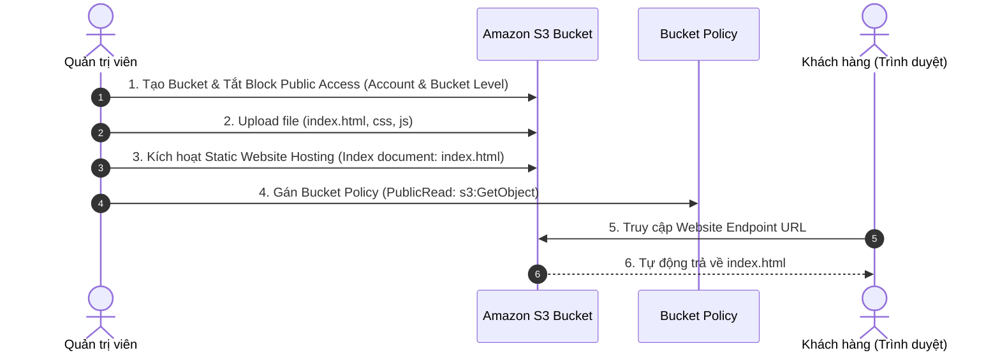

# Tóm tắt bài học: Thực hành & Khám phá Amazon S3 (Exploring Amazon S3)

**Khóa học:** Course 2 - Architecting Solutions on AWS  
**Chủ đề:** Hướng dẫn từng bước cấu hình S3 Bucket, Static Website Hosting, Bucket Policy và Phân quyền Public Access  
**Vị trí:** Module 2 - Designing a serverless data analytics solution on AWS

---

## 1. Bản chất và Phạm vi của Amazon S3 Bucket
* **Tên Bucket là duy nhất trên toàn cầu (Globally Unique):** Không thể có hai bucket cùng tên trên toàn bộ hạ tầng AWS toàn cầu vì tên bucket được dùng trực tiếp trong URL định tuyến Internet.
* **Phạm vi vùng (Regional Service):** Khi tạo bucket, bạn chỉ định một AWS Region cụ thể (ví dụ: `us-east-1`). Bạn **không** cần (và không thể) chọn Availability Zone (AZ) vì S3 tự động nhân bản dữ liệu trên nhiều AZ trong Region đó.

---

## 2. Quy trình thiết lập Static Website Hosting trên Amazon S3



---

## 3. Các bước thực hiện chi tiết

### 🔹 Bước 1: Tạo Bucket & Quản lý Block Public Access
1. Nhấn **Create bucket**, đặt tên (ví dụ: `raf-restaurant-1`), chọn Region (`us-east-1`).
2. **Cơ chế Block Public Access (2 tầng bảo vệ):**
   * **Account Level:** Cài đặt chặn toàn tài khoản. Phải chỉnh sửa (*Edit*) để cho phép nếu muốn mở website công khai.
   * **Bucket Level:** Bỏ chọn *"Block all public access"* và đánh dấu xác nhận (*Acknowledge*).
   > [!IMPORTANT]
   > Việc bỏ chọn *"Block all public access"* **chưa** làm cho bucket bị công khai ngay lập tức, mà chỉ mở quyền cho phép bạn cấu hình public ở các bước sau (thông qua Bucket Policy).

### 🔹 Bước 2: Tải lên nội dung Web (Upload Objects)
* Nhấn **Upload** và tải lên file giao diện (ví dụ: `index.html`).
* Ngay khi upload xong, file sẽ trở thành một đối tượng được tự động nhân bản đa AZ trong Region.

### 🔹 Bước 3: Kích hoạt Static Website Hosting
* Vào tab **Properties** $\rightarrow$ Cuộn xuống mục **Static website hosting** $\rightarrow$ Chọn **Edit** $\rightarrow$ Chọn **Enable**.
* **Index document:** Điền `index.html`.
* Sau khi lưu, S3 sẽ sinh ra một đường dẫn **Endpoint URL** công khai của website (ví dụ: `http://raf-restaurant-1.s3-website-us-east-1.amazonaws.com`).

### 🔹 Bước 4: Thiết lập Bucket Policy cho phép Public Read
* Vào tab **Permissions** $\rightarrow$ **Bucket policy** $\rightarrow$ Chọn **Edit** và nhập chính sách cấp quyền đọc:

```json
{
    "Version": "2012-10-17",
    "Statement": [
        {
            "Sid": "PublicReadGetObject",
            "Effect": "Allow",
            "Principal": "*",
            "Action": [
                "s3:GetObject",
                "s3:GetObjectVersion"
            ],
            "Resource": "arn:aws:s3:::raf-restaurant-1/*"
        }
    ]
}
```

---

## 4. Liên hệ với tình huống thực tế của Khách hàng
* Website tĩnh này chính là giao diện thực đơn (menu) điện tử hiển thị khi thực khách quét mã QR tại bàn.
* Bên trong file `index.html` / `JavaScript`, khách hàng nhúng mã tracking để bắt các sự kiện tương tác (Clickstream) và gửi HTTP POST request đến API Gateway ở các phần tiếp theo.
