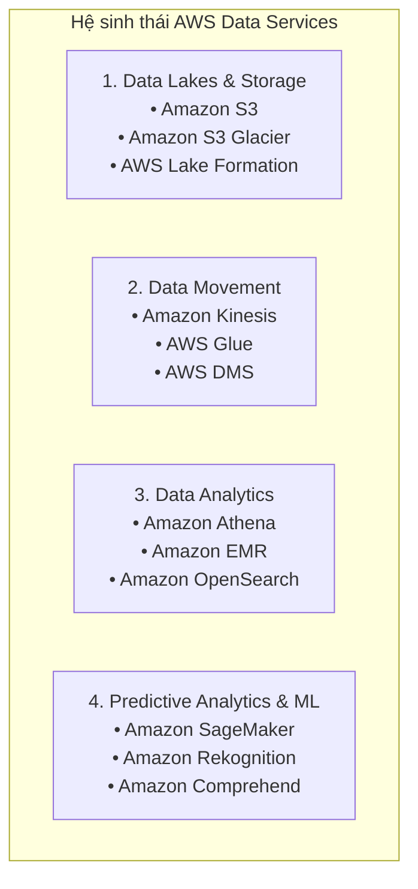

# Tài liệu đọc: Tổng quan các Dịch vụ Dữ liệu trên AWS (A Look into AWS Data Services)

**Khóa học:** Course 2 - Architecting Solutions on AWS  
**Chủ đề:** Khảo sát chi tiết 4 danh mục dịch vụ dữ liệu trên AWS phục vụ phân tích dữ liệu và luồng Clickstream  
**Vị trí:** Module 2 - Designing a serverless data analytics solution on AWS

---

## 1. Khái niệm Clickstream Data trong bối cảnh bài học
* **Clickstream Data:** Là các chuỗi sự kiện tương tác nhỏ của người dùng (chủ yếu từ frontend/trình duyệt) được sinh ra liên tục với **tốc độ cao (high speed)** và **khối lượng lớn (high volume)**.
* **Ứng dụng trong tình huống tuần 2:** Thu thập dữ liệu hành vi của khách hàng khi lướt xem menu điện tử của nhà hàng (xem món, cuộn trang, thời gian dừng, v.v.).

---

## 2. Phân loại 4 nhóm Dịch vụ Dữ liệu trên AWS

---

## 3. Chi tiết từng nhóm dịch vụ

### 🔹 Nhóm 1: Data Lakes & Data Storage (Lưu trữ & Hồ dữ liệu)

| Dịch vụ | Đặc điểm kỹ thuật | Trường hợp sử dụng tiêu biểu |
| :--- | :--- | :--- |
| **Amazon S3** | Dịch vụ lưu trữ đối tượng (Object Storage) quy mô không giới hạn, độ bền vững 99.999999999% (11 số 9), bảo mật cao, hỗ trợ nhiều Storage Classes. | • Lưu trữ trung tâm làm **Data Lake**. • Host web tĩnh (Static Website Hosting). • Lưu trữ sao lưu & khôi phục thảm họa (Backup/DR). |
| **Amazon S3 Glacier** | Các lớp lưu trữ chuyên dụng cho lưu trữ dữ liệu lưu trữ dài hạn (Data Archiving) với chi phí thấp nhất. | Lưu trữ dữ liệu lịch sử, tuân thủ pháp lý, kiểm toán dài hạn. |
| **AWS Lake Formation** | Dịch vụ tự động hóa thiết lập hồ dữ liệu (Data Lake) an toàn chỉ trong vài ngày, tập trung hóa chính sách bảo mật và phân quyền truy cập. | Xây dựng Data Lake tập trung, chia sẻ dữ liệu an toàn giữa nhiều bộ phận. |

---

### 🔹 Nhóm 2: Data Movement (Thu nạp & Di chuyển dữ liệu)

| Dịch vụ | Đặc điểm kỹ thuật | Trường hợp sử dụng tiêu biểu |
| :--- | :--- | :--- |
| **Amazon Kinesis** | Bộ dịch vụ thu nạp, xử lý và phân tích luồng dữ liệu thời gian thực (*Streaming Data*) quy mô lớn (Kinesis Data Streams, Firehose, Data Analytics). | Thu nạp luồng **Clickstream**, IoT telemetry, video stream, application logs thời gian thực. |
| **AWS Glue** | Dịch vụ **Serverless Data Integration / ETL** giúp tự động khám phá, trích xuất, làm sạch, chuẩn hóa và nạp dữ liệu vào Data Lake/Data Warehouse. | ETL pipeline tự động, trích xuất metadata và xây dựng Data Catalog. |
| **AWS DMS** | Dịch vụ di chuyển CSDL (Database Migration Service) nhanh chóng và an toàn, giữ database nguồn hoạt động liên tục (minimal downtime). | Di chuyển CSDL On-premises lên AWS hoặc chuyển đổi giữa các loại DB. |

---

### 🔹 Nhóm 3: Data Analytics (Phân tích & Truy vấn)

| Dịch vụ | Đặc điểm kỹ thuật | Đánh giá theo tình huống khách hàng tuần 2 |
| :--- | :--- | :--- |
| **Amazon Athena** | Dịch vụ truy vấn tương tác **Serverless** trực tiếp trên S3 bằng **SQL tiêu chuẩn**. Không cần nạp dữ liệu, tính phí theo dung lượng quét ($5/TB). | ✅ **Rất phù hợp:** Đội ngũ ít người, không cần quản trị hạ tầng, tính phí theo lượng query thực tế. |
| **Amazon EMR** | Nền tảng Big Data chạy các cụm mã nguồn mở (**Apache Spark, Hadoop, Hive, Presto**) xử lý dữ liệu quy mô Petabyte (MPP). | ⚠️ **Không phù hợp cho khách hàng này:** Đòi hỏi kiến thức chuyên sâu và tốn công vận hành (đội ngũ khách hàng ít nhân sự). |
| **Amazon OpenSearch Service** | Dịch vụ tìm kiếm và phân tích log phân tán thời gian thực kế thừa từ Elasticsearch, tích hợp dashboard trực quan hóa (OpenSearch Dashboards/Kibana). | Phù hợp cho phân tích log tương tác, tìm kiếm website, giám sát hệ thống thời gian thực. |

---

### 🔹 Nhóm 4: Predictive Analytics & Machine Learning (Dự đoán & Học máy)

| Dịch vụ | Bản chất | Ứng dụng trong hệ thống phân tích dữ liệu |
| :--- | :--- | :--- |
| **Amazon SageMaker** | Nền tảng phát triển, huấn luyện và triển khai mô hình ML toàn diện (Fully Managed). | Xây dựng mô hình dự đoán hành vi, gợi ý món ăn (Recommendation Systems) nâng cao. |
| **Amazon Rekognition** | Dịch vụ **Serverless Computer Vision** thông qua API (nhận diện khuôn mặt, vật thể, văn bản từ ảnh/video trong vòng 3 giây). | Tự động phân tích hình ảnh món ăn, phát hiện nhãn món ăn trong menu. |
| **Amazon Comprehend** | Dịch vụ **NLP (Xử lý ngôn ngữ tự nhiên)** trích xuất insight, sắc thái cảm xúc từ văn bản không cấu trúc (có phiên bản chuyên biệt *Comprehend Medical*). | Phân tích đánh giá/phản hồi của thực khách về món ăn và dịch vụ. |

---

## 4. Tổng kết bài học kiến trúc
* **Chọn công cụ phù hợp năng lực đội ngũ:** Dù **Amazon EMR** rất mạnh mẽ cho dữ liệu lớn, với một đội ngũ nhân sự mỏng (*reduced staff*), việc lựa chọn các dịch vụ **Serverless như Amazon Athena + S3** mang lại hiệu quả vượt trội về chi phí và thời gian triển khai.
* **Định hướng pipeline cho bài toán Clickstream:**
  $$\text{JS Client Tracker} \xrightarrow{\text{HTTPS POST}} \text{API Gateway} \xrightarrow{} \text{Kinesis Data Stream / Firehose} \xrightarrow{} \text{Amazon S3 (Data Lake)} \xrightarrow{} \text{Amazon Athena (SQL Analytics)}$$
