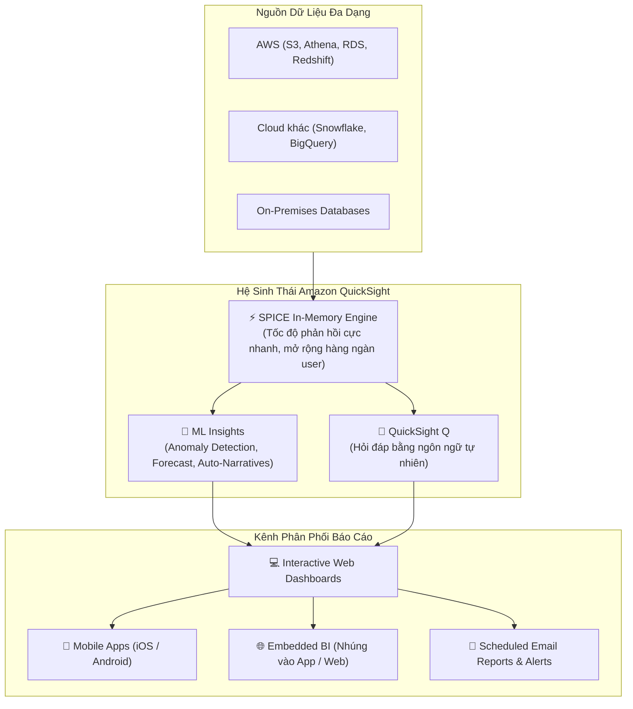

# Tài liệu đọc: Các Tính năng Cốt lõi của Amazon QuickSight (Amazon QuickSight Features)

**Khóa học:** Course 2 - Architecting Solutions on AWS  
**Chủ đề:** Khảo sát toàn diện về dịch vụ Business Intelligence (BI) Serverless - Amazon QuickSight, bộ máy SPICE và tích hợp ML  
**Vị trí:** Module 2 - Designing a serverless data analytics solution on AWS

---

## 1. Tổng quan về Amazon QuickSight
* **Amazon QuickSight** là dịch vụ **Business Intelligence (BI)** đám mây hoàn toàn **Serverless**, cho phép người dùng ở mọi cấp độ trong tổ chức phân tích dữ liệu, xây dựng dashboard tương tác, đặt câu hỏi bằng ngôn ngữ tự nhiên và tự động nhận diện mẫu hình dữ liệu thông qua Machine Learning.

---

## 2. 7 Nhóm Tính năng & Lợi thế Cốt lõi

### 🔹 1. Kết nối và Mở rộng Dữ liệu (Connect & Scale)
* **Đa dạng nguồn dữ liệu:** Kết nối liền mạch với các dịch vụ AWS, cơ sở dữ liệu On-premises, hoặc các nền tảng đám mây khác (Snowflake, Exasol,...).
* **Bộ máy tính toán SPICE (Super-fast, Parallel, In-memory Calculation Engine):**
  * Lưu trữ dữ liệu trong bộ nhớ (*in-memory*) với khả năng xử lý song song phân tán.
  * Đảm bảo tốc độ phản hồi dashboard tức thì cho hàng nghìn người dùng đồng thời mà **không gây áp lực/tải lên cơ sở dữ liệu nguồn**.
* **Mô hình hóa dữ liệu:** Kết hợp nhiều nguồn dữ liệu (*data blending/joins*) và thiết lập mô hình dữ liệu tập trung được quản trị chặt chẽ.

---

### 🔹 2. Bảng điều khiển Tùy biến Cao (Customizable Dashboards)
* Thiết kế báo cáo trực quan phù hợp theo từng trường hợp sử dụng cụ thể.
* **Email Reports & Alerts:** Tự động gửi báo cáo định kỳ và cảnh báo qua email cho người dùng khi các chỉ số chạm ngưỡng quan trọng.
* **Truy cập mọi nơi:** Hỗ trợ ứng dụng di động chuyên dụng trên iOS, Android và giao diện web mobile.

---

### 🔹 3. Tích hợp Trí tuệ Nhân tạo & Machine Learning (ML Insights)
* **Anomaly Detection (Phát hiện bất thường):** Liên tục giám sát và tự động tìm ra các điểm dị biệt hoặc biến động bất thường trong dữ liệu mà mắt thường khó nhận thấy.
* **Forecasting & What-if Analysis:** Dự báo xu hướng tương lai và mô phỏng các kịch bản giả định (*Nếu doanh số tăng 10% thì lợi nhuận thế nào?*).
* **Auto-Narratives:** Tự động diễn giải ý nghĩa các biểu đồ số liệu thành đoạn văn tóm tắt ngôn ngữ tự nhiên giúp người đọc nắm bắt ngữ cảnh nhanh chóng.

---

### 🔹 4. Self-service BI & Phân tích Nhúng (Embedded Analytics)
* **Hỏi đáp ngôn ngữ tự nhiên (QuickSight Q):** Người dùng không cần kỹ năng kỹ thuật/SQL chỉ cần gõ câu hỏi bằng ngôn ngữ tự nhiên để nhận lại biểu đồ trực quan.
* **Giao diện Web kéo - thả:** Dễ dàng tạo các phân tích dữ liệu trực quan ngay trên trình duyệt mà không cần cài đặt phần mềm phức tạp.
* **Embedded Analytics:** Cho phép lập trình viên nhúng trực tiếp dashboard và tính năng phân tích vào các ứng dụng web/portal của doanh nghiệp.

---

### 🔹 5. Tích hợp Nguyên bản Sâu sắc với AWS (Native AWS Integration)
* **Kết nối VPC riêng tư (VPC Private Connectivity):** Truy cập an toàn vào Amazon Redshift, Amazon RDS mà không cần mở kết nối ra Internet công cộng.
* **Phân quyền IAM nguyên bản:** Tích hợp chặt chẽ với **Amazon S3** và **Amazon Athena** với cơ chế kiểm soát quyền truy cập chi tiết (*fine-grained access control*).
* **Tích hợp Amazon SageMaker:** Cho phép gọi trực tiếp các mô hình ML phức tạp đã huấn luyện vào biểu đồ báo cáo mà không cần xây dựng pipeline riêng.

---

### 🔹 6. Serverless & Mô hình Giá Tối ưu (Pay-per-Session)
* **Hoàn toàn Serverless:** Không cần cung cấp máy chủ, tự động mở rộng phục vụ hàng trăm nghìn người dùng với tính sẵn sàng cao (*High Availability*).
* **Mô hình giá Pay-per-Session linh hoạt:** Chỉ tính tiền theo phiên truy cập thực tế của người dùng (*pay for actual usage*), không bắt buộc phải mua giấy phép cố định (*fixed user licenses*) đắt đỏ cho toàn bộ nhân viên.

---

### 🔹 7. Bảo mật Cấp Doanh nghiệp & Tuân thủ Tiêu chuẩn (Security & Governance)
* **Mã hóa dữ liệu toàn diện:** Mã hóa khi truyền tải (In-transit) và mã hóa khi lưu trữ (At-rest) bên trong bộ nhớ SPICE.
* **Bảo mật phân quyền sâu:**
  * **Row-Level Security (RLS):** Giới hạn dòng dữ liệu hiển thị theo từng tài khoản/nhóm người dùng (ví dụ: Quản lý nhà hàng A chỉ thấy số liệu nhà hàng A).
  * **Column-Level Security (CLS):** Ẩn các cột dữ liệu nhạy cảm (như thông tin cá nhân PII) đối với một số nhóm người dùng.
* **Đạt các chứng chỉ tuân thủ quốc tế khắt khe:** HIPAA, GDPR, PCI-DSS, SOC 1/2/3, ISO 27001, FedRAMP High,...
