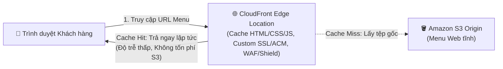
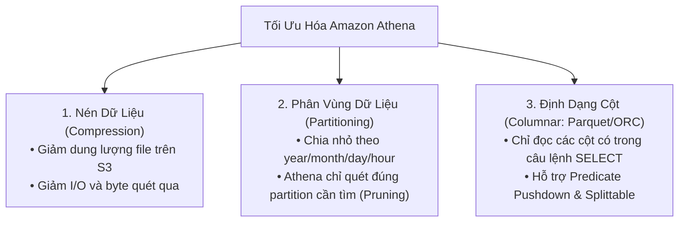

# Tài liệu đọc: Tối ưu hóa Kiến trúc Nâng cao (Architecture Optimizations for Week 2)

**Khóa học:** Course 2 - Architecting Solutions on AWS  
**Chủ đề:** Hướng dẫn chi tiết các kỹ thuật tối ưu hóa Serverless, CDN CloudFront, Cognito, IaC CloudFormation, Exponential Backoff và Tối ưu hóa truy vấn Athena  
**Vị trí:** Module 2 - Designing a serverless data analytics solution on AWS

---

## 1. Mở rộng Kiến trúc Serverless trên AWS (Serverless on AWS)
* **Khái niệm:** Công nghệ Serverless cho phép chạy ứng dụng, quản trị dữ liệu và tích hợp hệ thống mà **hoàn toàn không cần quản lý máy chủ**.
* **Lợi ích cốt lõi:**
  * **Tự động co giãn (Automatic Scaling):** Xử lý từ vài request đến hàng triệu request không cần can thiệp.
  * **Sẵn sàng cao tích hợp sẵn (Built-in High Availability):** Tự động phân tán qua nhiều Availability Zones.
  * **Pay-for-use:** Chỉ tính phí khi code thực thi, không tốn chi phí duy trì khi nhàn rỗi.
* **AWS Lambda:** Dịch vụ tính toán hướng sự kiện (*Event-driven compute*), tích hợp tự nhiên với hơn 200 dịch vụ AWS và ứng dụng SaaS.

---

## 2. Tăng tốc Phân phối & Bảo vệ với Amazon CloudFront

* **Mạng lưới Điểm Biên (Edge Locations):** Phân phối nội dung tĩnh/động đến người dùng với độ trễ thấp nhất.
* **Tối ưu chi phí:** Giảm số lượng request trực tiếp vào S3 và tận dụng giá cước truyền dữ liệu ra ngoài (*Data Transfer Out*) rẻ hơn của CloudFront.
* **Bảo mật nâng cao:**
  * Tích hợp chứng chỉ SSL/TLS miễn phí qua **AWS Certificate Manager (ACM)** và tên miền tùy chỉnh (*Custom Domain*).
  * Chống tấn công từ chối dịch vụ (DDoS) nhờ **AWS Shield** và tường lửa ứng dụng web **AWS WAF**.

---

## 3. Tối ưu Ingestion với Amazon Cognito & AssumeRoleWithWebIdentity

* **Cơ chế hoạt động:** Thay vì dùng API Gateway làm proxy, JavaScript Client trên trình duyệt sử dụng **Amazon Cognito Identity Pools**.
* **Quy trình:**
  1. Trình duyệt gọi Cognito để xác thực và nhận thông tin chứng thực tạm thời (*Temporary AWS Credentials*) thông qua API `AssumeRoleWithWebIdentity` của AWS STS.
  2. Role được cấp chỉ chứa chính sách IAM nghiêm ngặt: **Chỉ cho phép duy nhất hành động `kinesis:PutRecord`**.
  3. Trình duyệt dùng **AWS JavaScript SDK** gọi trực tiếp vào Kinesis Data Firehose $\rightarrow$ **Loại bỏ hoàn toàn chi phí duy trì API Gateway**.

---

## 4. Quản lý Hạ tầng bằng Mã (IaC) với AWS CloudFormation

* **Bản chất:** Mô hình hóa toàn bộ tài nguyên hạ tầng AWS thành các tệp mẫu (*Templates*) định dạng YAML hoặc JSON.
* **Lợi ích:**
  * Khởi tạo và đồng bộ tài nguyên tự động, quản lý quan hệ phụ thuộc giữa các dịch vụ (*Dependencies*).
  * Dễ dàng nhân bản toàn bộ môi trường sang nhiều **AWS Accounts / Regions** khác nhau (Chiến lược *Multi-Account*).
  * **Chính sách bảo vệ dữ liệu:** Sử dụng thuộc tính `DeletionPolicy: Retain` để bảo vệ S3 Bucket và Database không bao giờ bị xóa nhầm khi stack bị hủy.

---

## 5. Xử lý Thử lại Lỗi & Giảm tải theo Cấp số nhân (Error Retries & Exponential Backoff)

* **Vấn đề thực tế:** Mạng Internet, bộ định tuyến, DNS, bộ cân bằng tải luôn có thể gặp lỗi thoáng qua (*transient network errors*).
* **Cơ chế Exponential Backoff with Jitter:**
  * Không gửi dồn dập request liên tục khi gặp lỗi.
  * Tăng dần thời gian chờ giữa các lần thử lại theo cấp số nhân (ví dụ: $100\text{ms} \rightarrow 200\text{ms} \rightarrow 400\text{ms} \rightarrow 800\text{ms}$) kết hợp thêm độ trễ ngẫu nhiên (*Jitter*).
* **Ưu điểm của AWS SDK:** Mọi bộ AWS SDK (như JavaScript SDK) đều **đã tích hợp sẵn cơ chế Exponential Backoff mặc định**.

---

## 6. Top 3 Kỹ thuật Tối ưu hóa Hiệu năng & Chi phí cho Amazon Athena

> [!IMPORTANT]
> **Nguyên tắc chi phí của Amazon Athena:**  
> Athena tính phí **\$5.00 trên mỗi TB dữ liệu quét qua**. Áp dụng đúng 3 kỹ thuật dưới đây có thể giúp **tiết kiệm từ 30% đến 90% chi phí truy vấn** và tăng tốc độ xử lý gấp nhiều lần.

### Chi tiết 3 kỹ thuật:

| Kỹ thuật | Cơ chế hoạt động | Hiệu quả mang lại |
| :--- | :--- | :--- |
| **1. Nén Dữ Liệu (Compression)** | Nén các tệp bằng GZIP, Snappy hoặc ZSTD trước khi lưu trữ trên S3. | Giảm kích thước tệp $\rightarrow$ Giảm dung lượng Athena phải đọc từ đĩa. |
| **2. Phân Vùng (Partitioning)** | Tổ chức dữ liệu theo tiền tố thời gian: `/year=2026/month=08/day=15/`. | Khi chạy `WHERE month = '08'`, Athena **chỉ quét dữ liệu tháng 8**, bỏ qua toàn bộ 11 tháng còn lại (tránh Full Table Scan). |
| **3. Định dạng Cột (Columnar Parquet / ORC)** | Lưu trữ dữ liệu theo từng cột thay vì từng dòng như CSV/JSON. | • **Chỉ đọc cột cần thiết:** `SELECT dish_name, count(*)` chỉ quét đúng 2 cột đó. • **Predicate Pushdown:** Dùng min/max metadata trong block để bỏ qua (*skip*) các khối dữ liệu không khớp điều kiện. • **Song song hóa (Splittable):** Cho phép nhiều thread đọc song song cùng lúc. |
