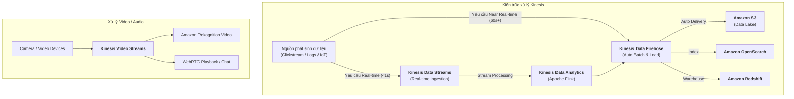

# Tài liệu đọc: So sánh các Dịch vụ trong Gia đình Amazon Kinesis (Differences Between Amazon Kinesis Services)

**Khóa học:** Course 2 - Architecting Solutions on AWS  
**Chủ đề:** Khảo sát chi tiết 4 thành viên thuộc họ dịch vụ Amazon Kinesis (Streams, Firehose, Analytics, Video Streams)  
**Vị trí:** Module 2 - Designing a serverless data analytics solution on AWS

---

## 1. Tổng quan về Amazon Kinesis Family
Họ dịch vụ **Amazon Kinesis** giúp thu nạp, xử lý và phân tích dữ liệu luồng (*streaming data*) theo thời gian thực ở mọi quy mô (từ video, audio, application logs, website clickstreams, đến IoT telemetry).

---

## 2. Bảng so sánh 4 Dịch vụ Amazon Kinesis

| Tiêu chí | Amazon Kinesis Data Streams | Amazon Kinesis Data Firehose | Amazon Kinesis Data Analytics | Amazon Kinesis Video Streams |
| :--- | :--- | :--- | :--- | :--- |
| **Vai trò chính** | Thu nạp & Đệm luồng dữ liệu thời gian thực (Custom streaming buffer). | Nạp luồng dữ liệu tự động vào Data Lake/Data Store (Data loader). | Xử lý & Phân tích luồng dữ liệu trực tiếp bằng **Apache Flink** / SQL. | Thu nạp, lưu trữ và xử lý luồng **Video & Âm thanh**. |
| **Độ trễ (Latency)** | **Dưới 1 giây (< 1s)** *Milliseconds* (Real-time). | **60 giây - 900 giây** *Near real-time* (do cơ chế gom lô Buffer). | **Thời gian thực** *Sub-second* streaming processing. | **Thời gian thực** *Sub-second* video streaming. |
| **Độ phức tạp vận hành** | Cần quản lý Shards & viết code cho **Producer / Consumer** (dùng KCL, Lambda,...). | **Serverless / Zero-Admin** Tự động nạp, không cần viết Consumer code. | **Serverless** Tự động co giãn theo dung lượng ứng dụng Flink. | **Fully Managed** Tự động mở rộng hạ tầng cho hàng triệu thiết bị camera. |
| **Tích hợp đích đến (Destinations)** | Bất kỳ ứng dụng custom consumer nào đọc từ Stream. | Amazon S3, Redshift, OpenSearch, HTTP Endpoints, Datadog, Splunk,... | Kinesis Data Streams, Firehose, S3, OpenSearch,... | Amazon Rekognition Video, TensorFlow, OpenCV, WebRTC playback. |
| **Khả năng biến đổi (Transformation)** | Tự phát triển code xử lý ở tầng Consumer. | Tích hợp sẵn với **AWS Lambda** để làm sạch/nén/đổi định dạng trước khi ghi. | Xử lý phức tạp với Windowing, Joins, Aggregations trên luồng dữ liệu. | Trích xuất khung hình, phân tích khuôn mặt/vật thể theo thời gian thực. |
| **Tình huống sử dụng tiêu biểu** | Real-time Dashboard, định giá động (Dynamic Pricing), phát hiện gian lận tức thì. | Nạp dữ liệu Clickstream vào **S3 Data Lake**, lưu trữ log vào OpenSearch. | Thống kê số liệu trượt (Sliding window metrics), cảnh báo ngưỡng tức thì. | Camera giám sát an ninh thông minh, đàm thoại video 2 chiều qua WebRTC. |

---

## 3. Sơ đồ kiến trúc luồng dữ liệu giữa các dịch vụ Kinesis

---

## 4. Bài học rút ra cho Tình huống Khách hàng tuần 2
* **Kinesis Data Streams:** Cung cấp quyền kiểm soát tối đa (*Control*) và độ trễ cực thấp, nhưng đòi hỏi công sức lập trình và vận hành cao.
* **Kinesis Data Firehose:** Cung cấp sự tiện lợi tối đa (*Convenience*), không đòi hỏi kiến thức chuyên sâu về Big Data, tự động gom lô và nạp thẳng vào **Amazon S3** $\rightarrow$ Đây là lựa chọn hoàn hảo cho đội ngũ nhân sự mỏng của khách hàng.
