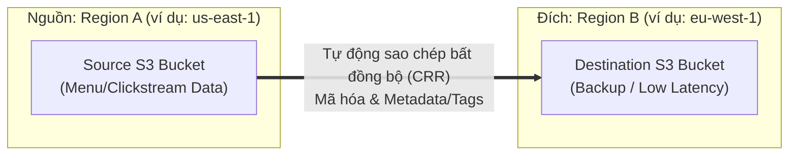
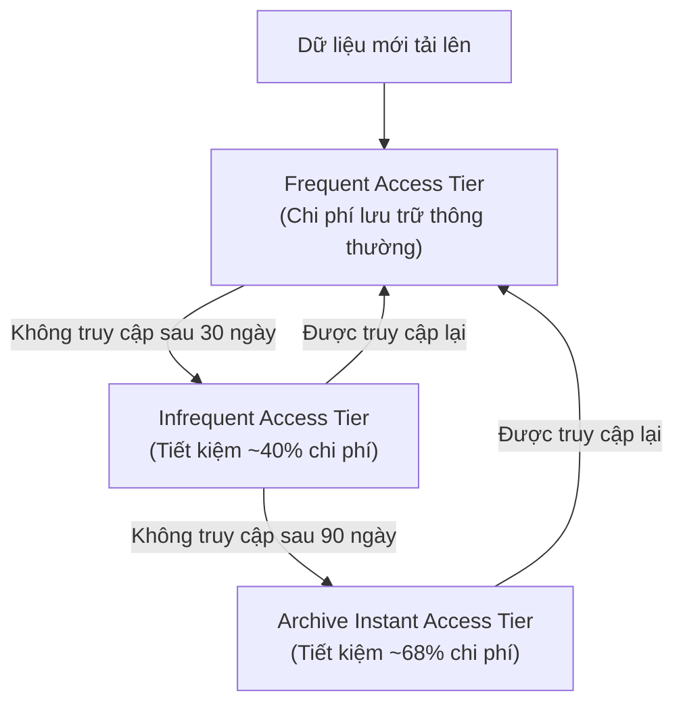

# Tài liệu đọc: Sao lưu Đa Vùng & Quản lý Vòng đời Đối tượng trên Amazon S3 (S3 CRR & Object Lifecycle)

**Khóa học:** Course 2 - Architecting Solutions on AWS  
**Chủ đề:** Cơ chế S3 Cross-Region Replication (CRR), S3 Lifecycle Policies và S3 Intelligent-Tiering  
**Vị trí:** Module 2 - Designing a serverless data analytics solution on AWS

---

## 1. Amazon S3 Cross-Region Replication (CRR)

### A. Bản chất kỹ thuật
* **CRR (Cross-Region Replication):** Tự động nhân bản các đối tượng (objects), metadata và thẻ gắn (tags) từ một S3 bucket nguồn sang một hoặc nhiều S3 bucket đích ở các **AWS Region khác nhau**.
* **Phạm vi cấu hình linh hoạt:**
  * Toàn bộ bucket (*Bucket level*).
  * Theo tiền tố thư mục (*Shared prefix level*, ví dụ: `logs/` hoặc `raw-data/`).
  * Theo thẻ đối tượng (*Object tag level*).

### B. Các tình huống sử dụng tiêu biểu (Use Cases)
1. **Tuân thủ quy định & Pháp lý (Compliance):** Đáp ứng yêu cầu pháp luật về việc lưu trữ bản sao dữ liệu cách xa hàng trăm hoặc hàng ngàn dặm (vượt ra ngoài phạm vi 1 Region).
2. **Khắc phục thảm họa (Disaster Recovery - DR):** Đảm bảo an toàn dữ liệu khi toàn bộ một Region gặp sự cố lớn.
3. **Giảm độ trễ truy cập (Latency Performance):** Đặt bản sao dữ liệu gần hơn về mặt địa lý với người dùng hoặc hệ thống ở các châu lục khác.
4. **Bảo vệ chống mất mát/xóa nhầm:** Cho phép đổi quyền sở hữu (*Account Ownership*) của bản sao sang tài khoản AWS khác để chống lại việc tài khoản nguồn bị xâm nhập hoặc xóa nhầm.

---

## 2. Quản lý Vòng đời Đối tượng (Amazon S3 Lifecycle)

* **Khái niệm:** Thiết lập các quy tắc tự động (**Lifecycle Rules**) để chuyển đổi lớp lưu trữ (*Transition*) hoặc xóa đối tượng khi hết hạn (*Expiration*) dựa trên tuổi thọ của tệp.
* **Ví dụ quy trình tối ưu chi phí theo thời gian:**
  $$\text{S3 Standard (30 ngày)} \xrightarrow{\text{Transition}} \text{S3 Standard-IA (90 ngày)} \xrightarrow{\text{Transition}} \text{S3 Glacier Flexible Retrieval (Archive)} \xrightarrow{\text{Expire}} \text{Xóa}$$

---

## 3. Lớp lưu trữ S3 Intelligent-Tiering (Tự động tối ưu chi phí)

> [!TIP]
> **Giải pháp cho bài toán không xác định được tần suất truy cập:**  
> Nếu bạn **chưa rõ hoặc không thể đoán trước** mô hình truy cập dữ liệu (*unpredictable/unknown access patterns*), **S3 Intelligent-Tiering** là lựa chọn mặc định lý tưởng nhất cho Data Lake và Analytics.

### Các đặc điểm nổi bật của S3 Intelligent-Tiering:
* **Tự động 100%:** Tự động di chuyển dữ liệu giữa các tầng truy cập (Frequent, Infrequent, Archive Instant) khi tần suất truy cập thay đổi mà không làm gián đoạn hiệu năng.
* **Không mất phí truy xuất (NO retrieval charges):** Khác với S3 Standard-IA hay Glacier, Intelligent-Tiering không tính phí khi bạn đọc/truy xuất dữ liệu.
* **Chi phí:** Chỉ tính một khoản phí giám sát và tự động hóa rất nhỏ hàng tháng cho mỗi đối tượng.
* **Kích thước đối tượng:** Tự động tối ưu tốt nhất cho các tệp $\ge 128\text{ KB}$. Các tệp nhỏ hơn $128\text{ KB}$ vẫn được lưu trữ an toàn ở Frequent Access tier mà không bị tính phí giám sát.

---

## 4. Các lớp lưu trữ Amazon S3 Glacier (Data Archiving)
* Chuyên dụng cho việc lưu trữ dữ liệu lịch sử dài hạn (Data Archiving) với chi phí thấp nhất trên đám mây.
* Giữ nguyên độ bền dữ liệu **11 số 9 (99.999999999%)**.
* Cung cấp các tùy chọn truy xuất linh hoạt tùy theo mức độ khẩn cấp (từ vài phút đến vài giờ) để tiết kiệm tối đa ngân sách.
