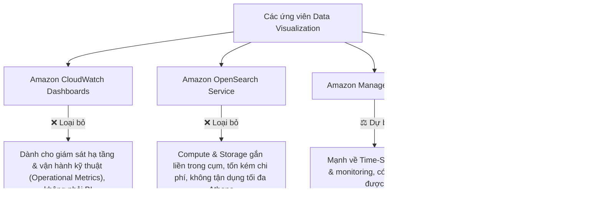
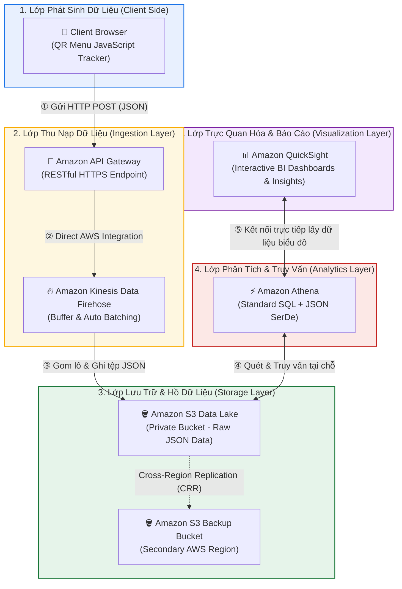

# Tóm tắt bài học: Trực quan hóa Dữ liệu (Visualizing the Data)

**Khóa học:** Course 2 - Architecting Solutions on AWS  
**Chủ đề:** Đánh giá các công cụ trực quan hóa dữ liệu (CloudWatch vs OpenSearch vs Grafana vs QuickSight) và hoàn thiện lớp BI  
**Vị trí:** Module 2 - Designing a serverless data analytics solution on AWS

---

## 1. Đánh giá và Loại trừ các giải pháp Trực quan hóa Dữ liệu

| Dịch vụ | Đặc tính & Định hướng sử dụng | Đánh giá theo yêu cầu khách hàng |
| :--- | :--- | :--- |
| **Amazon CloudWatch** | Giám sát tài nguyên AWS (CPU, RAM, số lượng S3 objects, alarms). | ❌ **Không phù hợp:** Dành cho SysAdmin quản trị vận hành, không phục vụ phân tích nghiệp vụ kinh doanh (BI). |
| **Amazon OpenSearch Service** | Tìm kiếm phân tán và phân tích log với OpenSearch Dashboards / Kibana. | ❌ **Không tối ưu chi phí:** Phải trả tiền duy trì cụm máy chủ và dung lượng lưu trữ gắn liền, phá vỡ tính độc lập của S3 Data Lake. |
| **Amazon Managed Grafana** | Nền tảng phân tích và biểu đồ trực quan hóa dữ liệu chuỗi thời gian (Time-Series). | ⚠️ **Khả thi:** Rất mạnh nhưng khách hàng chưa có sẵn kinh nghiệm sử dụng nội bộ. |
| **Amazon QuickSight** | Dịch vụ **Cloud-native Business Intelligence (BI)** hoàn toàn Serverless, tích hợp sẵn Machine Learning Insights. | ✅ **LỰA CHỌN SỐ 1:** Kết nối trực tiếp với **Amazon Athena**, tính phí theo lượng dùng/người dùng, không cần quản lý máy chủ. |

---

## 2. Cuộc gọi làm rõ Kỹ năng & Công cụ Hiện có (Tooling Clarification Call)

* **Vấn đề cần khảo sát:** Đội ngũ của khách hàng đã có kinh nghiệm sử dụng công cụ nào trong số các ứng viên khả thi?
* **Xác nhận từ khách hàng (Morgan):**
  * Đội ngũ BI của công ty **đang sử dụng Amazon QuickSight** cho hệ thống Sales Dashboard ở dự án khác.
  * Các chuyên viên phân tích đã rất quen thuộc với giao diện và tính năng của QuickSight.
* **Quyết định kiến trúc:** Chọn **Amazon QuickSight**.

> [!TIP]
> **Nguyên tắc thiết kế kiến trúc thực tế (Architectural Mindset):**  
> *"Sometimes the best service is the service that your team already knows how to use."*  
> (Đôi khi dịch vụ tối ưu nhất chính là dịch vụ mà đội ngũ của khách hàng đã biết cách sử dụng). Việc này giúp:
> 1. Tiết kiệm chi phí mua mới hoặc bản quyền riêng biệt.
> 2. Giảm tối đa thời gian đào tạo (*learning curve*).
> 3. Tăng tốc độ đưa tính năng vào khai thác thực tế (*Time-to-Market*).

---

## 3. Hoàn thiện Kiến trúc Phân tích Dữ liệu Toàn diện (Full End-to-End Architecture)

