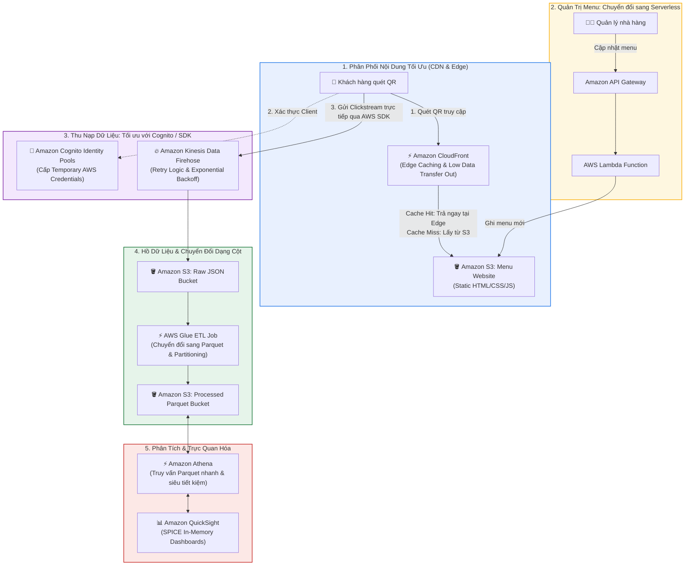

# Tóm tắt bài học: Tổng kết Tuần 2 - Nâng cấp Kiến trúc lên Tầm cao mới (Taking this Architecture to the Next Level)

**Khóa học:** Course 2 - Architecting Solutions on AWS  
**Chủ đề:** 6 đề xuất tối ưu hóa toàn diện về hiệu năng, chi phí, độ tin cậy và tự động hóa cho kiến trúc Data Analytics  
**Vị trí:** Module 2 - Designing a serverless data analytics solution on AWS

---

## 1. Tư duy Tối ưu hóa Kiến trúc Liên tục (Continuous Architecture Evolution)

> [!NOTE]
> **Triết lý của Solutions Architect:**  
> *"Rethinking current architectures should be a never-ending effort."*  
> (Đánh giá lại và tối ưu hóa kiến trúc là một nỗ lực không ngừng nghỉ). Các giải pháp kiến trúc cần được định kỳ xem xét lại khi có dịch vụ mới ra đời hoặc khi quy mô và yêu cầu kinh doanh của khách hàng thay đổi.

---

## 2. Sơ đồ Kiến trúc Nâng cấp Toàn diện (Optimized Architecture Diagram)

---

## 3. Chi tiết 6 Đề xuất Nâng cấp Kiến trúc

### 🔹 Đề xuất 1: Chuyển hệ thống Cập nhật Menu từ EC2 sang Serverless
* **Hiện trạng:** Hệ thống cập nhật menu chạy trên máy chủ EC2 hoạt động 24/7, gây lãng phí chi phí khi nhà hàng không sửa menu liên tục.
* **Nâng cấp:** Thay thế bằng **API Gateway + AWS Lambda + S3/DynamoDB**.
* **Lợi ích:** Chỉ trả tiền khi có quản lý nhà hàng thao tác cập nhật menu (*Zero Idle Cost*).

---

### 🔹 Đề xuất 2: Tăng tốc & Tiết kiệm chi phí với Amazon CloudFront (CDN)
* **Hiện trạng:** Trình duyệt người dùng tải trực tiếp tệp HTML menu từ Amazon S3.
* **Nâng cấp:** Đặt **Amazon CloudFront** làm lớp mạng phân phối nội dung phía trước S3 bucket.
* **Lợi ích:**
  * **Giảm độ trễ:** Lưu bộ nhớ đệm (*cache*) tại các điểm biên (*Edge Locations*) gần người dùng nhất.
  * **Giảm chi phí:** Chi phí truyền dữ liệu ra ngoài (*Data Transfer Out*) của CloudFront rẻ hơn S3, đồng thời giảm số lượng request trực tiếp vào S3 bucket.

---

### 🔹 Đề xuất 3: Tối giản Ingestion bằng Amazon Cognito + AWS JavaScript SDK
* **Hiện trạng:** Dùng API Gateway làm proxy chuyển tiếp HTTP POST từ client.
* **Nâng cấp:** Sử dụng **Amazon Cognito Identity Pools** cấp quyền tạm thời cho AWS JavaScript SDK trên trình duyệt để gọi trực tiếp API `PutRecord` vào Kinesis Data Firehose.
* **Lợi ích:** Loại bỏ hoàn toàn chi phí và công sức quản lý Amazon API Gateway.

---

### 🔹 Đề xuất 4: Triển khai Hạ tầng bằng Mã (IaC) với AWS CloudFormation
* **Nâng cấp:** Đóng gói toàn bộ kiến trúc thành các mẫu **AWS CloudFormation Templates**.
* **Lợi ích:**
  * Tự động hóa triển khai, loại bỏ lỗi cấu hình thủ công.
  * Hỗ trợ chiến lược **Multi-Account**: Dễ dàng nhân bản hạ tầng sang các tài khoản AWS độc lập cho từng chuỗi nhà hàng lớn (giúp tách biệt chi phí hóa đơn và quản trị bảo mật).

---

### 🔹 Đề xuất 5: Xử lý Thử lại Thông minh (Retry Logic & Exponential Backoff)
* **Thách thức:** Khi mạng internet hoặc điểm tiếp nhận gặp sự cố gián đoạn tạm thời, client không nên gửi dồn dập request liên tục gây tắc nghẽn.
* **Nâng cấp:** Cài đặt cơ chế **Exponential Backoff with Jitter** (tăng dần thời gian chờ sau mỗi lần thử lại).
* **Lợi ích:** AWS JavaScript SDK đã tích hợp sẵn cơ chế này giúp tăng độ bền vững (*resiliency*) của client.

---

### 🔹 Đề xuất 6: Tối ưu hóa Dữ liệu cho Athena (Columnar Parquet & Partitioning)
* **Hiện trạng:** Athena truy vấn trực tiếp trên các tệp JSON thô.
* **Nâng cấp:** Chuyển đổi dữ liệu sang định dạng cột **Apache Parquet** (kèm nén Snappy) và phân vùng theo thời gian `year/month/day`.
* **Lợi ích:**
  * Giảm tới **80 - 90% dung lượng dữ liệu quét qua**.
  * Tăng tốc độ thực thi truy vấn lên gấp nhiều lần và giảm chi phí truy vấn Athena tối đa.
