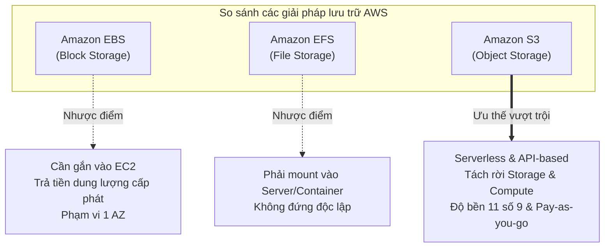

# Tóm tắt bài học: Tại sao chọn Amazon S3 cho Lưu trữ Dữ liệu? (Why Amazon S3 for Storage?)

**Khóa học:** Course 2 - Architecting Solutions on AWS  
**Chủ đề:** So sánh các dịch vụ lưu trữ AWS (EBS vs EFS vs S3) và lý do lựa chọn Amazon S3 làm Data Lake  
**Vị trí:** Module 2 - Designing a serverless data analytics solution on AWS

---

## 1. So sánh 3 dịch vụ lưu trữ cốt lõi trên AWS

| Tiêu chí | Amazon EBS (Block Storage) | Amazon EFS (File Storage) | Amazon S3 (Object Storage) |
| :--- | :--- | :--- | :--- |
| **Bản chất** | Ổ đĩa khối (Block level) | Hệ thống tệp chia sẻ (NFS/POSIX) | Lưu trữ đối tượng qua Internet (Object via REST API) |
| **Gắn kết hạ tầng** | ❌ **Bắt buộc gắn vào 1 EC2 instance** | ❌ **Phải mount vào EC2 / Container / Server** | ✅ **Độc lập hoàn toàn (Standalone layer)** |
| **Giao thức truy cập** | Block I/O qua bus hệ thống | Giao thức tệp mạng NFS | API cuộc gọi HTTP/HTTPS (`PutObject`, `GetObject`, v.v.) |
| **Độ bền dữ liệu (Durability)** | Trong phạm vi 1 Availability Zone (AZ) | Đa AZ trong 1 Region | **99.999999999% (11 số 9)** trên nhiều AZ vật lý |
| **Mô hình tính phí** | Trả theo dung lượng cấp phát (*Provisioned size*, ví dụ tạo 50GB dùng 2GB vẫn trả 50GB) | Trả theo dung lượng tệp lưu trữ | **Pay-per-refined-use** (Lưu 5MB trả 5MB, lưu 1PB trả 1PB) |
| **Đánh giá kiến trúc** | ❌ Không phù hợp cho Data Analytics độc lập | ❌ Không đáp ứng kiến trúc Serverless phi máy chủ | ✅ **Lựa chọn tối ưu nhất (The Chosen One)** |

---

## 2. Lợi thế cốt lõi của Amazon S3 trong kiến trúc Data Analytics

### 💡 Tách rời Lưu trữ và Xử lý (Decoupling Storage from Processing)
* **Khái niệm:** Lớp lưu trữ tồn tại độc lập, không bị ràng buộc vào bất kỳ cụm máy chủ xử lý dữ liệu nào.
* **Lợi ích:**
  * Cho phép nhiều công cụ thu nạp (API Gateway, Kinesis) và xử lý (Athena, Glue, Spark) cùng truy cập vào một nguồn dữ liệu duy nhất mà không gây nghẽn.
  * Thể hiện đúng nguyên tắc *"Use the right tool for the job"* — thay đổi hoặc nâng cấp công cụ phân tích mà không cần di chuyển dữ liệu.
  * Là nền tảng tiêu chuẩn xây dựng **Data Lake** trên đám mây.

---

## 3. Đối chiếu Amazon S3 với 5 yêu cầu của Khách hàng

| Yêu cầu của Khách hàng | Khả năng đáp ứng của Amazon S3 | Trạng thái |
| :--- | :--- | :---: |
| **1. Độ bền dữ liệu (Durability)** | Thiết kế đạt chuẩn **11 số 9 (99.999999999%)** nhờ tự động phân tán đối tượng qua nhiều trung tâm dữ liệu độc lập trong Region. | ✅ Đạt |
| **2. Sao lưu đa vùng (Cross-Region Backup)** | Hỗ trợ tính năng **S3 Cross-Region Replication (CRR)** tự động sao chép đối tượng sang bucket ở Region khác. | ✅ Đạt |
| **3. Mã hóa dữ liệu (Encryption)** | Hỗ trợ mã hóa cả **In-Transit** (bắt buộc HTTPS/TLS) và **At-Rest** (SSE-S3 / AWS KMS) mặc định không tốn thêm chi phí. | ✅ Đạt |
| **4. Tối ưu chi phí theo lượng dùng (Pay-per-use)** | Chỉ tính tiền đúng dung lượng dữ liệu lưu trữ thực tế. Hỗ trợ **S3 Intelligent-Tiering** tự động tối ưu chi phí theo tần suất truy cập. | ✅ Đạt |
| **5. Không quản trị máy chủ (Serverless / Managed)** | Dịch vụ Fully Managed hoàn toàn, không có EC2, không quản trị OS, vận hành 100% qua API. | ✅ Đạt |
