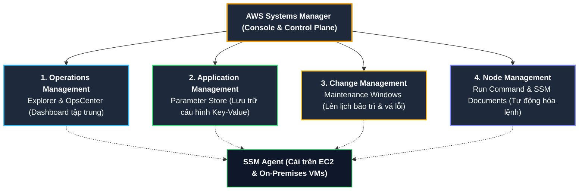
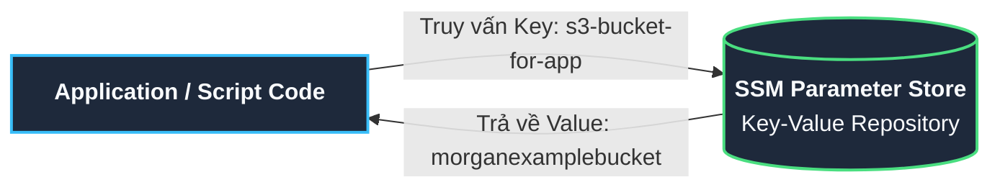
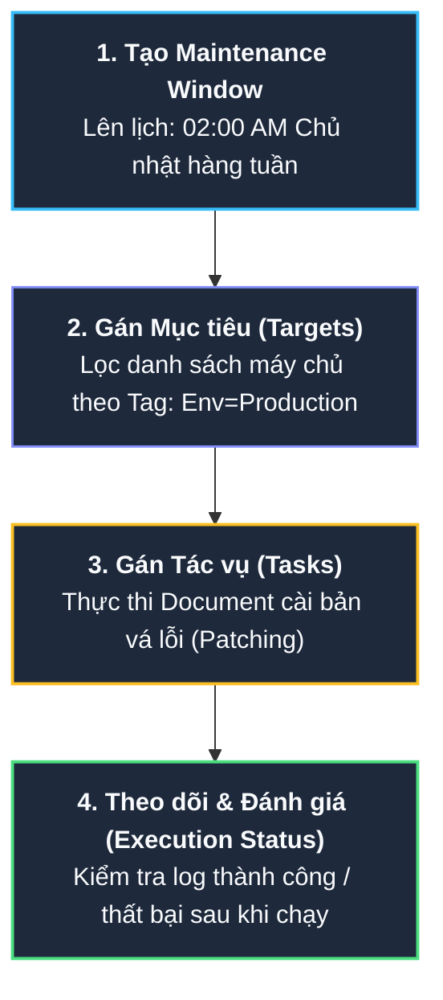

# Tóm tắt bài học: Thực hành Khám phá AWS Systems Manager Console (AWS Systems Manager Exploration)

**Khóa học:** Course 2 - Architecting Solutions on AWS  
**Chủ đề:** Hướng dẫn thực hành khám phá các tính năng quản trị vận hành cốt lõi của AWS Systems Manager (SSM)  
**Vị trí:** Module 3 - Designing a hybrid solution for container based workloads on AWS

---

## 1. Tổng quan Kiến trúc AWS Systems Manager (SSM)

AWS Systems Manager là bộ công cụ quản lý và vận hành tập trung an toàn, hỗ trợ quy mô lớn cho cả tài nguyên trên **AWS Cloud** và **môi trường Hybrid (On-Premises)**.

> [!IMPORTANT]
> **SSM Agent:** Để một máy chủ (EC2 Instance trên Cloud hoặc Máy ảo On-Premises) có thể được quản lý bởi Systems Manager, bắt buộc phải có tiến trình **SSM Agent** được cài đặt và đang chạy trên hệ điều hành đó.

---

## 2. Chi tiết 4 Tính năng Cốt lõi được Demo trên AWS Console

### A. Operations Management - Explorer & OpsCenter
* **Mục đích:** Tạo trang tổng quan giám sát vận hành (*Customizable Operational Dashboards*).
* **Khả năng:** Tổng hợp dữ liệu hoạt động (**OpsData**) và các sự cố cần xử lý (**OpsItems**) xuyên suốt nhiều tài khoản AWS (**AWS Accounts**) và nhiều khu vực (**AWS Regions**).
* **Giá trị:** Cung cấp góc nhìn toàn cảnh về tình trạng sức khỏe hạ tầng cho đội ngũ vận hành.

---

### B. Application Management - Parameter Store

* **Mục đích:** Lưu trữ các thông số cấu hình dưới dạng cặp **Key-Value**, tách rời hoàn toàn dữ liệu cấu hình ra khỏi mã nguồn (*externalize configurations*).
* **Lợi ích:** Tránh việc hardcode các giá trị hằng số (như tên S3 bucket, Database endpoint, URL service) trong code; khi cấu hình thay đổi, không cần phải build hoặc redeploy lại toàn bộ ứng dụng.
* **Các loại Parameter (Data Types):**
  1. **String:** Dữ liệu chuỗi văn bản thông thường (ví dụ: tên bucket `morganexamplebucket`).
  2. **StringList:** Danh sách các chuỗi phân cách bởi dấu phẩy.
  3. **SecureString:** Dữ liệu chuỗi nhạy cảm được tự động **mã hóa bởi AWS KMS** (khuyến nghị cho API tokens, passwords; có thể kết hợp thêm cùng *AWS Secrets Manager*).

---

### C. Change Management - Maintenance Windows

* **Mục đích:** Lên lịch định kỳ và tự động thực thi các tác vụ bảo trì (vá lỗi hệ điều hành, cập nhật phần mềm) trên quy mô toàn bộ máy chủ (*fleet*).
* **Quy trình cấu hình:**
  1. Thiết lập khung thời gian bảo trì (thời gian bắt đầu, thời lượng chạy, thời gian ngắt).
  2. Chọn tập hợp máy chủ đích (*targets*) dựa trên Tags hoặc SSM Agent IDs.
  3. Chỉ định tài liệu tác vụ bảo trì (*SSM Task/Document*).
  4. Xem lại báo cáo trạng thái hoàn thành sau khi khung giờ bảo trì kết thúc.

---

### D. Node Management - Run Command & SSM Documents

* **Mục đích:** Thực thi lệnh/script từ xa trên hàng loạt máy chủ mà **không cần mở cổng SSH/RDP** và không cần đăng nhập thủ công từng máy.
* **SSM Documents:** Là các file cấu hình định dạng **JSON** hoặc **YAML** định nghĩa chuỗi các hành động thực thi (PowerShell trên Windows, Shell Script trên Linux).
  * **AWS Predefined Documents:** Tài liệu do AWS cung cấp sẵn (ví dụ: `AWS-ConfigureWindowsUpdate` dùng để bật/tắt tính năng tự động cập nhật Windows Update).
  * **Custom Documents:** Cho phép tự viết script nghiệp vụ tùy chỉnh của doanh nghiệp để triển khai tự động.

---

## 3. Tổng kết Các Dịch vụ Phụ trợ Quan trọng trong Systems Manager

| Tính năng trong SSM | Chức năng chính | Ứng dụng thực tế cho Doanh nghiệp |
| :--- | :--- | :--- |
| **Run Command** | Chạy lệnh từ xa quy mô lớn không cần SSH/RDP. | Cập nhật cấu hình phần mềm đồng loạt trên hàng trăm server. |
| **Parameter Store** | Quản lý tham số cấu hình Key-Value bảo mật. | Lưu trữ biến môi trường, tên S3 bucket, DB Connection strings. |
| **Maintenance Windows** | Lên lịch bảo trì tự động vào giờ thấp điểm. | Tự động hóa lịch cập nhật hệ điều hành và reboot định kỳ. |
| **Session Manager** | Cung cấp giao diện dòng lệnh trực tiếp trên trình duyệt. | Truy cập terminal máy chủ an toàn mà không cần mở port 22/3389 qua Internet. |
| **Patch Manager** | Quản lý quy trình quét và vá lỗi bảo mật OS. | Đảm bảo tuân thủ tiêu chuẩn an toàn thông tin doanh nghiệp. |
