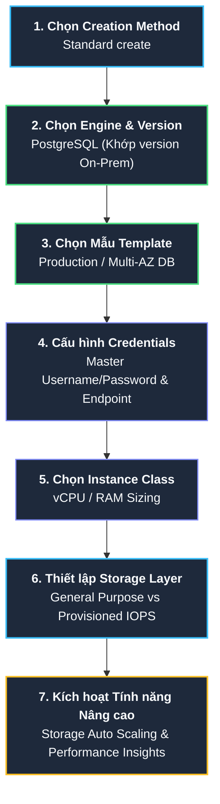

# Tóm tắt bài học: Thực hành Khám phá Amazon RDS Console (Amazon RDS Exploration)

**Khóa học:** Course 2 - Architecting Solutions on AWS  
**Chủ đề:** Hướng dẫn từng bước cấu hình và khởi tạo Database Instance trên giao diện quản trị Amazon RDS  
**Vị trí:** Module 3 - Designing a hybrid solution for container based workloads on AWS

---

## 1. Quy trình Cấu hình và Khởi tạo Database trên AWS Console

---

## 2. Chi tiết các Bước Cấu hình Cốt lõi

### Bước 1: Phương thức khởi tạo (Database creation method)
* **Standard create:** Cung cấp đầy đủ tất cả các tùy chọn cấu hình về mạng, bảo mật, sao lưu và tính sẵn sàng cao (Khuyến nghị cho môi trường doanh nghiệp).
* **Easy create:** Sử dụng các cấu hình mặc định được định hình sẵn của AWS.

### Bước 2: Lựa chọn Database Engine & Phiên bản (Engine Options)
* **Các Engine hỗ trợ:** Amazon Aurora, MySQL, MariaDB, **PostgreSQL**, Oracle, Microsoft SQL Server.
* **Lựa chọn cho AnyCompany:** Chọn **PostgreSQL**.
* > [!TIP]
  > **Best Practice về Phiên bản (Engine Version):** Khi mới bắt đầu di chuyển lên Cloud, nên chọn **chính xác phiên bản (version)** của PostgreSQL đang chạy tại On-Premises để đảm bảo tính tương thích tuyệt đối của schema, cú pháp SQL và các hàm mở rộng (*extensions*).

### Bước 3: Mẫu Triển khai & Tính sẵn sàng (Templates & Availability)
* **Templates:** Hỗ trợ 3 mẫu: *Production*, *Dev/Test*, và *Free Tier*.
* **Cấu hình Multi-AZ:**
  * Ở mẫu *Production*, chọn **Multi-AZ DB Instance** (triển khai 1 Primary và 1 Standby ở 2 AZs khác nhau) để đảm bảo High Availability và tự động Failover.
  * Mẫu *Free Tier* sẽ khóa tính năng Multi-AZ và chỉ cho phép chạy Single-AZ instance.

### Bước 4: Định danh & Thông tin Xác thực (Settings & Credentials)
* **DB instance identifier:** Tên định danh duy nhất của database instance trên AWS console (ví dụ: `database-1`).
* **Master username & Password:** Tài khoản quản trị cao nhất dùng để kết nối qua các công cụ DB Client (như *pgAdmin, DBeaver, psql*) nhằm tạo bảng, nạp schema và cấp quyền cho các ứng dụng.

### Bước 5: Lớp Phiên bản Máy chủ (DB Instance Class)
* Cho phép chọn cấu hình tài nguyên phần cứng (vCPU và RAM):
  * **Standard classes:** Dòng máy chủ cân bằng tài nguyên (ví dụ dòng `db.m5`, `db.m6g`).
  * **Memory Optimized classes:** Tối ưu hóa bộ nhớ cho cơ sở dữ liệu lớn (ví dụ dòng `db.r5`, `db.r6g`).
  * **Burstable classes:** Dòng tiết kiệm chi phí, có khả năng tăng đột biến hiệu năng khi cần (ví dụ dòng `db.t3`, `db.t4g`).

---

## 3. Cấu hình Tầng Lưu trữ (Storage Layer & Storage Types)

Tầng lưu trữ của Amazon RDS được vận hành trên hạ tầng ổ đĩa **Amazon EBS (Elastic Block Store)**:

| Loại ổ đĩa (Storage Type) | Đặc tính hiệu năng | Trường hợp sử dụng |
| :--- | :--- | :--- |
| **General Purpose SSD (gp2 / gp3)** | Hiệu năng cân bằng, chi phí hợp lý. IOPS cơ bản phụ thuộc vào dung lượng ổ đĩa. | Phù hợp với hầu hết các khối lượng công việc thông thường và môi trường Dev/Test. |
| **Provisioned IOPS SSD (io1 / io2)** | Tùy chỉnh thông lượng và IOPS đọc/ghi cực cao, độ trễ đĩa thấp và ổn định. | Dành cho các ứng dụng Production có tần suất giao dịch (OLTP) nặng, đọc/ghi liên tục. |
| **Magnetic Storage** | Ổ đĩa từ tính truyền thống, IOPS thấp nhất nhưng chi phí rẻ nhất. | Khối lượng công việc cũ, truy cập không thường xuyên hoặc dữ liệu lưu trữ tạm. |

### Tính năng mở rộng dung lượng tự động (Storage Auto Scaling)
* Tự động tăng dung lượng ổ cứng khi lưu lượng sử dụng đạt tới ngưỡng giới hạn cấu hình trước (*threshold*).
* Giúp ngăn chặn triệt để sự cố ứng dụng bị treo do cơ sở dữ liệu bị tràn đĩa (*Storage Full*).

---

## 4. Giám sát & Quản trị Nâng cao (Monitoring & Performance Insights)

* **Amazon RDS Performance Insights:**
  * Tính năng giám sát tải của cơ sở dữ liệu theo thời gian thực (*Database Load Monitoring*).
  * Giúp phân tích sâu nguyên nhân gây nghẽn: xác định câu lệnh SQL nào đang chiếm nhiều tài nguyên nhất, user nào đang tạo nhiều kết nối, hoặc ứng dụng đang phải chờ tài nguyên (Wait Events) ở đâu.
  * Giúp kiến trúc sư và DBA chẩn đoán và khắc phục nhanh chóng các vấn đề hiệu năng mà không cần cài đặt thêm công cụ bên thứ ba.

---

## 5. Kết nối Sau khi Khởi tạo (Post-Creation Connectivity)

Sau khi quá trình khởi tạo hoàn tất (thường mất từ 3 - 5 phút):
1. AWS RDS sẽ cung cấp một **Endpoint** (chuỗi ký tự DNS ví dụ: `database-1.cxxxxxxxx.ap-southeast-1.rds.amazonaws.com`).
2. Quản trị viên kết nối đến Endpoint qua Port mặc định `5432` (đối với PostgreSQL).
3. Thực hiện nạp Schema, cấu hình Security Group (chỉ mở port cho EC2 Container Subnet) và khởi chạy tiến trình di chuyển dữ liệu (AWS DMS).
