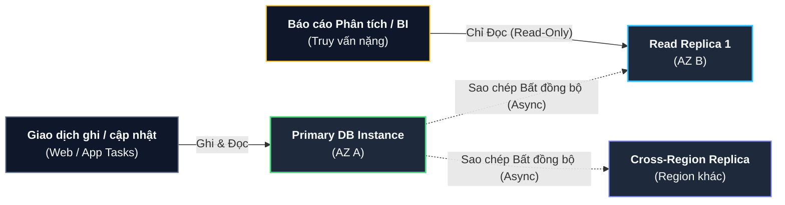
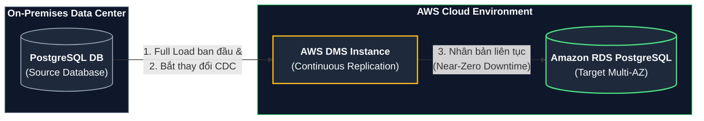
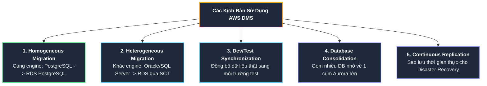

# Tóm tắt bài học: Dịch vụ Cơ sở Dữ liệu Quan hệ Amazon RDS (Amazon Relational Database Service)

**Khóa học:** Course 2 - Architecting Solutions on AWS  
**Chủ đề:** Thiết kế giải pháp lưu trữ dữ liệu với Amazon RDS for PostgreSQL, kiến trúc Multi-AZ, Read Replicas và quy trình di chuyển dữ liệu không gián đoạn bằng AWS DMS  
**Vị trí:** Module 3 - Designing a hybrid solution for container based workloads on AWS

---

## 1. Lựa chọn Cơ sở Dữ liệu: Amazon RDS for PostgreSQL
* **Hiện trạng & Yêu cầu:** Khách hàng AnyCompany Insurance đang chạy cơ sở dữ liệu quan hệ **PostgreSQL** tại trung tâm dữ liệu On-Premises. Dự án yêu cầu di chuyển lên AWS với tiêu chí **độ sẵn sàng cao (High Availability), chịu lỗi (Fault Tolerance) và giữ nguyên mã nguồn ứng dụng**.
* **Dịch vụ được chọn:** **Amazon Relational Database Service (Amazon RDS)** với PostgreSQL Engine.
* **Lợi ích:** Dịch vụ cơ sở dữ liệu quản lý toàn phần (Managed Database), tự động hóa các tác vụ quản trị hạ tầng (cài đặt, sao lưu, vá lỗi hệ điều hành) trong khi vẫn tương thích 100% với PostgreSQL native.

---

## 2. Kiến trúc Độ sẵn sàng cao: RDS Multi-AZ Deployment

```mermaid
flowchart LR
    App["<b>Ứng dụng Container</b><br/>(Private Subnet)"] -->|"Kết nối DNS Endpoint duy nhất"| Primary["<b>Primary DB Instance</b><br/>(AZ A - Read/Write)"]
    Primary ==="Sao chép Đồng bộ (Sync)"=== Standby["<b>Standby DB Instance</b><br/>(AZ B - Dự phòng)"]
    App -.->|"Tự động Failover qua DNS<br/>khi Primary lỗi"| Standby

    style App fill:#0f172a,stroke:#64748b,stroke-width:1.5px,color:#f8fafc;
    style Primary fill:#1e293b,stroke:#4ade80,stroke-width:2px,color:#f8fafc;
    style Standby fill:#1e293b,stroke:#fbbf24,stroke-width:2px,color:#f8fafc;
```

### A. Vấn đề của Single-AZ Instance
* Một DB instance đơn lẻ khi gặp sự cố phần cứng hoặc lỗi hệ thống sẽ không có cơ chế tự động phục hồi tức thì, dẫn đến gián đoạn dịch vụ (*downtime*).

### B. Cơ chế hoạt động của Multi-AZ Deployment
* **Khởi tạo 2 DB Instances tại 2 Availability Zones khác nhau:**
  * **Primary DB Instance (AZ A):** Tiếp nhận toàn bộ lưu lượng Đọc và Ghi (Read/Write).
  * **Standby / Secondary DB Instance (AZ B):** Bản sao dự phòng được đồng bộ hóa dữ liệu thời gian thực (*Synchronous Replication*).
* **Cơ chế Chuyển đổi Dự phòng Tự động (Automated Failover qua DNS):**
  * Ứng dụng chỉ kết nối tới cơ sở dữ liệu thông qua một **DNS Endpoint duy nhất**.
  * Khi Primary instance bị lỗi, AWS tự động kích hoạt quá trình Failover:
    1. Bản ghi DNS tự động cập nhật để trỏ Endpoint sang Standby instance tại AZ B.
    2. Standby instance được nâng cấp lên thành Primary instance mới.
  * **Ưu điểm:** **Không cần thay đổi chuỗi kết nối (Connection String) hay mã nguồn ứng dụng**. Toàn bộ quá trình diễn ra tự động trong vài phút.

---

## 3. Tối ưu Hiệu năng Truy vấn với Read Replicas



* **Vấn đề:** Các báo cáo Business Intelligence (BI) hoặc truy vấn phức tạp (*Complex SQL Queries*) tiêu tốn lượng lớn tài nguyên CPU/RAM, có thể gây nghẽn và làm chậm các giao dịch nghiệp vụ chính trên Primary DB.
* **Giải pháp Read Replicas (Bản sao chỉ đọc):**
  * Dữ liệu từ Primary DB được sao chép bất đồng bộ (*Asynchronous Replication*) sang các bản sao Read Replica.
  * Phân tách lưu lượng: Định tuyến toàn bộ báo cáo phân tích và truy vấn nặng sang Read Replica, giải phóng tài nguyên cho Primary DB.
  * Hỗ trợ tạo nhiều bản sao trong cùng Region hoặc khác Region (**Cross-Region Read Replicas**) để phục vụ người dùng toàn cầu hoặc tăng cường khả năng phục hồi thảm họa (Disaster Recovery).

---

## 4. Di chuyển Dữ liệu Không Gián đoạn với AWS Database Migration Service (AWS DMS)

### Sơ đồ quy trình đồng bộ dữ liệu liên tục:



### Các kịch bản sử dụng chính của AWS DMS:



1. **Di chuyển cùng loại cơ sở dữ liệu (Homogeneous Migration):**
   * Trường hợp của AnyCompany Insurance: Di chuyển từ PostgreSQL On-Premise sang Amazon RDS for PostgreSQL. Đây là phương án đơn giản, trực tiếp và giữ nguyên cấu trúc schema/code.
2. **Di chuyển khác loại cơ sở dữ liệu (Heterogeneous Migration):**
   * Chuyển đổi giữa các loại DB khác nhau (ví dụ: Oracle $\rightarrow$ PostgreSQL). Cần sử dụng công cụ **AWS Schema Conversion Tool (AWS SCT)** để tự động dịch schema, stored procedures, và mã nguồn trước khi dùng DMS đồng bộ dữ liệu.
3. **Đồng bộ môi trường Dev/Test với Production:** Giữ dữ liệu môi trường kiểm thử luôn đồng bộ với dữ liệu thực tế.
4. **Hợp nhất Cơ sở dữ liệu (Database Consolidation):** Tập trung nhiều cơ sở dữ liệu rời rạc về một cụm Amazon Aurora duy nhất.
5. **Sao chép Dữ liệu Liên tục (Continuous Replication / DR):** Dự phòng thảm họa giữa on-premises, EC2 và RDS.

---

## 5. Cập nhật Sơ đồ Kiến trúc Giải pháp

| Khối thành phần | Dịch vụ AWS | Vị trí / Cấu hình |
| :--- | :--- | :--- |
| **Kết nối mạng** | **AWS Direct Connect** | Cầu nối chuyên dụng giữa Data Center On-Premises và AWS VPC. |
| **Điều phối Container** | **Amazon ECS** | Quản lý vòng đời cụm container. |
| **Nền tảng tính toán** | **Amazon EC2 (Multi-AZ)** | Chạy container workloads trong Private Subnet (hỗ trợ SSH và Custom AMI). |
| **Định tuyến Internet** | **NAT Gateway (Multi-AZ)** | Cho phép EC2 tải thư viện/User Data scripts an toàn ra Internet. |
| **Cơ sở dữ liệu** | **Amazon RDS for PostgreSQL** | Triển khai **Multi-AZ** trong Private Subnet để đạt độ sẵn sàng cao tối đa. |
| **Công cụ Di chuyển DB** | **AWS DMS** | Kết nối trực tiếp qua Direct Connect để đồng bộ dữ liệu liên tục On-Premises $\rightarrow$ RDS. |
