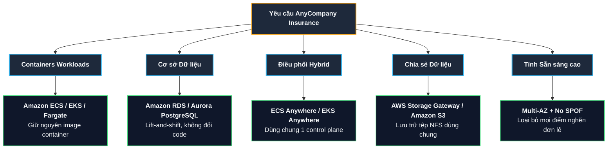

# Tóm tắt bài học: Customer #3 - Requirements Breakdown

**Khóa học:** Course 2 - Architecting Solutions on AWS  
**Chủ đề:** Phân tích, bóc tách và định hướng kiến trúc từ yêu cầu của AnyCompany Insurance  
**Vị trí:** Module 3 - Designing a hybrid solution for container based workloads on AWS

---

## 1. Tổng quan hiện trạng khách hàng (Current State Summary)
* **Ứng dụng:** Đang vận hành toàn bộ dưới dạng **Containers** tại trung tâm dữ liệu On-Premises.
* **Cơ sở dữ liệu:** Chạy hệ quản trị cơ sở dữ liệu quan hệ **PostgreSQL** trên On-Premises (không đóng gói container).
* **Tiến độ hợp đồng Data Center:**
  * **50% hệ thống** thuộc các trung tâm dữ liệu hết hạn hợp đồng $\rightarrow$ Cần di chuyển sang AWS ngay.
  * **50% hệ thống** còn lại tiếp tục chạy On-Premises cho đến khi hết hạn hợp đồng, sau đó cũng sẽ được chuyển dịch toàn bộ lên AWS.
  * $\rightarrow$ **Mô hình Hybrid Cloud tạm thời trong vài năm.**

---

## 2. Bóc tách 6 yêu cầu kỹ thuật & Góc nhìn của Solutions Architect

### 📌 Yêu cầu 1: Triển khai & Vận hành Container trên AWS (Container Execution)
* **Phân tích:** Khách hàng muốn tiếp tục sử dụng container trên AWS. Bản chất của container có tính linh hoạt và khả chuyển (*portable*), giúp ứng dụng có thể chạy trên AWS tương tự như trên On-Premises mà không cần sửa đổi nhiều.
* **Định hướng của SA:** Cân nhắc và đánh giá các giải pháp chạy container trên AWS (**Amazon ECS, Amazon EKS, AWS Fargate**).

### 📌 Yêu cầu 2: Di chuyển Cơ sở dữ liệu PostgreSQL (Database Migration)
* **Phân tích:** Cần di chuyển các cơ sở dữ liệu PostgreSQL lên AWS song song với các ứng dụng container.
* **Định hướng của SA:** Lựa chọn dịch vụ cơ sở dữ liệu quản lý tương thích hoàn toàn với PostgreSQL trên AWS (như **Amazon RDS for PostgreSQL** hoặc **Amazon Aurora PostgreSQL**) để đảm bảo hiệu năng và không cần sửa đổi mã nguồn ứng dụng.

### 📌 Yêu cầu 3: Đồng nhất bộ công cụ điều phối (Consistent Container Orchestration)
* **Phân tích:** Khách hàng muốn dùng chung một công cụ quản lý và điều phối container trên cả On-Premises và AWS để đơn giản hóa vận hành và giảm thiểu chi phí học tập của đội ngũ kỹ thuật.
* **Định hướng của SA:** Khảo sát các dịch vụ hỗ trợ kiến trúc Hybrid chuyên dụng của AWS như **Amazon ECS Anywhere** hoặc **Amazon EKS Anywhere**.

### 📌 Yêu cầu 4: Chia sẻ dữ liệu & Lưu trữ Hybrid (Hybrid Data Access & Storage)
* **Phân tích:**
  * Ứng dụng chạy On-Premises cần lưu trữ dữ liệu lên AWS.
  * Ứng dụng Container trên AWS cần truy cập vào dữ liệu đó.
  * Khách hàng **không muốn viết lại code** của các ứng dụng On-Premises để giao tiếp với các API lưu trữ mới.
* **Định hướng của SA:** Cần giải pháp lưu trữ tệp mạng (File Storage / Storage Gateway) tương thích chuẩn tệp tin thông thường (NFS/SMB) và sẵn sàng follow-up làm rõ chi tiết với khách hàng khi thiết kế sâu hơn.

### 📌 Yêu cầu 5: Tối đa hóa tính phục hồi và khả năng chịu lỗi (Resilience & Fault Tolerance)
* **Phân tích:** Đây là doanh nghiệp bảo hiểm lớn (*Enterprise Insurance Customer*), thời gian hoạt động liên tục (**high uptime**) là ưu tiên số một.
* **Định hướng của SA:** Thiết kế kiến trúc loại bỏ hoàn toàn các điểm nghẽn đơn lẻ (**Single Points of Failure - SPOF**), cấu hình dự phòng đa vùng khả dụng (**Multi-AZ**) và đường truyền mạng dự phòng.

### 📌 Yêu cầu 6: Chiến lược Di chuyển "Lift and Shift" (Pure Lift-and-Shift Strategy)
* **Phân tích:** Khách hàng nhiều lần nhấn mạnh không muốn viết lại code ứng dụng (*leave application code alone*).
* **Định hướng của SA:** Ưu tiên đơn giản hóa quy trình di chuyển bằng cách giữ nguyên mã nguồn và đóng gói hiện tại, tận dụng tối đa tính tương thích tự nhiên của Containers và PostgreSQL.

---

## 3. Sơ đồ tư duy bóc tách yêu cầu (Architectural Decisions Map)

