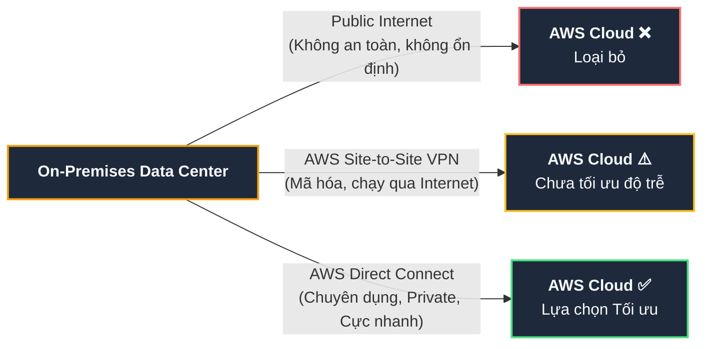

# Tóm tắt bài học: Hybrid Networking and Connectivity Services

**Khóa học:** Course 2 - Architecting Solutions on AWS  
**Chủ đề:** Thiết kế mạng kết nối Hybrid giữa On-Premises Data Center và AWS Cloud  
**Vị trí:** Module 3 - Designing a hybrid solution for container based workloads on AWS

---

## 1. Thiết lập cấu trúc mạng phía AWS (AWS Network Setup)
* **VPC (Virtual Private Cloud):**
  * Khởi đầu với mô hình kiến trúc cơ bản: **1 AWS Account, 1 AWS Region, 1 VPC** (để giữ sự đơn giản trước khi mở rộng).
* **Phân chia Subnet (Subnet Sizing & Strategy):**
  * Do đặc thù ứng dụng của AnyCompany Insurance là **ứng dụng nội bộ (Internal Applications)** không nhận truy cập trực tiếp từ Internet (*no ingress internet traffic*).
  * **Quyết định thiết kế:** Cấu hình **nhiều Private Subnet với dải mạng (CIDR block) lớn hơn** so với Public Subnet để dành không gian cho container workloads và cơ sở dữ liệu.

---

## 2. Đánh giá & So sánh các phương án kết nối Hybrid

### A. Phương án 1: Public Internet (Internet công cộng)
* **Rủi ro bảo mật:** Dữ liệu truyền tải không được bảo vệ riêng tư; nguy cơ nghe lén (*packet sniffing*) đối với dữ liệu tài chính/bảo hiểm.
* **Hạn chế hiệu năng:** Băng thông bị chia sẻ chung với toàn mạng internet, độ trễ biến động thất thường, không đảm bảo thông lượng ổn định.
* $\rightarrow$ **Kết luận:** **Loại bỏ (Rejected)**.

### B. Phương án 2: AWS Virtual Private Network (AWS VPN)
AWS cung cấp 2 giải pháp VPN chính:
1. **AWS Site-to-Site VPN:** Tạo đường hầm mã hóa IPSec kết nối Data Center với Amazon VPC hoặc AWS Transit Gateway.
2. **AWS Client VPN:** Kết nối từ máy tính cá nhân/laptop của người dùng/quản trị viên vào mạng nội bộ AWS.
* **Ưu điểm:** Đảm bảo tính bảo mật và mã hóa đường truyền.
* **Hạn chế:** Bản chất đường truyền VPN vẫn đi qua **Public Internet**, do đó vẫn chịu ảnh hưởng bởi tình trạng nghẽn mạng internet công cộng và không đảm bảo độ trễ thấp tối đa.
* $\rightarrow$ **Kết luận:** Chưa đáp ứng hoàn hảo yêu cầu khắt khe về độ trễ cực thấp và lưu lượng mạng cực lớn của khách hàng.

### C. Phương án 3: AWS Direct Connect (Lựa chọn tối ưu - Selected)
* **Đặc điểm:** Cung cấp đường truyền vật lý **riêng tư và chuyên dụng (Dedicated Private Connection)** từ Data Center đến AWS thông qua đối tác hạ tầng (Direct Connect Delivery Partner) hoặc kết nối trực tiếp.
* **Ưu điểm vượt trội:**
  * Lưu lượng mạng hoàn toàn đi trên **hạ tầng mạng toàn cầu của AWS (AWS Global Network)**, không bao giờ chạm vào Public Internet.
  * **Độ trễ thấp nhất có thể (Lowest Latency)** và **thông lượng ổn định (Consistent Throughput)**.
  * Tránh hoàn toàn tình trạng thắt nút cổ chai (*bottlenecks*) hoặc tăng đột biến độ trễ.
* $\rightarrow$ **Quyết định thiết kế:** Lựa chọn **AWS Direct Connect** làm cầu nối mạng chính cho kiến trúc Hybrid này.

---

## 3. Bảng so sánh tổng hợp các giải pháp kết nối mạng

| Tiêu chí | Public Internet | AWS Site-to-Site VPN | AWS Direct Connect (Lựa chọn) |
| :--- | :--- | :--- | :--- |
| **Bảo mật / Mã hóa** | Kém (Công cộng) | Cao (Mã hóa IPSec) | Tối đa (Đường truyền riêng tư chuyên dụng) |
| **Độ trễ (Latency)** | Không đoán trước được | Phụ thuộc Internet | **Cực thấp và cố định** |
| **Băng thông & Thông lượng** | Dao động, dễ nghẽn | Giới hạn bởi Internet ISP | **Băng thông lớn, ổn định (1 Gbps - 100 Gbps)** |
| **Môi trường truyền tải** | Public Internet | Public Internet | **AWS Global Backbone Network** |
| **Trường hợp sử dụng** | Duyệt web thông thường | Kết nối văn phòng nhỏ, Backup | **Enterprise Hybrid, High-throughput, Low-latency** |

---

## 4. Mở rộng kiến trúc trong tương lai (Scalability Note)
* **AWS Transit Gateway:** Nếu trong tương lai AnyCompany Insurance mở rộng thêm nhiều **AWS Accounts** hoặc nhiều **AWS Regions**, AWS Transit Gateway sẽ được bổ sung làm trung tâm điều phối lưu lượng (Hub-and-Spoke routing) kết hợp cùng AWS Direct Connect.
