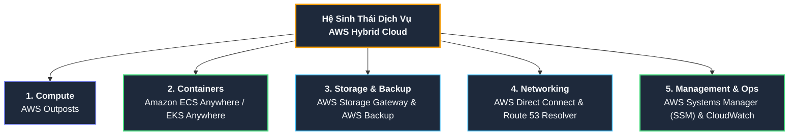
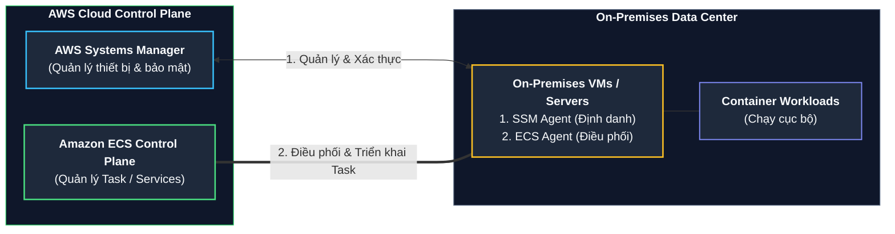

# Tóm tắt bài học: Các Giải pháp Hybrid trên AWS (Hybrid Solutions on AWS)

**Khóa học:** Course 2 - Architecting Solutions on AWS  
**Chủ đề:** Khảo sát danh mục dịch vụ AWS Hybrid Cloud và thiết kế bộ công cụ quản trị, điều phối đồng nhất (Consistent Tooling) giữa On-Premises và Cloud  
**Vị trí:** Module 3 - Designing a hybrid solution for container based workloads on AWS

---

## 1. Yêu cầu Quản trị Vận hành của Khách hàng (AnyCompany Insurance)

* **Ràng buộc:** Khách hàng muốn sử dụng **cùng một bộ công cụ vận hành (Consistent Operational Tooling)** trên cả AWS Cloud và Data Center On-Premises để:
  * Giảm thiểu chi phí đào tạo và chuyển giao công nghệ cho đội ngũ kỹ sư (*reduce support costs*).
  * Loại bỏ các thao tác trùng lặp và phân mảnh trong việc quản trị hạ tầng phân tán (*reduce redundant efforts*).

---

## 2. Danh mục Dịch vụ AWS Hybrid Cloud theo Từng Nhóm Chức năng

---

## 3. Phân tích Chuyên sâu các Dịch vụ Đề xuất cho Khách hàng

### A. Điều phối Container Đồng nhất: Amazon ECS Anywhere
* **Vấn đề:** 50% container đã chuyển lên Amazon ECS trên AWS, nhưng 50% container còn lại vẫn phải chạy trên các máy ảo (VM) tại On-Premises trong vài năm tới.
* **Giải pháp:** Sử dụng **Amazon ECS Anywhere** để dùng chung một Control Plane duy nhất trên AWS quản lý toàn bộ container ở cả 2 môi trường.

* **Quy trình thiết lập ECS Anywhere:**
  1. Tạo **Activation Key & Code** trên AWS Console.
  2. Cài đặt **AWS Systems Manager (SSM) Agent** trên máy chủ On-Premises để đăng ký thiết bị thành Managed Instance.
  3. Cài đặt **Amazon ECS Container Agent** trên máy chủ On-Premises.
  4. Khai báo Task Definition và triển khai ứng dụng bình thường thông qua ECS Console/CLI; container sẽ thực thi trực tiếp trên tài nguyên máy chủ On-Premises.

---

### B. Tự động hóa Quản trị Hạ tầng Phân tán: AWS Systems Manager (SSM)
* **Bản chất:** Giải pháp quản lý vòng đời và vận hành tài nguyên hybrid an toàn và có khả năng mở rộng ở quy mô lớn (*scale-out automation*).
* **Tính năng nổi bật - Run Command:**
  * Cho phép thực thi các lệnh quản trị, cài đặt gói phần mềm hoặc chạy các script tự động hóa trên **hàng loạt máy chủ cùng lúc (cả EC2 trên AWS và VM On-Premises)**.
  * Gom nhóm máy chủ theo Tags hoặc Metadata để thực thi lệnh chính xác.
  * **Lợi ích:** Loại bỏ hoàn toàn việc đăng nhập SSH thủ công từng máy, tiết kiệm thời gian và ngăn ngừa lỗi thao tác con người.

---

### C. Quản lý Sao lưu Tập trung: AWS Backup
* **Bản chất:** Dịch vụ quản lý chính sách bảo vệ dữ liệu và tuân thủ tập trung (*centralized backup & compliance*).
* **Phạm vi hỗ trợ Hybrid:**
  * Sao lưu các máy ảo **VMware ESXi** chạy tại On-Premises và trên AWS.
  * Tự động sao lưu các volume của **AWS Storage Gateway**.
  * Sao lưu tài nguyên trên AWS: Amazon EBS, Amazon RDS PostgreSQL, Amazon EFS, Amazon DynamoDB.
* **Đề xuất:** Morgan đưa AWS Backup vào sơ đồ kiến trúc tổng thể để khách hàng có thể áp dụng chính sách sao lưu định kỳ đồng nhất trên toàn hệ thống.

---

### D. Các Dịch vụ Hybrid Bổ sung Cần biết

1. **AWS Outposts:**
   * Cung cấp phần cứng tủ rack hoặc máy chủ vật lý do chính AWS sản xuất, vận chuyển và lắp đặt trực tiếp vào Data Center của khách hàng.
   * Chạy native các dịch vụ AWS (EC2, EBS, S3, ECS) ngay tại Data Center.
   * *Trường hợp sử dụng:* Xử lý dữ liệu yêu cầu độ trễ dưới 1 mili-giây (ultra-low latency) hoặc các ngành tài chính/y tế có quy định bắt buộc dữ liệu không được rời khỏi trụ sở vật lý.
2. **Amazon Route 53 Resolver (Hybrid DNS):** Cho phép phân giải tên miền hai chiều thông suốt giữa tên miền nội bộ On-Premises (`.corp`, `.local`) và AWS Private Hosted Zones.
3. **AWS Directory Service:** Kết nối đồng bộ người dùng từ Microsoft Active Directory On-Premises lên hạ tầng AWS IAM và các ứng dụng doanh nghiệp.

---

## 4. Tổng hợp Khối Kiến trúc Toàn diện Sau Bài học

| Vị trí | Lớp chức năng | Dịch vụ AWS đề xuất | Mục đích kiến trúc |
| :--- | :--- | :--- | :--- |
| **Mạng kết nối** | Network Connectivity | **AWS Direct Connect** | Đường truyền riêng tư, băng thông lớn, thông lượng ổn định. |
| **Lưu trữ Tệp Hybrid** | File Storage Gateway | **AWS Storage Gateway (S3 File GW)** | Cung cấp NFS share, local cache tại on-prem, lưu trữ gốc trên Amazon S3. |
| **Cơ sở Dữ liệu** | Managed Database | **Amazon RDS PostgreSQL (Multi-AZ)** | DB giao dịch chính, tự động failover, không thay đổi mã nguồn. |
| **Di chuyển Dữ liệu** | DB Migration | **AWS DMS** | Nhân bản dữ liệu liên tục On-Premises $\rightarrow$ RDS với Near-Zero Downtime. |
| **Điều phối Container** | Hybrid Orchestration | **Amazon ECS + ECS Anywhere** | Dùng chung 1 giao diện ECS điều phối container trên cả Cloud và On-Premises. |
| **Tính toán Container** | Compute Platform | **Amazon EC2 (Multi-AZ)** | Chạy container trên Cloud trong Private Subnet (Custom AMI, SSH). |
| **Quản trị Máy chủ** | Fleet Management | **AWS Systems Manager (SSM)** | Chạy tự động hóa Run Command trên toàn bộ máy chủ Cloud và On-Premises. |
| **Bảo vệ Dữ liệu** | Centralized Backup | **AWS Backup** | Chính sách sao lưu tự động tập trung cho VMware, Storage Gateway và RDS. |
