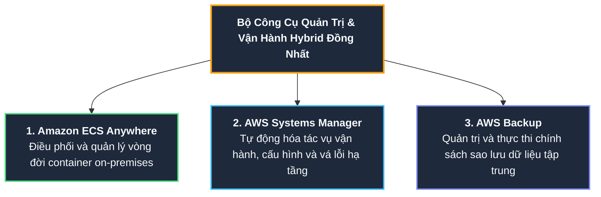
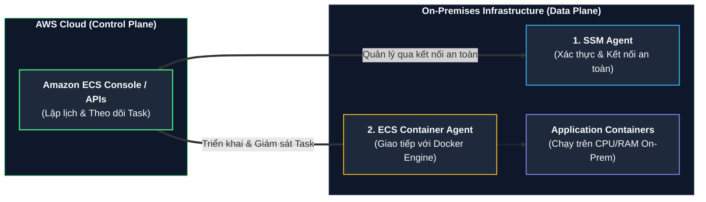
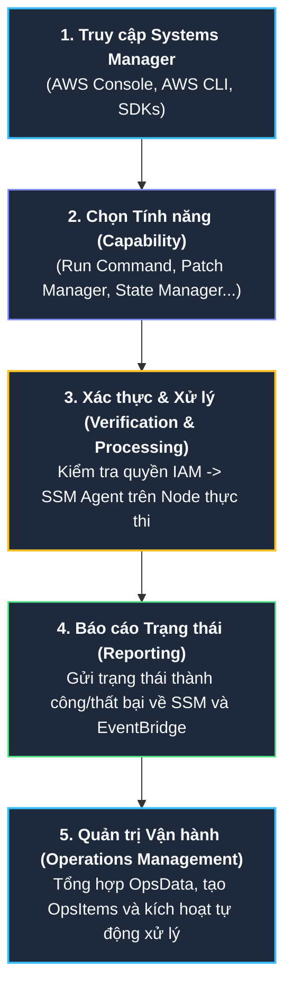
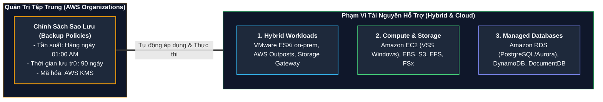

# Tài liệu đọc: Các Dịch vụ AWS cho Triển khai Hybrid (AWS Services for Hybrid Deployments)

**Khóa học:** Course 2 - Architecting Solutions on AWS  
**Chủ đề:** Chi tiết kỹ thuật về Amazon ECS Anywhere, Luồng xử lý tác vụ của AWS Systems Manager và Cơ chế bảo vệ dữ liệu tập trung với AWS Backup  
**Vị trí:** Module 3 - Designing a hybrid solution for container based workloads on AWS

---

## 1. Tổng quan Bộ Giải pháp Quản trị Hybrid cho Khách hàng

Để đáp ứng trọn vẹn yêu cầu **dùng chung một bộ công cụ quản lý và vận hành** trên cả Data Center On-Premises và AWS Cloud, giải pháp kiến trúc của AnyCompany Insurance tích hợp 3 dịch vụ trọng tâm:

---

## 2. Amazon ECS Anywhere (Điều phối Container Hybrid)

### A. Nguyên lý & Lợi ích
* **Khái niệm:** Là tính năng mở rộng của Amazon ECS cho phép chạy và điều phối các tác vụ container trên chính hạ tầng phần cứng/máy ảo do khách hàng tự quản trị (*customer-managed infrastructure*).
* **Trải nghiệm đồng nhất:** Sử dụng chung API, cú pháp Task Definition, cluster management và monitoring tương tự như khi vận hành trên AWS Cloud.
* **Tối ưu chi phí & Tận dụng hạ tầng cũ:** Cho phép khách hàng khai thác tối đa phần cứng máy chủ On-Premises sẵn có trong thời gian chờ hết hạn hợp đồng data center, đồng thời đáp ứng các tiêu chuẩn tuân thủ pháp lý về lưu trữ dữ liệu tại chỗ.

---

## 3. AWS Systems Manager - Quy trình 5 Bước Thực thi Tác vụ

AWS Systems Manager cung cấp giao diện thống nhất để xem dữ liệu vận hành và tự động hóa các tác vụ trên toàn bộ tài nguyên AWS và On-Premises.

### Chi tiết từng bước:
1. **Access Systems Manager:** Quản trị viên khởi tạo tác vụ qua Console hoặc câu lệnh CLI/SDK.
2. **Choose a Capability:** Lựa chọn công cụ phù hợp với mục đích (ví dụ: *Run Command* để chạy script, *Patch Manager* để vá lỗi, *Maintenance Windows* để lên lịch).
3. **Verification & Processing:** 
   * SSM tự động kiểm tra chính sách quyền IAM của người dùng/role.
   * Nếu đích là **Managed Node** (EC2 hoặc On-Premises VM), **SSM Agent** cài trên máy sẽ trực tiếp thực thi tác vụ.
   * Nếu là tài nguyên khác (S3, RDS), Systems Manager sẽ trực tiếp gọi API của dịch vụ đó.
4. **Reporting:** SSM Agent và các dịch vụ liên quan báo cáo chi tiết kết quả thực thi về Systems Manager dashboard.
5. **Operations Management:** Các công cụ *Explorer, OpsCenter, Incident Manager* tổng hợp dữ liệu, tự động tạo sự cố (**OpsItems**) và kích hoạt quy trình khắc phục tự động (*Automated Remediation*).

---

## 4. AWS Backup - Bảo vệ Dữ liệu Tập trung theo Chính sách

AWS Backup là dịch vụ quản lý toàn phần (*fully managed*), tự động hóa và tập trung hóa việc sao lưu dữ liệu trên quy mô lớn (*policy-based data protection*).

### Danh mục các tài nguyên được AWS Backup hỗ trợ:

| Nhóm tài nguyên | Danh sách dịch vụ hỗ trợ |
| :--- | :--- |
| **Môi trường Hybrid** | Máy ảo **VMware** (On-Premises, Amazon Outposts, VMware Cloud on AWS), **AWS Storage Gateway volumes**. |
| **Tính toán & Máy chủ** | **Amazon EC2 instances**, các ứng dụng hỗ trợ Windows VSS (*Windows Server, Microsoft SQL Server, Exchange Server*). |
| **Lưu trữ Tệp & Khối** | **Amazon EBS**, **Amazon S3**, **Amazon EFS**, **Amazon FSx** (*ONTAP, Lustre, Windows File Server, OpenZFS*). |
| **Cơ sở Dữ liệu Quản lý** | **Amazon RDS** (bao gồm cụm Aurora), **Amazon DynamoDB**, **Amazon Neptune**, **Amazon DocumentDB**. |

---

## 5. Tổng kết Lựa chọn Kiến trúc cho AnyCompany Insurance

| Nhu cầu của Khách hàng | Giải pháp Kiến trúc AWS | Giá trị Đem lại |
| :--- | :--- | :--- |
| **Quản trị Container Hybrid** | **Amazon ECS Anywhere** | Dùng chung 1 giao diện điều phối container trên cả AWS và on-premise, không cần học công cụ mới. |
| **Tự động hóa Vận hành** | **AWS Systems Manager** | Quản trị tập trung, chạy lệnh Run Command không cần SSH, lên lịch vá lỗi OS qua Maintenance Windows. |
| **Bảo vệ Dữ liệu Doanh nghiệp** | **AWS Backup** | Áp dụng chính sách sao lưu tự động cho VMware on-premise, Storage Gateway và RDS PostgreSQL. |
