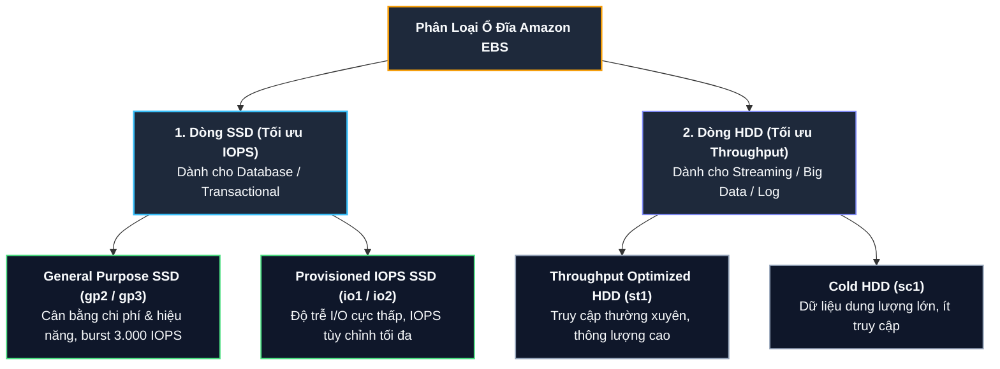
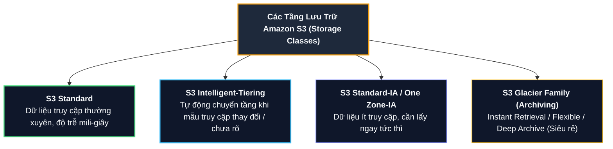

# Tài liệu đọc: Các Dịch vụ Lưu trữ trên AWS (AWS Storage Services)

**Khóa học:** Course 2 - Architecting Solutions on AWS  
**Chủ đề:** So sánh chuyên sâu các giải pháp lưu trữ AWS: AWS Storage Gateway (S3 File Gateway), Amazon EBS, Amazon EFS và Amazon S3  
**Vị trí:** Module 3 - Designing a hybrid solution for container based workloads on AWS

---

## 1. Tổng quan Lựa chọn Lưu trữ cho Kiến trúc Hybrid

Đối với yêu cầu của AnyCompany Insurance, kiến trúc sư Morgan lựa chọn kết hợp **AWS Storage Gateway (Amazon S3 File Gateway)** cùng với **Amazon S3**:
* **Lý do:** Khách hàng bắt buộc duy trì giao thức hệ thống tệp **NFS** cho các ứng dụng On-Premises (không sửa mã nguồn), nhưng lại muốn lưu trữ tập trung dữ liệu trên AWS để các container trên Cloud cùng khai thác.

```mermaid
flowchart LR
    subgraph OnPrem["<b>Môi trường On-Premises</b>"]
        App["<b>Ứng dụng Linux</b>"]
        FG["<b>S3 File Gateway (VM)</b><br/><i>Local Cache (NFSv3/v4.1)</i>"]
    end

    subgraph AWSCloud["<b>Môi trường AWS Cloud</b>"]
        S3[("<b>Amazon S3 Bucket</b><br/><i>(Object Storage)</i>")]
        ECS["<b>Amazon ECS Containers</b><br/><i>(Analytics / ML Workloads)</i>"]
    end

    App -->|"Ghi / Đọc file (NFS)"| FG
    FG ==="Đồng bộ tự động qua Direct Connect"===> S3
    S3 -->|"Truy cập trực tiếp dữ liệu"| ECS

    style OnPrem fill:#0f172a,stroke:#64748b,stroke-width:1px,color:#f8fafc;
    style AWSCloud fill:#0f172a,stroke:#22c55e,stroke-width:1px,color:#f8fafc;
    style App fill:#1e293b,stroke:#94a3b8,stroke-width:1.5px,color:#f8fafc;
    style FG fill:#1e293b,stroke:#fbbf24,stroke-width:2px,color:#f8fafc;
    style S3 fill:#1e293b,stroke:#4ade80,stroke-width:2px,color:#f8fafc;
    style ECS fill:#1e293b,stroke:#38bdf8,stroke-width:2px,color:#f8fafc;
```

---

## 2. AWS Storage Gateway (Amazon S3 File Gateway)

### A. Nguyên lý Hoạt động & Triển khai
* **Bản chất:** Kết hợp giữa phần mềm ảo hóa (*virtual software appliance*) triển khai tại On-Premises và dịch vụ quản lý trên AWS Cloud.
* **Hỗ trợ Hypervisor:** VMware ESXi, Microsoft Hyper-V, Linux KVM hoặc thiết bị phần cứng chuyên dụng (*Hardware Appliance*).
* **Giao thức hỗ trợ:** Chuẩn **NFS (v3, v4.1)** cho Linux và **SMB (v2, v3)** cho Windows.

### B. Các tính năng cốt lõi
1. **Lưu trữ & Truy xuất trực tiếp:** Ánh xạ các file mount point tại On-Premises thành các đối tượng chuẩn (*native objects*) trong Amazon S3.
2. **Bộ nhớ đệm cục bộ trong suốt (Transparent Local Caching):** Cung cấp độ trễ đọc/ghi siêu thấp tương đương mạng nội bộ LAN cho các tệp truy cập thường xuyên gần đây.
3. **Quản trị dữ liệu toàn diện:** Tận dụng toàn bộ sức mạnh của Amazon S3:
   * **S3 Lifecycle Policies:** Tự động chuyển tầng dữ liệu cũ sang S3-IA hoặc Glacier để tối ưu chi phí.
   * **S3 Cross-Region Replication (CRR):** Nhân bản dữ liệu sang Region khác phục vụ Disaster Recovery.
   * **S3 Versioning:** Bảo vệ file chống ghi đè hoặc vô tình xóa nhầm.

---

## 3. Amazon Elastic Block Store (Amazon EBS)

Amazon EBS cung cấp bộ nhớ dạng khối (**Block Storage**) gắn trực tiếp vào các máy chủ **Amazon EC2**, hoạt động tương tự như một ổ cứng vật lý.



* **Elastic Volumes:** Cho phép tăng dung lượng, thay đổi loại volume hoặc điều chỉnh mức IOPS ngay trên hệ thống Production đang chạy mà không gây downtime.
* > [!IMPORTANT]
  > **Quy luật về IOPS:** Với General Purpose SSD (gp2), số lượng IOPS cơ sở tăng tỷ lệ thuận với dung lượng ổ đĩa. Nếu muốn tăng thêm IOPS mà không đổi loại ổ đĩa, cần phải mở rộng dung lượng ổ đĩa theo chiều dọc (*vertically scale the volume*).

---

## 4. Amazon Elastic File System (Amazon EFS)

* **Bản chất:** Hệ thống tệp Serverless đàn hồi hoàn toàn (*Serverless Elastic File System*), tự động co giãn từ Gigabytes lên tới Petabytes mà không cần cấp phát dung lượng trước.
* **Giao thức:** Hỗ trợ chuẩn **NFSv4 (NFSv4.0 và NFSv4.1)**.
* **Truy cập đồng thời (Multi-Attach / Shared Storage):** Cho phép hàng nghìn máy chủ **Amazon EC2, Amazon ECS Containers và AWS Lambda** cùng mount và đọc/ghi đồng thời trên một hệ thống tệp chung.
* **Tự động tối ưu chi phí:** Hỗ trợ tính năng EFS Lifecycle Management tự động chuyển các tệp không truy cập trong 30/60/90 ngày sang tầng EFS Infrequent Access (EFS IA).

---

## 5. Amazon Simple Storage Service (Amazon S3) & Các Storage Classes

Amazon S3 là dịch vụ lưu trữ đối tượng (**Object Storage**) với độ bền đạt $99.999999999\%$ (11 số 9).



### Bảng so sánh các tầng lưu trữ Amazon S3

| Tầng lưu trữ (Storage Class) | Mục đích sử dụng | Thời gian truy xuất | Tối ưu chi phí |
| :--- | :--- | :--- | :--- |
| **S3 Standard** | Dữ liệu active, truy cập liên tục hàng ngày. | Mili-giây | Chi phí lưu trữ tiêu chuẩn, không phí truy xuất. |
| **S3 Intelligent-Tiering** | Mẫu truy cập thay đổi hoặc không xác định trước. | Mili-giây | Tự động chuyển qua 4 tiers để tiết kiệm chi phí tối đa. |
| **S3 Standard-IA** | Dữ liệu ít truy cập nhưng cần sẵn sàng ngay khi cần. | Mili-giây | Phí lưu trữ rẻ hơn ~50% so với Standard, có phí truy xuất. |
| **S3 Glacier Instant Retrieval** | Dữ liệu lưu trữ dài hạn cần truy xuất tức thì vài lần/năm. | Mili-giây | Rẻ hơn Standard-IA tới ~68%. |
| **S3 Glacier Flexible Retrieval** | Sao lưu lưu trữ định kỳ (Backup/Archive). | 1 phút - 5 giờ | Chi phí lưu trữ cực thấp. |
| **S3 Glacier Deep Archive** | Lưu trữ tuân thủ pháp lý (Compliance), lưu 7-10 năm. | 12 - 48 giờ | Mức chi phí lưu trữ thấp nhất trong toàn bộ AWS. |

---

## 6. Ma trận So sánh 4 Dịch vụ Lưu trữ AWS

| Tiêu chí | Amazon S3 | Amazon EFS | Amazon EBS | AWS Storage Gateway (File GW) |
| :--- | :--- | :--- | :--- | :--- |
| **Mô hình** | Object Storage | File Storage (NFS) | Block Storage | Hybrid File Storage Gateway |
| **Giao thức** | REST API (HTTPS) | NFSv4 | Block Level | NFSv3/4.1, SMB |
| **Phạm vi truy cập** | Toàn cầu (Web / Cloud) | Cụm VPC / Direct Connect | 1 EC2 Instance trong 1 AZ | On-Premises Data Center + AWS |
| **Khả năng chia sẻ** | Hàng triệu client đồng thời | Hàng nghìn node đồng thời | Gắn trực tiếp vào 1 node (Multi-Attach giới hạn) | Nhiều server On-Premise qua LAN |
| **Tối ưu cho** | Static Assets, Data Lake, Big Data | Home directories, CMS, Shared Linux apps | Boot volumes, Transactional Databases | **Hybrid migration, On-Premises File Sharing** |
