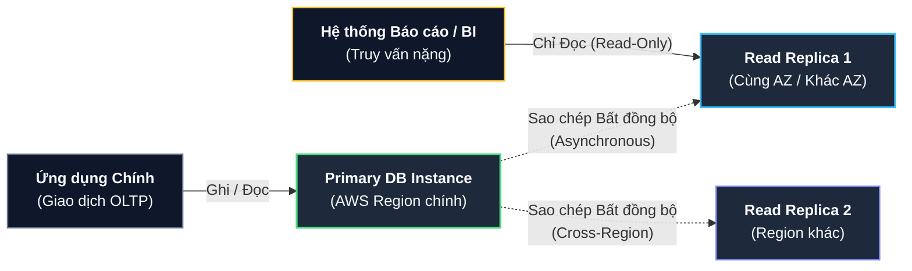
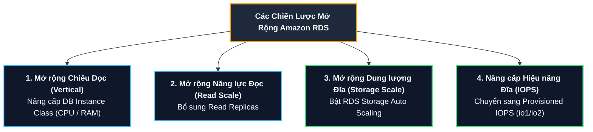
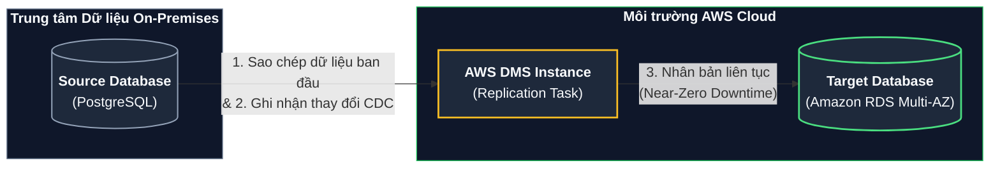

# Tài liệu đọc: Kiến trúc Chuyên sâu Amazon RDS và AWS DMS (Amazon RDS & AWS DMS)

**Khóa học:** Course 2 - Architecting Solutions on AWS  
**Chủ đề:** Chi tiết kỹ thuật về Multi-AZ Deployments (1 Standby vs 2 Readable Standbys), Read Replicas, Chiến lược Scaling RDS và Quy trình Homogeneous Migration với AWS DMS  
**Vị trí:** Module 3 - Designing a hybrid solution for container based workloads on AWS

---

## 1. Kiến trúc Triển khai Đa vùng Khả dụng (Amazon RDS Multi-AZ Deployments)

Amazon RDS cung cấp 2 tùy chọn triển khai Multi-AZ phục vụ các cấp độ sẵn sàng và yêu cầu hiệu năng khác nhau:

### A. Mô hình 1: Multi-AZ với 1 Standby Instance (2 Availability Zones)

```mermaid
flowchart LR
    App["<b>Ứng dụng Container</b><br/>(App Tasks)"] -->|"DNS Endpoint"| Primary["<b>Primary DB Instance</b><br/>(AZ A - Read/Write)"]
    Primary ==="Sao chép Đồng bộ<br/>(Synchronous)"=== Standby["<b>Standby DB Instance</b><br/>(AZ B - Dự phòng)"]
    App -.->|"Tự động Failover qua DNS<br/>khi Primary lỗi"| Standby

    style App fill:#0f172a,stroke:#64748b,stroke-width:1.5px,color:#f8fafc;
    style Primary fill:#1e293b,stroke:#4ade80,stroke-width:2px,color:#f8fafc;
    style Standby fill:#1e293b,stroke:#fbbf24,stroke-width:2px,color:#f8fafc;
```

* **Cơ chế:** Tạo 1 Primary DB instance và 1 Standby instance ở AZ khác; dữ liệu được đồng bộ hóa tức thời (**Synchronous Replication**).
* **Failover tự động:** Khi phát hiện sự cố, RDS tự động chuyển đổi sang Standby instance thông qua cập nhật DNS mà không cần can thiệp thủ công.
* **Đặc điểm Standby:** Bản Standby ở mô hình này **không tiếp nhận truy vấn đọc** (Non-readable), chỉ dùng cho mục đích dự phòng failover.

---

### B. Mô hình 2: Multi-AZ với 2 Readable Standbys (3 Availability Zones)

```mermaid
flowchart TD
    App_Write["<b>Lưu lượng Ghi / Đọc</b><br/>(Read / Write Traffic)"] -->|"Endpoint Chính"| Primary["<b>Primary DB Instance</b><br/>(AZ A)"]
    
    Primary ==="Sao chép Đồng bộ"=== S1["<b>Standby 1</b><br/>(AZ B - Readable)"]
    Primary ==="Sao chép Đồng bộ"=== S2["<b>Standby 2</b><br/>(AZ C - Readable)"]

    App_Read["<b>Lưu lượng Đọc mở rộng</b><br/>(Read-Only Traffic)"] -->|"Read Endpoint"| S1
    App_Read -->|"Read Endpoint"| S2

    style Primary fill:#1e293b,stroke:#4ade80,stroke-width:2px,color:#f8fafc;
    style S1 fill:#1e293b,stroke:#38bdf8,stroke-width:2px,color:#f8fafc;
    style S2 fill:#1e293b,stroke:#38bdf8,stroke-width:2px,color:#f8fafc;
    style App_Write fill:#0f172a,stroke:#64748b,stroke-width:1.5px,color:#f8fafc;
    style App_Read fill:#0f172a,stroke:#64748b,stroke-width:1.5px,color:#f8fafc;
```

Áp dụng cho MySQL và **PostgreSQL** trên 3 Availability Zones:
* **Thời gian chuyển đổi sự cố siêu tốc (Fast Failover):** Thời gian tự động Failover thông thường **dưới 35 giây (under 35s)**.
* **Tăng tốc ghi giao dịch:** Độ trễ xác nhận giao dịch (*transaction-commit latency*) nhanh hơn tới **2 lần (2x faster)** so với mô hình 1 standby nhờ cơ chế commit tối ưu.
* **Mở rộng năng lực đọc:** Cả hai Standby instances đều cho phép tiếp nhận kết nối đọc (**Readable Standbys**), gia tăng đáng kể thông lượng đọc tổng thể.
* **Lựa chọn phần cứng:** Hỗ trợ cả vi xử lý thế hệ mới dựa trên ARM (**AWS Graviton2**) và Intel.

---

## 2. Bản sao chỉ đọc (Amazon RDS Read Replicas)



* **Nguyên lý:** Sử dụng cơ chế sao chép **bất đồng bộ (Asynchronous Replication)** từ bản snapshot của Primary DB instance để tạo ra các bản sao phục vụ riêng cho lưu lượng chỉ đọc (*Read-only*).
* **Khả năng thăng cấp:** Read Replica có thể được thăng cấp (*promoted*) thành một DB instance độc lập khi cần thiết (phục vụ tách dữ liệu hoặc khôi phục thảm họa).
* **Động cơ hỗ trợ:** MySQL, MariaDB, **PostgreSQL**, Oracle, Microsoft SQL Server, và Amazon Aurora.
* **Trường hợp sử dụng thực tế:** Phân tách các truy vấn báo cáo tài chính/bảo hiểm (BI reporting) hoặc các tác vụ tính toán đọc nặng về CPU ra khỏi Primary instance, giúp bảo vệ hiệu năng ghi của cơ sở dữ liệu chính.

---

## 3. Các Phương thức Mở rộng Quy mô Amazon RDS (Scaling Strategies)



### A. Mở rộng theo chiều dọc (Vertical Scaling - Instance Size)
* Nâng cấp cấu hình DB Instance Class lên phiên bản lớn hơn khi cần bổ sung đồng thời năng lực CPU, RAM và băng thông mạng.

### B. Mở rộng Năng lực Đọc (Horizontal Read Scaling)
* Thêm Read Replicas khi chỉ cần tăng tài nguyên CPU xử lý các truy vấn đọc mà không có nhu cầu tăng dung lượng lưu trữ của Primary instance.

### C. Mở rộng Lưu trữ Tự động (RDS Storage Auto Scaling)
* **Giải quyết bài toán cấp phát:** Trước đây, việc ước tính thủ công có thể dẫn đến *Underprovisioning* (hết đĩa gây sập ứng dụng) hoặc *Overprovisioning* (lãng phí chi phí).
* **Cơ chế:** Bạn thiết lập ngưỡng lưu trữ tối đa (*maximum storage limit*), RDS liên tục theo dõi và **tự động tăng dung lượng đĩa** khi dung lượng sử dụng đạt tới ngưỡng cảnh báo mà **không gây gián đoạn dịch vụ (virtually zero downtime)**.

### D. Tối ưu Loại Lưu trữ (Storage Types)

| Loại ổ đĩa | Đặc điểm hiệu năng | Khuyến nghị sử dụng |
| :--- | :--- | :--- |
| **General Purpose SSD (gp2/gp3)** | Độ trễ mili-giây, burst lên 3.000 IOPS, chi phí hợp lý. | Hầu hết các ứng dụng thông thường, Dev/Test, hệ thống nội bộ. |
| **Provisioned IOPS (io1/io2)** | Thiết kế riêng cho I/O-intensive workloads, độ trễ I/O cực thấp, thông lượng ổn định cao. | Cơ sở dữ liệu giao dịch lớn (OLTP), nghiệp vụ bảo hiểm/ngân hàng cốt lõi. |
| **Magnetic (Từ tính)** | Tương thích ngược với hệ thống cũ, dung lượng tối đa hạn chế, IOPS thấp. | Không khuyến nghị cho hệ thống mới; nên chuyển sang SSD. |

---

## 4. Di chuyển Cơ sở Dữ liệu với AWS Database Migration Service (AWS DMS)

### Sơ đồ quy trình nhân bản dữ liệu liên tục:



### A. Kiến trúc Vận hành của AWS DMS
* AWS DMS khởi tạo một **Replication Instance** (máy chủ chạy phần mềm sao chép) đặt trong AWS Cloud.
* Kết nối giữa **Source Database** (PostgreSQL On-Premises) và **Target Database** (Amazon RDS for PostgreSQL).
* Tự động khởi tạo bảng, khóa chính (Primary Keys) và đồng bộ dữ liệu liên tục qua tác vụ **Change Data Capture (CDC)**.

### B. Di chuyển Cùng loại (Homogeneous Database Migration)
* **Định nghĩa:** Nguồn và đích sử dụng cùng loại hoặc tương thích engine cơ sở dữ liệu (ví dụ: PostgreSQL $\rightarrow$ Amazon RDS for PostgreSQL).
* **Lợi thế:**
  * Cấu trúc Schema, kiểu dữ liệu và mã lệnh SQL hoàn toàn tương thích.
  * Quy trình thực hiện tinh gọn 1 bước mà **không cần viết lại mã nguồn**.
  * Hệ thống cơ sở dữ liệu On-Premises tiếp tục hoạt động và phục vụ khách hàng bình thường trong suốt quá trình đồng bộ.
* **Công cụ hỗ trợ chuyển đổi nâng cao:** Đối với các trường hợp di chuyển khác loại (Heterogeneous), sử dụng **AWS Schema Conversion Tool (AWS SCT)** để tự động chuyển đổi cấu trúc schema, views, triggers và stored procedures trước khi dùng DMS đồng bộ dữ liệu.

---

## 5. Tổng kết Kiến trúc cho AnyCompany Insurance

| Yêu cầu kỹ thuật | Giải pháp kỹ thuật áp dụng | Lợi ích nghiệp vụ |
| :--- | :--- | :--- |
| **Khả năng chịu lỗi & Uptime** | **RDS PostgreSQL Multi-AZ** | Tự động chuyển đổi dự phòng (Failover) qua DNS trong vài giây khi gặp sự cố, loại bỏ SPOF. |
| **Không sửa mã nguồn** | **Homogeneous Migration qua AWS DMS** | Giữ nguyên 100% schema và ứng dụng, di chuyển dữ liệu liên tục với Near-Zero Downtime. |
| **Tự động hóa vận hành** | **RDS Storage Auto Scaling** | Tự động tăng dung lượng đĩa tránh rủi ro tràn ổ cứng. |
