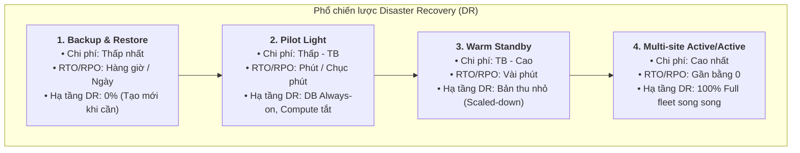

# Architecture Optimizations for Week 3 — In-Depth Reference Guide

## 1. Disaster Recovery (DR) Strategies on AWS
AWS phân chia chiến lược khắc phục thảm họa (DR) thành 4 cấp độ theo phổ đánh đổi giữa **Chi phí (Cost)**, **Độ phức tạp (Complexity)**, cùng hai chỉ số mục tiêu:
* **RTO (Recovery Time Objective):** Thời gian tối đa cho phép để khôi phục hệ thống hoạt động trở lại.
* **RPO (Recovery Point Objective):** Lượng dữ liệu tối đa chấp nhận bị mất (tính theo khoảng thời gian từ lần backup cuối).

> **Chiều hướng đánh đổi:**
> * 📈 **Chi phí (Cost) & Độ phức tạp (Complexity):** Tăng dần từ trái sang phải (`1` $\rightarrow$ `4`).
> * 📉 **Thời gian gián đoạn (RTO) & Mất mát dữ liệu (RPO):** Giảm dần từ trái sang phải (nhanh nhất ở `4`).

---

### Chi tiết 4 chiến lược DR:

| Chiến lược DR | Cơ chế hoạt động | Trạng thái hạ tầng ở DR Region | Đánh giá RTO / RPO | Chi phí |
| :--- | :--- | :--- | :--- | :--- |
| **1. Backup and Restore** | Sao lưu dữ liệu & AMI sang Region khác. Khi xảy ra thảm họa, dựng lại toàn bộ hạ tầng bằng IaC (CloudFormation/CDK) và restore data. | Không có tài nguyên compute nào chạy sẵn. | RTO: Hàng giờ / ngày RPO: Tính theo chu kỳ snapshot | Thấp nhất |
| **2. Pilot Light** | Dữ liệu cốt lõi (RDS, S3) được đồng bộ liên tục (always on). Server ứng dụng được cấu hình sẵn nhưng ở trạng thái tắt (turned off) hoặc chưa provision. | Core storage & DB luôn bật; compute tắt hoàn toàn, chỉ bật khi failover. | RTO: Tính bằng phút/chục phút RPO: Rất thấp (dữ liệu live) | Thấp - Trung bình |
| **3. Warm Standby** | Triển khai phiên bản thu nhỏ (scaled-down replica) nhưng hoạt động đầy đủ (fully functional) ở Region phụ. Có thể dùng để test định kỳ. | Toàn bộ các tầng đều chạy với số lượng instance tối thiểu (min fleet). | RTO: Vài phút (scale-out thêm) RPO: Gần bằng 0 | Trung bình - Cao |
| **4. Multi-site Active/Active (hoặc Hot Standby)** | Chạy toàn bộ tải song song ở cả 2 hoặc nhiều Region cùng lúc. Traffic được phân phối qua Route 53. | Đầy đủ 100% tài nguyên ở tất cả các Region tham gia. | RTO: Gần như bằng 0 RPO: Gần như bằng 0 | Đắt nhất & phức tạp nhất |

> [!TIP]
> **Vai trò của Infrastructure as Code (IaC):**
> Đối với các chiến lược phục hồi nhanh (đặc biệt là Backup & Restore hoặc Pilot Light), việc triển khai bằng **AWS CloudFormation** hoặc **AWS CDK** kết hợp **AWS CodePipeline** là bắt buộc để tự động hóa quá trình dựng lại môi trường ở DR Region mà không bị lỗi thao tác thủ công.

---

## 2. Network Resiliency: AWS Direct Connect kết hợp VPN Failover
* **Mô hình dự phòng:** Sử dụng **AWS Site-to-Site VPN** qua Internet công cộng làm kết nối dự phòng cho **AWS Direct Connect**.
* **Cơ chế hoạt động:**
  * Bình thường, lưu lượng ưu tiên đi qua đường Direct Connect chuyên dụng để đạt độ trễ thấp và băng thông cao.
  * Nếu router on-premises hoặc cổng Direct Connect gặp sự cố phần cứng/đứt cáp, lưu lượng mạng tự động chuyển hướng (failover) qua đường hầm IPsec VPN.
* **Tích hợp:** Thường cấu hình kết hợp qua **AWS Transit Gateway** với giao thức định tuyến động **BGP** để tự động hóa failover.

---

## 3. Automatic Scaling cho Container trên Amazon ECS
Khi chạy Amazon ECS trên hạ tầng Amazon EC2, cần thiết kế tự động co giãn độc lập ở **2 lớp (Two-Layer Scaling)**:

### 3.1. Cluster Auto Scaling (Tầng hạ tầng EC2)
* Quản lý bởi **Amazon ECS Capacity Providers** kết hợp **Auto Scaling Group (ASG)** có bật **Managed Scaling**.
* **Nguyên lý:** ECS tự động sinh ra 2 CloudWatch metrics tùy chỉnh và một **Target Tracking Scaling Policy**. Khi các tasks cần thêm dung lượng CPU/RAM mà cluster EC2 không còn đủ chỗ, ECS sẽ tự động yêu cầu ASG scale-out thêm EC2 instances để đáp ứng.

### 3.2. Container Service Auto Scaling (Tầng Application Tasks)
* Sử dụng dịch vụ **Application Auto Scaling** để tăng/giảm số lượng Task mong muốn (`desired count`) dựa theo CloudWatch Alarms.
* **Các loại chính sách scaling:**
  1. **Target Tracking Scaling Policies (Khuyến nghị):** Giữ metric ở một giá trị mục tiêu cố định (ví dụ: giữ Average CPU Utilization ở mức 70%), tương tự như cơ chế điều hòa nhiệt độ.
  2. **Step Scaling Policies:** Tăng/giảm số lượng tasks theo từng bước cụ thể tương ứng với mức độ vượt ngưỡng cảnh báo (alarm breach size).

---

## 4. Amazon RDS Storage Auto Scaling
* **Cơ chế:** Khi database sắp hết dung lượng trống, RDS tự động cấp phát và mở rộng dung lượng ổ đĩa (storage) mà không làm gián đoạn ứng dụng hay đòi hỏi DBA thao tác thủ công.
* **Ứng dụng:** Cực kỳ hữu ích cho các hệ thống có tốc độ tăng trưởng dữ liệu không thể dự đoán trước.

---

## 5. Tối ưu chi phí lưu trữ với Amazon S3 Intelligent-Tiering
* **Đặc điểm nổi bật:** Là storage class duy nhất tự động phân loại và tối ưu chi phí lưu trữ mà không làm suy giảm hiệu năng truy cập hay phát sinh chi phí vận hành can thiệp.
* **Cách thức vận hành:**
  * Thu một khoản phí nhỏ giám sát (monitoring fee) hàng tháng trên từng object.
  * Tự động di chuyển dữ liệu giữa các tier truy cập thường xuyên (Frequent Access) và ít truy cập (Infrequent / Archive Access) dựa trên tần suất đọc/ghi thực tế.
* **Trường hợp sử dụng lý tưởng:**
  * Dữ liệu có mẫu truy cập không cố định, khó dự đoán (unknown, changing access patterns).
  * Data lakes, data analytics, user-uploaded content (ảnh, tài liệu hợp đồng bảo hiểm).
