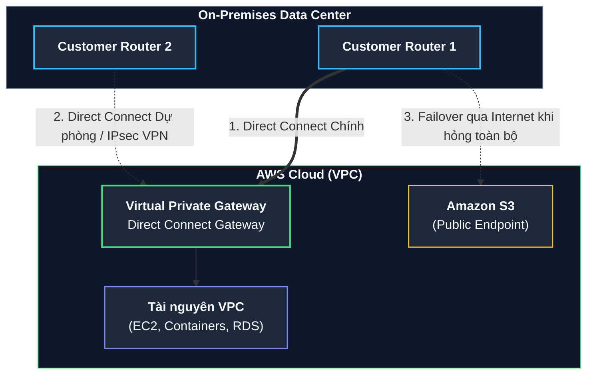
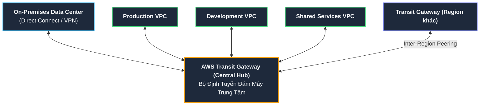

# Tài liệu đọc: Mạng Hybrid và Các Dịch vụ Kết nối AWS (Hybrid Networking and Connectivity)

**Khóa học:** Course 2 - Architecting Solutions on AWS  
**Chủ đề:** Chi tiết kỹ thuật về AWS Direct Connect, AWS Site-to-Site VPN, AWS Client VPN và AWS Transit Gateway  
**Vị trí:** Module 3 - Designing a hybrid solution for container based workloads on AWS

---

## 1. Tổng quan về Kết nối Mạng Hybrid (Hybrid Networking Overview)
Trong các giải pháp kiến trúc lai (Hybrid Cloud), việc thiết lập kết nối mạng tin cậy, thông lượng ổn định giữa On-Premises Data Center và AWS là yếu tố sống còn. Tùy thuộc vào yêu cầu về băng thông, độ trễ, tính bảo mật và quy mô hệ thống, AWS cung cấp các lựa chọn kiến trúc từ mức cơ bản đến nâng cao.

---

## 2. AWS Direct Connect

### A. Nguyên lý hoạt động & Lợi ích
* **Đường truyền ngắn nhất & riêng tư:** Lưu lượng mạng truyền trực tiếp giữa hạ tầng on-premises và AWS qua hạ tầng cáp quang riêng, **hoàn toàn không đi qua Public Internet**.
* **Độ trễ & Băng thông tối ưu:** Loại bỏ rủi ro nghẽn cổ chai (*bottlenecks*) và các đợt tăng vọt độ trễ bất thường do biến động đường truyền internet công cộng.
* **Tùy chọn kết nối:**
  * **Hosted Connection:** Được cung cấp thông qua đối tác hạ tầng AWS Direct Connect Delivery Partner (băng thông linh hoạt từ 50 Mbps đến 10 Gbps).
  * **Dedicated Connection:** Cổng kết nối vật lý trực tiếp 1 Gbps, 10 Gbps hoặc 100 Gbps tại hơn 100 trung tâm kết nối Direct Connect trên toàn cầu.
* **AWS Direct Connect SiteLink:** Cho phép chuyển tiếp dữ liệu trực tiếp giữa các địa điểm Direct Connect khác nhau để tạo mạng WAN riêng kết nối giữa các văn phòng và data center của doanh nghiệp trên toàn cầu.

### B. Chiến lược dự phòng & Chuyển vùng sự cố (Redundancy & Failover)

* **Dự phòng Đa cổng (Dual Direct Connect Connections):**
  * Khuyến nghị thiết lập kết nối thứ hai từ router on-premise đến thiết bị Direct Connect độc lập của AWS để đảm bảo High Availability (HA).
  * Khi yêu cầu nhiều port tại cùng 1 vị trí Direct Connect, AWS tự động cấp phát trên các thiết bị phần cứng dự phòng độc lập (*redundant AWS equipment*).
* **Dự phòng bằng AWS Site-to-Site VPN (Direct Connect + VPN Backup):**
  * Cấu hình đường hầm IPsec VPN làm kênh dự phòng chi phí thấp cho Direct Connect.
  * **Cơ chế Failover tự động:**
    * Khi Direct Connect gặp sự cố: Toàn bộ lưu lượng nội bộ VPC sẽ tự động chuyển hướng sang kênh IPsec VPN.
    * Lưu lượng tới các tài nguyên Public Endpoint (như Amazon S3) sẽ tự động định tuyến qua đường truyền Internet công cộng.
  * > [!WARNING]
    > **Rủi ro mất kết nối VPC:** Nếu không cấu hình đường Direct Connect thứ 2 hoặc kênh IPsec VPN dự phòng, khi đường Direct Connect bị đứt, toàn bộ lưu lượng tới VPC sẽ bị ngắt hoàn toàn (*traffic will be dropped*).

---

## 3. AWS Managed VPN Services

### A. AWS Site-to-Site VPN
* **Mục đích:** Kết nối mạng bảo mật giữa toàn bộ mạng on-premises và Amazon VPC / Transit Gateway qua đường hầm mã hóa IPsec trên Internet.
* **Các thành phần cốt lõi:**
  1. **Virtual Private Gateway (VGW):** Bộ tập trung VPN (*VPN concentrator*) phía AWS, gắn vào VPC. Tích hợp sẵn tính năng tự động chuyển đổi dự phòng (*automated redundancy & failover*) với 2 VPN endpoints ở 2 Availability Zone khác nhau.
  2. **Customer Gateway (CGW):** Thiết bị phần cứng hoặc phần mềm router vật lý/ảo đặt tại phía mạng on-premises do khách hàng quản lý và cấu hình.

### B. AWS Client VPN
* **Mục đích:** Dịch vụ VPN quản lý toàn phần (Managed VPN) dành cho nhân viên/quản trị viên làm việc từ xa truy cập vào tài nguyên trên AWS và On-Premises.
* **Đặc tính:** Tự động co giãn theo số lượng kết nối (*fully elastic*), hỗ trợ phần mềm client chuẩn giao thức **OpenVPN**.
* **3 Kịch bản triển khai phổ biến:**
  * **Kịch bản 1 (Single Target VPC):** Dành cho client chỉ cần truy cập vào tài nguyên trong một VPC duy nhất.
  * **Kịch bản 2 (On-Premises Access Only):** Dành cho client truy cập từ xa vào mạng trung tâm dữ liệu On-Premises thông qua Client VPN endpoint.
  * **Kịch bản 3 (VPC & Client-to-Client Communication):** Client vừa truy cập tài nguyên trong VPC, vừa có thể giao tiếp trực tiếp với nhau thông qua dải địa chỉ IP (CIDR block) được cấp phát riêng khi kết nối VPN endpoint.

---

## 4. AWS Transit Gateway (Cloud Router trung tâm)

### A. Vấn đề của kiến trúc không dùng Transit Gateway
* Khi số lượng VPC, AWS Accounts, AWS Regions và kết nối On-Premises tăng lên:
  * Mô hình VPC Peering và VPN point-to-point tạo thành mạng lưới phức tạp dạng mạng nhện (Full-mesh complexity: $N \times (N-1) / 2$ kết nối).
  * Khó quản lý bảng định tuyến (*Route Tables*), khó cấu hình bảo mật và giám sát.

### B. Lợi ích khi sử dụng AWS Transit Gateway
* **Mô hình Hub-and-Spoke:** Đóng vai trò như một bộ định tuyến đám mây trung tâm (*Centralized Cloud Router*). Mỗi VPC, VPN, hay Direct Connect chỉ cần tạo kết nối duy nhất (1 Attachment) vào Transit Gateway.
* **Quản trị định tuyến tập trung:** Cho phép áp dụng các Route Tables trên Transit Gateway để phân luồng, cô lập hoặc chia sẻ mạng giữa các môi trường (Dev/Prod/Shared Services).
* **Inter-Region Peering:** Kết nối các Transit Gateway giữa các AWS Region khác nhau qua hạ tầng mạng trục toàn cầu của AWS với dữ liệu được tự động mã hóa.

---

## 5. Tổng kết Lựa chọn Kiến trúc cho AnyCompany Insurance

| Thành phần | Lựa chọn đề xuất | Lý do kỹ thuật |
| :--- | :--- | :--- |
| **Kết nối chính (Primary Link)** | **AWS Direct Connect** | Đảm bảo băng thông lớn, thông lượng ổn định tuyệt đối và độ trễ cực thấp cho 50% khối lượng công việc phân tán. |
| **Kết nối dự phòng (Failover Link)** | **Direct Connect thứ 2 hoặc Site-to-Site VPN** | Đảm bảo tính sẵn sàng cao (High Availability), tránh rủi ro Single Point of Failure gây gián đoạn dịch vụ bảo hiểm. |
| **Định tuyến mở rộng (Future Growth)** | **AWS Transit Gateway** | Sẵn sàng kết nối trung tâm khi AnyCompany Insurance mở rộng thêm nhiều tài khoản (Accounts) hoặc khu vực (Regions). |
