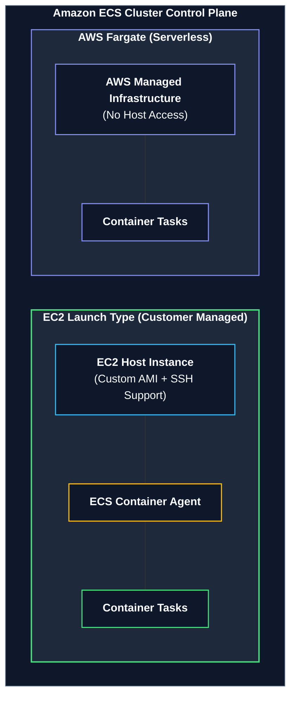
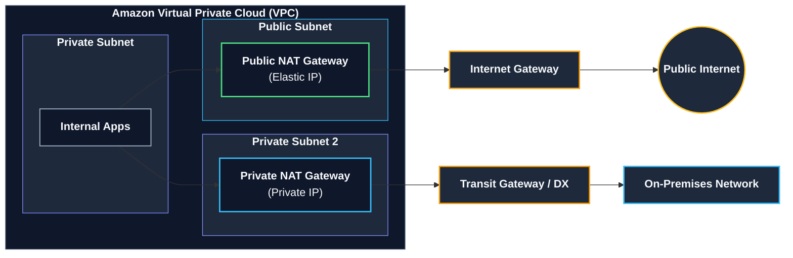

# Tài liệu đọc: Vận hành Container trên AWS và Thiết bị NAT (Running Containers on AWS and NAT Gateways)

**Khóa học:** Course 2 - Architecting Solutions on AWS  
**Chủ đề:** So sánh chuyên sâu Amazon ECS Launch Types (EC2 vs Fargate) và cơ chế hoạt động của Thiết bị NAT (NAT Gateway vs NAT Instance)  
**Vị trí:** Module 3 - Designing a hybrid solution for container based workloads on AWS

---

## 1. Tổng quan Kiến trúc Lựa chọn cho Khách hàng
* **Bối cảnh:** Ứng dụng container nội bộ (*internal workloads*), không nhận lưu lượng truy cập Inbound từ Internet nhưng cần kết nối Outbound ra Internet (ví dụ: tải bản cập nhật phần mềm, packages).
* **Ràng buộc:** Khách hàng yêu cầu dùng **Custom AMI riêng** và duy trì quyền **truy cập SSH** vào máy chủ để đồng bộ quy trình vận hành.
* **Bộ giải pháp được chọn:**
  * **Orchestration:** **Amazon ECS** (Đơn giản, native AWS).
  * **Compute Launch Type:** **Amazon EC2 Launch Type** (Hỗ trợ Custom AMI và SSH).
  * **Egress Connectivity:** **AWS NAT Gateway** (Managed, tính sẵn sàng cao, băng thông lớn).

---

## 2. Chi tiết về Amazon ECS Launch Types

### A. EC2 Launch Type
* **Nguyên lý:** Bạn khởi tạo và tự quản trị cụm máy chủ EC2 instances, sau đó đăng ký chúng vào Amazon ECS cluster.
* **Thành phần cốt lõi:** Mỗi EC2 instance phải được cài đặt **Amazon ECS Container Agent**. ECS Agent đóng vai trò cầu nối liên lạc giữa dịch vụ điều phối ECS Control Plane và các Docker container trên node.
* **Trường hợp sử dụng:**
  * Yêu cầu dùng **Custom AMI riêng** của doanh nghiệp.
  * Cần quyền truy cập **SSH/SSM** vào hệ điều hành host bên dưới.
  * Tối ưu hóa chi phí với các loại instance chuyên dụng (GPU, Storage Optimized, Spot Instances).

### B. AWS Fargate Launch Type
* **Nguyên lý:** Nền tảng tính toán **Serverless** cho container. Bạn chỉ cần định nghĩa thông số CPU và RAM cho Task/Pod, AWS sẽ tự động cấp phát và quản lý hạ tầng bên dưới.
* **Ưu điểm:** Loại bỏ hoàn toàn gánh nặng quản lý máy chủ, vá lỗi hệ điều hành và scaling cluster.
* **Hạn chế:** **Không hỗ trợ Custom AMI** và **không cho phép truy cập SSH** vào host.

---

## 3. Phân tích Chuyên sâu Thiết bị NAT (NAT Devices)

Thiết bị NAT (Network Address Translation) cho phép các tài nguyên trong **Private Subnet** khởi tạo kết nối ra ngoài Internet hoặc các mạng khác (Egress-only) nhưng **ngăn chặn hoàn toàn** các kết nối không mong muốn từ bên ngoài vào (No Ingress).

### A. Cơ chế biên dịch địa chỉ (Address Translation Workflow)
1. Instance trong Private Subnet gửi gói tin với Source IP là Private IP của nó.
2. Thiết bị NAT thay thế Source IPv4 của instance bằng địa chỉ IP của thiết bị NAT.
3. Thiết bị NAT gửi gói tin ra Internet qua Internet Gateway.
4. Khi nhận dữ liệu phản hồi, thiết bị NAT dịch ngược địa chỉ IP đích về lại Private IPv4 của instance ban đầu.

---

## 4. So sánh NAT Instance vs NAT Gateway

| Tiêu chí | NAT Instance (Tự quản lý) | NAT Gateway (AWS Managed) |
| :--- | :--- | :--- |
| **Bản chất** | Là 1 EC2 instance chạy phần mềm NAT/IP forwarding | Dịch vụ Serverless chuyên dụng do AWS quản trị |
| **Bảo trì & Vận hành** | Tự quản lý OS, cài đặt, vá lỗi bảo mật | **AWS quản lý hoàn toàn** (Không cần bảo trì) |
| **Tính sẵn sàng (HA)** | Không tự động dự phòng (Phải tự dựng Auto Scaling/Failover script) | **Tích hợp sẵn dự phòng trong 1 AZ**; hỗ trợ Multi-AZ |
| **Băng thông** | Bị giới hạn bởi Instance Type (Dễ bị nghẽn) | **Tự động co giãn lên tới 100 Gbps** |
| **Hiệu quả chi phí** | Rẻ hơn cho khối lượng tải rất nhỏ | Trả phí theo giờ chạy và dung lượng dữ liệu xử lý |

---

## 5. Hai loại kết nối của NAT Gateway (Public vs Private NAT Gateway)

### A. Public NAT Gateway (Mặc định)
* **Vị trí:** Phải được tạo trong **Public Subnet**.
* **Yêu cầu IP:** **Bắt buộc gắn một Elastic IP (EIP)** tĩnh khi tạo.
* **Định tuyến:** Định tuyến lưu lượng từ NAT Gateway qua **Internet Gateway (IGW)** để ra ngoài Internet.
* **Mục đích:** Cho phép các tài nguyên trong Private Subnet truy cập Internet một chiều an toàn.

### B. Private NAT Gateway
* **Vị trí:** Có thể đặt trong Private Subnet.
* **Yêu cầu IP:** **Không được gắn Elastic IP** (chỉ sử dụng Private IP).
* **Định tuyến:** Định tuyến lưu lượng qua **Transit Gateway** hoặc **Virtual Private Gateway** để kết nối sang VPC khác hoặc mạng On-Premises.
* > [!CAUTION]
  > **Ràng buộc quan trọng:** Không được định tuyến lưu lượng từ Private NAT Gateway tới Internet Gateway. Nếu cấu hình như vậy, **Internet Gateway sẽ tự động chặn và loại bỏ toàn bộ gói tin (drop the traffic)**.
