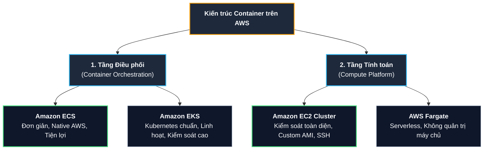
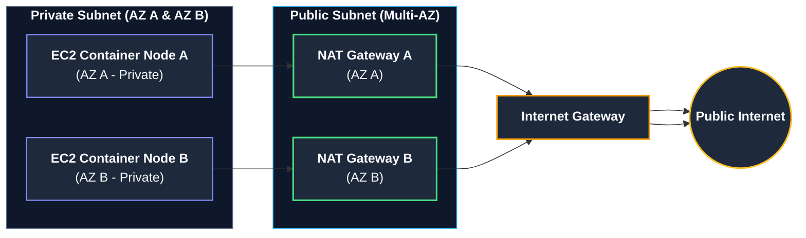

# Tóm tắt bài học: Chạy Container trên AWS (Running Containers on AWS)

**Khóa học:** Course 2 - Architecting Solutions on AWS  
**Chủ đề:** Lựa chọn dịch vụ điều phối Container (ECS vs EKS), nền tảng tính toán (EC2 vs Fargate) và thiết kế kết nối mạng an toàn (NAT Gateway)  
**Vị trí:** Module 3 - Designing a hybrid solution for container based workloads on AWS

---

## 1. Hai tầng quyết định kiến trúc Container trên AWS

Khi triển khai các khối lượng công việc Container quy mô lớn (hàng trăm đến hàng nghìn containers), kiến trúc sư cần đưa ra 2 quyết định cốt lõi:

---

## 2. Quyết định 1: Lựa chọn công cụ điều phối (Amazon ECS vs Amazon EKS)

### Thang đo: Tiện lợi (Convenience) vs Kiểm soát (Control)
* **Amazon EKS (Elastic Kubernetes Service):**
  * *Đặc điểm:* Cung cấp nền tảng Kubernetes được quản lý, chuẩn API mã nguồn mở, cộng đồng lớn mạnh và tính linh hoạt tối đa (*Control*).
  * *Hạn chế:* Đường cong học tập rất dốc (*steep learning curve*), phức tạp trong cấu hình và quản trị vận hành.
* **Amazon ECS (Elastic Container Service):**
  * *Đặc điểm:* Thiết kế tinh gọn, tối giản hóa việc vận hành (*Convenience*). ECS tiếp cận theo hướng định hình sẵn (*opinionated approach*), tích hợp tự nhiên sâu rộng với các dịch vụ AWS khác (IAM, Application Load Balancer, CloudWatch, VPC) mà không cần cấu hình phức tạp.
* **Lý do AnyCompany Insurance chọn Amazon ECS:**
  * Ứng dụng hiện tại không quá phức tạp nhưng số lượng container lớn.
  * Đội ngũ kỹ thuật từng cân nhắc Kubernetes nhưng bị quá tải bởi độ phức tạp (*overwhelmed by learning curve*).
  * Khách hàng ưu tiên giải pháp dễ vận hành, có khả năng mở rộng tốt và tích hợp sẵn với AWS.

---

## 3. Quyết định 2: Lựa chọn nền tảng tính toán (Amazon EC2 vs AWS Fargate)

### So sánh giữa EC2 Launch Type và AWS Fargate

| Tiêu chí | Amazon EC2 (Launch Type) | AWS Fargate (Serverless) |
| :--- | :--- | :--- |
| **Mức độ kiểm soát** | Kiểm soát toàn diện (*High Control*) | Trừu tượng hóa hoàn toàn (*High Convenience*) |
| **Quản lý hạ tầng** | Quản lý OS, vá lỗi (patching), cấu hình cluster | Không cần quản lý máy chủ |
| **Tùy biến Image (AMI)** | Hỗ trợ sử dụng Custom AMI riêng của doanh nghiệp | Sử dụng môi trường runtime chuẩn của AWS |
| **Quyền truy cập Host** | Hỗ trợ truy cập **SSH / SSM** trực tiếp vào máy chủ | Không cho phép SSH vào host bên dưới |
| **Chi phí** | Trả phí theo phiên bản EC2 chạy liên tục | Trả phí chính xác theo vCPU/Memory container sử dụng |

* **Lý do AnyCompany Insurance chọn Amazon EC2:**
  * Khách hàng muốn sử dụng **Custom Machine Image (AMI)** riêng của công ty để đảm bảo tiêu chuẩn bảo mật.
  * Cần duy trì khả năng truy cập **SSH** vào máy chủ để giám sát và xử lý sự cố hàng ngày theo quy trình quen thuộc từ môi trường VM on-premise.

---

## 4. Thiết kế Mạng & Kết nối Egress an toàn (NAT Gateway)

### A. Vấn đề của Private Subnet
* Các EC2 Container instances được đặt trong **Private Subnets** (100% Internal workloads, không nhận traffic Ingress từ Internet).
* Khi khởi động, các đoạn mã **User Data scripts** cần tải gói phần mềm/cập nhật từ Internet để cấu hình môi trường (*bootstrap instance*). Do nằm trong Private Subnet, các yêu cầu này sẽ bị chặn.

### B. Giải pháp: NAT (Network Address Translation)
Thiết bị NAT đặt trong **Public Subnet**, nhận request từ Private Subnet, thay mặt gửi ra Internet lấy dữ liệu rồi trả về, giúp máy chủ riêng tư truy cập Internet một chiều (Egress-only) mà **không làm lộ IP hay mở cổng nhận kết nối từ Internet (Ingress)**.

### C. So sánh NAT Instance vs NAT Gateway

* **NAT Instance (EC2 tự dựng):** Chi phí thấp hơn cho workload nhỏ nhưng hiệu năng bị thắt nút bởi kích thước EC2, không có sẵn cơ chế dự phòng (phải tự dựng Auto Scaling/failover).
* **NAT Gateway (Managed Service - Lựa chọn tối ưu):**
  * Quản lý hoàn toàn bởi AWS (*Fully managed*), tự động co giãn băng thông lên đến 100 Gbps.
  * Tích hợp sẵn cơ chế dự phòng bên trong Availability Zone.
* **Chiến lược Multi-AZ High Availability:** Triển khai **1 NAT Gateway độc lập cho mỗi Availability Zone** (tối thiểu 2 AZs) để đảm bảo khả năng chịu lỗi độc lập giữa các vùng (*AZ-independent fault tolerance*), loại bỏ mọi điểm nghẽn đơn lẻ (Single Point of Failure - SPOF).

---

## 5. Tổng hợp Kiến trúc Giải pháp hiện tại

| Thành phần | Dịch vụ AWS lựa chọn | Vai trò trong kiến trúc |
| :--- | :--- | :--- |
| **Kết nối Hybrid** | **AWS Direct Connect** | Đường truyền chuyên dụng, độ trễ thấp, kết nối Data Center với AWS. |
| **Điều phối Container** | **Amazon ECS** | Quản lý vòng đời, mở rộng và điều phối hàng nghìn containers. |
| **Tài nguyên Tính toán** | **Amazon EC2 (Multi-AZ)** | Chạy container workloads trong Private Subnet, hỗ trợ SSH và Custom AMI. |
| **Kết nối Egress Internet** | **NAT Gateway (Multi-AZ)** | Cho phép EC2 Private tải thư viện/User Data scripts an toàn ra ngoài Internet. |
