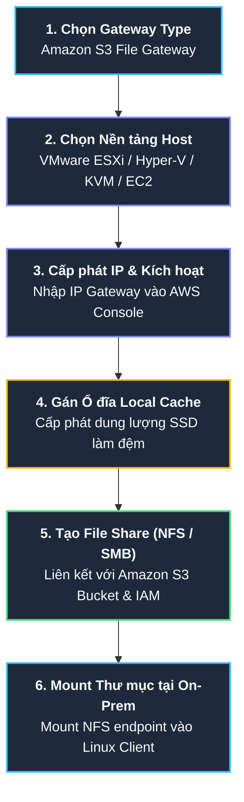

# Tóm tắt bài học: Thực hành Khám phá AWS Storage Gateway Console (Storage Gateway Exploration)

**Khóa học:** Course 2 - Architecting Solutions on AWS  
**Chủ đề:** Hướng dẫn từng bước thiết lập và cấu hình Amazon S3 File Gateway trên giao diện quản trị AWS  
**Vị trí:** Module 3 - Designing a hybrid solution for container based workloads on AWS

---

## 1. Quy trình Cấu hình AWS Storage Gateway trên AWS Console



---

## 2. Chi tiết các Bước Cấu hình Cốt lõi

### Bước 1: Lựa chọn Loại Gateway (Gateway Type)
* Truy cập vào dịch vụ **AWS Storage Gateway** trên Console và chọn **Create gateway**.
* Lựa chọn loại Gateway:
  * **Amazon S3 File Gateway (Được chọn):** Hỗ trợ chuẩn NFS và SMB, lưu trữ trực tiếp dưới dạng objects trên Amazon S3.
  * **Amazon FSx File Gateway:** Dành cho việc truy cập tệp trên Amazon FSx for Windows File Server.
  * **Volume Gateway / Tape Gateway:** Dành cho lưu trữ dạng khối iSCSI hoặc lưu trữ băng từ ảo VTL.

### Bước 2: Lựa chọn Nền tảng Máy chủ Ảo hóa (Host Platform)
Khách hàng có thể tải image máy chủ ảo (virtual appliance) về cài đặt tại trung tâm dữ liệu On-Premises:
* **VMware ESXi:** Dành cho hạ tầng VMware vSphere.
* **Microsoft Hyper-V:** Dành cho môi trường Windows Server Hyper-V.
* **Linux KVM:** Dành cho môi trường mã nguồn mở KVM.
* **Amazon EC2:** Dùng khi muốn chạy Gateway thử nghiệm ngay trên đám mây.
* **Hardware Appliance:** Thiết bị phần cứng chuyên dụng do AWS cung cấp đặt tại data center.

### Bước 3: Kích hoạt & Kết nối Gateway (Gateway Activation)
* Sau khi bật máy ảo Gateway trên On-Premises, Gateway sẽ nhận một địa chỉ IP nội bộ trong mạng LAN.
* Nhập địa chỉ **IP của Gateway** vào AWS Console để AWS kích hoạt và liên kết Gateway với tài khoản AWS thông qua kết nối an toàn.

### Bước 4: Cấu hình Vùng đệm Cục bộ (Local Cache Storage)
* Gán ít nhất một ổ đĩa cục bộ (ví dụ: ổ SSD tại on-premise) cho máy ảo Gateway để làm **Cache Storage** và **Upload Buffer**.
* **Vai trò của Local Cache:** Lưu trữ tạm thời các file được truy cập thường xuyên gần đây nhất để phục vụ đọc/ghi tức thì với độ trễ thấp (LAN speed).

### Bước 5: Tạo File Share (NFS File Share)
* Chọn **Create file share** và cấu hình:
  1. **Amazon S3 bucket name:** Nhập tên bucket S3 trên AWS sẽ chứa dữ liệu.
  2. **Giao thức chia sẻ (Access protocol):** Chọn **NFS (Network File System)** cho hệ thống Linux của AnyCompany.
  3. **IAM Role:** Cấp quyền cho Storage Gateway ghi/đọc dữ liệu trên S3 bucket.
  4. **Cấu hình Cache Refresh & Lifecycle:** Thiết lập thời gian tự động đồng bộ thay đổi giữa S3 và Gateway.

### Bước 6: Mount thư mục chia sẻ tại Máy trạm On-Premises
Sau khi File Share được tạo thành công, AWS Console cung cấp câu lệnh mount chuẩn Linux:
```bash
# Ví dụ lệnh mount NFS share từ Linux server on-premise
sudo mount -t nfs -o nolock,hard <Gateway-IP-Address>:/<s3-bucket-name> /mnt/hybrid-data
```

---

## 3. Cơ chế Hoạt động Đọc / Ghi Thực tế (Read/Write Data Flow)

```mermaid
flowchart LR
    subgraph OnPrem["<b>Môi trường On-Premises</b>"]
        App["<b>Linux App Servers</b>"]
        Cache[("<b>Local SSD Cache</b><br/>(File Gateway)")]
    end

    subgraph AWSCloud["<b>Môi trường AWS Cloud</b>"]
        S3Bucket[("<b>Amazon S3 Bucket</b><br/>(Lưu trữ lâu dài)")]
    end

    App -->|"1. Ghi tệp (Tốc độ LAN)"| Cache
    Cache ==="2. Đồng bộ ngầm bất đồng bộ (Upload Buffer)"===> S3Bucket
    App -.->|"3. Đọc dữ liệu (Cache Hit: Phản hồi ngay)"| Cache
    S3Bucket -.->|"4. Tải về nếu Cache Miss"| Cache

    style OnPrem fill:#0f172a,stroke:#64748b,stroke-width:1px,color:#f8fafc;
    style AWSCloud fill:#0f172a,stroke:#22c55e,stroke-width:1px,color:#f8fafc;
    style App fill:#1e293b,stroke:#94a3b8,stroke-width:2px,color:#f8fafc;
    style Cache fill:#1e293b,stroke:#f59e0b,stroke-width:2px,color:#f8fafc;
    style S3Bucket fill:#1e293b,stroke:#22c55e,stroke-width:2px,color:#f8fafc;
```

---

## 4. Tổng kết Giá trị Kỹ thuật

* **Minh bạch với Ứng dụng (Application Transparency):** Các ứng dụng On-Premises coi thư mục mount như một ổ cứng mạng nội bộ thông thường, không hề biết phía sau là lưu trữ đám mây Amazon S3.
* **Độ trễ thấp:** Tác vụ ghi hoàn thành ngay khi dữ liệu ghi xong vào Local Cache của Gateway.
* **Khả năng phục hồi & Mở rộng:** Dữ liệu tự động đẩy lên S3 với độ bền 99.999999999% (11 số 9), sẵn sàng cho các container phân tích trên AWS khai thác.
