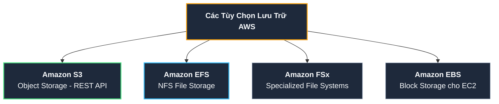
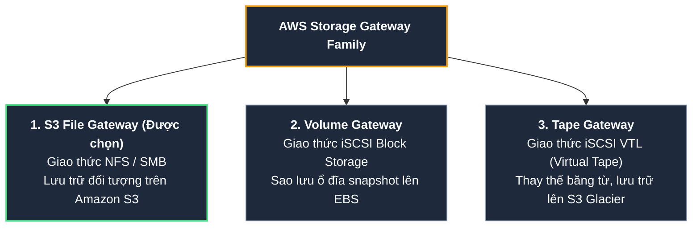

# Tóm tắt bài học: Lựa chọn Dịch vụ Lưu trữ Dữ liệu Hybrid (Where Should Our Customer Store Their Data?)

**Khóa học:** Course 2 - Architecting Solutions on AWS  
**Chủ đề:** So sánh các dịch vụ lưu trữ AWS (S3, EFS, FSx, EBS) và giải pháp chia sẻ dữ liệu Hybrid độ trễ thấp với AWS Storage Gateway (S3 File Gateway)  
**Vị trí:** Module 3 - Designing a hybrid solution for container based workloads on AWS

---

## 1. Bài toán Lưu trữ của Khách hàng (AnyCompany Insurance)

* **Bối cảnh:** Ứng dụng On-Premises liên tục tạo ra các file dữ liệu. Các ứng dụng xử lý dữ liệu và Machine Learning chạy trong Container trên AWS cần đọc các file này.
* **Các ràng buộc kỹ thuật cốt lõi:**
  1. **Không sửa mã nguồn:** Ứng dụng On-Premises đang dùng chuẩn hệ thống tệp Linux (**giao thức NFS**), không muốn refactor lại code để gọi REST API.
  2. **Độ trễ ghi cục bộ cực thấp:** Yêu cầu các tác vụ ghi file tại On-Premises phải diễn ra với tốc độ mạng LAN, không bị nghẽn do chờ truyền tải qua đường mạng đường dài.
  3. **Tối ưu hóa vòng đời dữ liệu (Lifecycle Management):** Dữ liệu cần truy cập nhiều trong 1 tuần đầu, ít dần sau 1 năm $\rightarrow$ Cần tự động chuyển tầng lưu trữ tiết kiệm chi phí (*Tiering*).
  4. **Định hướng tương lai:** Sẵn sàng cho lộ trình chuyển đổi 100% sang Cloud-native Object Storage mà không cần migrate dữ liệu lần thứ hai.

---

## 2. Đánh giá & So sánh các Dịch vụ Lưu trữ AWS



| Dịch vụ | Loại lưu trữ | Giao thức | Ưu điểm | Hạn chế đối với bài toán này |
| :--- | :--- | :--- | :--- | :--- |
| **Amazon S3** | Object Storage | REST API (HTTP/S) | Dung lượng vô hạn, chi phí cực thấp, hỗ trợ Lifecycle Rules mạnh mẽ. | Không hỗ trợ giao thức NFS trực tiếp (cần ứng dụng gọi API). |
| **Amazon EFS** | File Storage | NFSv4 | Quản lý toàn phần, hỗ trợ nhiều client mount cùng lúc, có Lifecycle. | Ghi file từ On-Premises qua Direct Connect có thể chịu độ trễ mạng (*network latency*). |
| **Amazon FSx** | File Storage | SMB, Lustre, ZFS | Chuyên dụng cho Windows Server, Lustre HPC, NetApp ONTAP. | Dư thừa và không đúng với hệ thống Linux NFS chuẩn của khách hàng. |
| **Amazon EBS** | Block Storage | Block Level | Ổ đĩa ảo gắn vào EC2, IOPS cao cho DB. | Không thể mount chia sẻ đồng thời giữa On-Premises và AWS. |

---

## 3. Giải pháp Đột phá: AWS Storage Gateway (Amazon S3 File Gateway)

Để kết hợp sự tiện lợi của **giao thức NFS tại On-Premises** với sức mạnh **lưu trữ vô hạn, chi phí thấp của Amazon S3**, giải pháp tối ưu là triển khai **AWS Storage Gateway (S3 File Gateway)**.

### Sơ đồ Kiến trúc Lưu trữ Hybrid:

```mermaid
flowchart LR
    subgraph OnPrem["<b>Trung tâm Dữ liệu On-Premises</b>"]
        App_OnPrem["<b>Ứng dụng On-Premises</b>"]
        GW_Local["<b>AWS Storage Gateway</b><br/>(File Gateway Appliance)<br/><i>Local Cache (NFS)</i>"]
    end

    subgraph AWSCloud["<b>Môi trường AWS Cloud</b>"]
        S3_Bucket[("<b>Amazon S3 Bucket</b><br/><i>(Tập trung dữ liệu)</i>")]
        ECS_App["<b>Ứng dụng Containers</b><br/>(Analytics / ML trên ECS)"]
        S3_Life["<b>S3 Lifecycle Policies</b><br/>(Standard -> IA -> Glacier)"]
    end

    App_OnPrem -->|"1. Ghi / Đọc file (NFS)<br/>Độ trễ cực thấp (LAN)"| GW_Local
    GW_Local ==="2. Đồng bộ Bất đồng bộ (Async)<br/>qua Direct Connect"===> S3_Bucket
    S3_Bucket -->|"3. Đọc dữ liệu phân tích"| ECS_App
    S3_Bucket -.-> S3_Life

    style OnPrem fill:#0f172a,stroke:#64748b,stroke-width:1px,color:#f8fafc;
    style AWSCloud fill:#0f172a,stroke:#22c55e,stroke-width:1px,color:#f8fafc;
    style App_OnPrem fill:#1e293b,stroke:#94a3b8,stroke-width:2px,color:#f8fafc;
    style GW_Local fill:#1e293b,stroke:#f59e0b,stroke-width:2px,color:#f8fafc;
    style S3_Bucket fill:#1e293b,stroke:#22c55e,stroke-width:2px,color:#f8fafc;
    style ECS_App fill:#1e293b,stroke:#38bdf8,stroke-width:2px,color:#f8fafc;
    style S3_Life fill:#1e293b,stroke:#818cf8,stroke-width:2px,color:#f8fafc;
```

---

## 4. Các Dòng Sản phẩm của AWS Storage Gateway



1. **Amazon S3 File Gateway (Giải pháp được chọn):**
   * Cung cấp giao diện mount chuẩn **NFS** hoặc **SMB** cho các máy chủ on-premises.
   * Dữ liệu được ghi vào bộ nhớ đệm cục bộ (**Local Cache**) với tốc độ cao, sau đó được ngầm đồng bộ bất đồng bộ (*asynchronous transfer*) lên Amazon S3 dưới dạng các object chuẩn.
2. **Volume Gateway (iSCSI):** Cung cấp các ổ đĩa block ảo cho máy chủ on-premise, tự động snapshot về EBS trên Cloud.
3. **Tape Gateway (Virtual Tape Library - VTL):** Thay thế hệ thống băng từ truyền thống, lưu trữ và lưu trữ dài hạn trên Amazon S3 Glacier.

---

## 5. Lợi ích Toàn diện của Giải pháp S3 File Gateway cho Khách hàng

1. **Hiệu năng cao với Độ trễ thấp:** Thiết bị File Gateway đặt trực tiếp tại Data Center đóng vai trò Local Cache, giúp ứng dụng ghi nhận phản hồi ghi file tức thì theo tốc độ mạng LAN.
2. **Không sửa đổi mã nguồn:** Toàn bộ ứng dụng On-Premises tiếp tục mount thư mục NFS như hệ thống tệp tin thông thường.
3. **Tự động tối ưu hóa chi phí (S3 Lifecycle):**
   * Sau 1 tuần $\rightarrow$ Chuyển sang **S3 Standard-IA (Infrequent Access)**.
   * Sau 1 năm $\rightarrow$ Tự động chuyển sang **S3 Glacier Flexible / Deep Archive** hoặc tự động xóa.
4. **Chuẩn bị sẵn sàng cho Tương lai (Future-Proof):**
   * Dữ liệu lưu trong S3 là định dạng đối tượng gốc (native objects). Khi khách hàng hiện đại hóa ứng dụng sang Cloud-Native, ứng dụng có thể trực tiếp gọi S3 API mà **không cần thực hiện migration dữ liệu lần 2**.

---

## 6. Cập nhật Sơ đồ Khối Kiến trúc Toàn diện

| Vị trí | Khối thành phần | Dịch vụ AWS | Vai trò kiến trúc |
| :--- | :--- | :--- | :--- |
| **On-Premises** | **Bộ đệm tệp cục bộ** | **AWS Storage Gateway (File Gateway)** | Cung cấp NFS Share, đệm cục bộ, giảm độ trễ ghi cho app on-prem. |
| **Hybrid Network** | **Đường truyền mạng** | **AWS Direct Connect** | Truyền tải dữ liệu đồng bộ giữa File Gateway và AWS S3. |
| **AWS Cloud** | **Kho Lưu trữ Đối tượng** | **Amazon S3** | Lưu trữ tập trung dữ liệu, áp dụng S3 Lifecycle Policies tiết kiệm chi phí. |
| **AWS Cloud** | **Ứng dụng Xử lý** | **Amazon ECS on EC2** | Đọc dữ liệu từ S3 để chạy các tác vụ Analytics và Machine Learning. |
| **AWS Cloud** | **Cơ sở Dữ liệu** | **Amazon RDS PostgreSQL (Multi-AZ)** | Lưu trữ dữ liệu giao dịch nghiệp vụ chính. |
