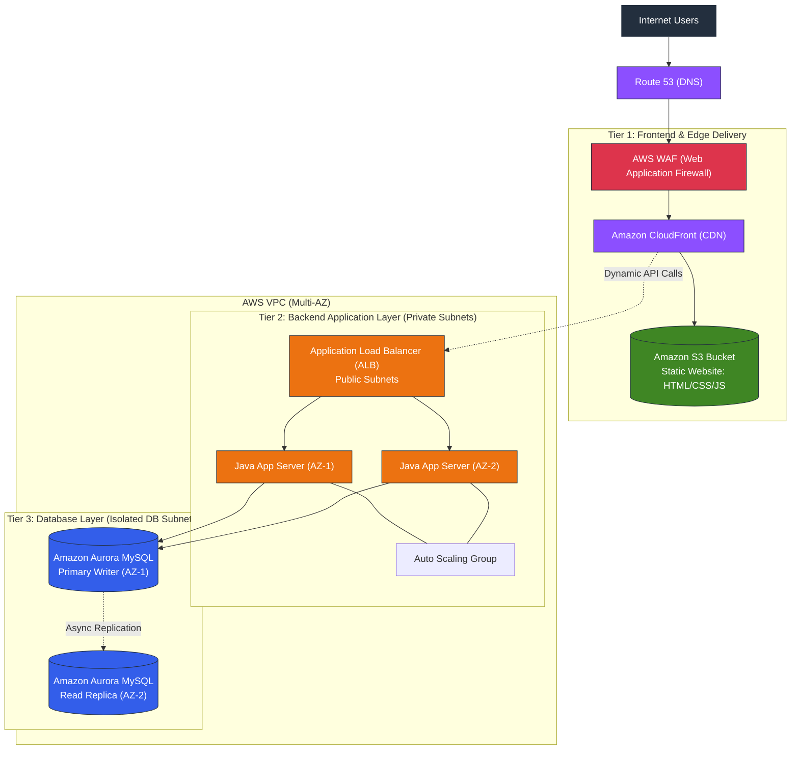
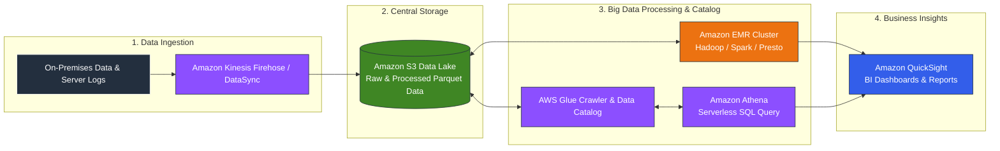

# Capstone Project Architecture Design: On-Premises Migration to AWS

> **Course:** AWS Cloud Solutions Architect Professional Certificate  
> **Course 2:** Architecting Solutions on AWS  
> **Graded Assignment:** Capstone Project — Architecture Design & Justification  

---

## 1. Phân tích yêu cầu bài toán (Scenario & Requirements Analysis)

### 1.1. Hiện trạng On-Premises
Khách hàng hiện đang vận hành 2 khối lượng công việc (workloads) độc lập trong trung tâm dữ liệu vật lý (Data Center):
1. **Workload 1: Ứng dụng Web 3 lớp (Three-Tier Web Application):**
   * **Frontend:** HTML, CSS, JavaScript (website động tiếp nhận traffic từ Internet).
   * **Backend:** Apache Web Server và ứng dụng Java.
   * **Database:** Cơ sở dữ liệu quan hệ MySQL.
2. **Workload 2: Nền tảng Phân tích Dữ liệu lớn (Big Data Analytics Workload):**
   * Nền tảng phân tích chạy cụm **Apache Hadoop**.
   * Lưu trữ và xử lý khối lượng dữ liệu khổng lồ tại chỗ (on-premises storage).
   * Kết nối với công cụ trực quan hoá (visualization tools) để trích xuất thông tin chi tiết (insights).

### 1.2. Nỗi đau & Mục tiêu chuyển đổi lên AWS
* **Single Point of Failure (SPOF):** Cả hai hệ thống đều phụ thuộc vào máy chủ vật lý on-premises. Nếu xảy ra mất điện hoặc sự cố mạng tại data center, toàn bộ hệ thống sẽ sập hoàn toàn (*offline*).
* **Mục tiêu:**
  * Di chuyển toàn bộ lên AWS đám mây nhằm đạt tính sẵn sàng cao (**High Availability - HA**), khả năng chịu lỗi (**Fault Tolerance**), và mở rộng linh hoạt (**Scalability**).
  * Tách rời (*decouple*) hoàn toàn các tầng: Frontend $\leftrightarrow$ Backend $\leftrightarrow$ Database.
  * Tận dụng tối đa các **dịch vụ quản trị của AWS (Managed Services)**.
  * Khối phân tích: Khởi chạy cụm **Amazon EMR** (thay thế Hadoop on-premises) và tự chủ thiết kế các khâu **Ingestion (Thu nạp)**, **Storage (Lưu trữ)**, và **Visualization (Trực quan hóa)**.

---

## 2. Thiết kế kiến trúc tổng thể trên AWS (Target Architecture)

Toàn bộ hệ thống được triển khai bên trong một **VPC (Virtual Private Cloud)** với mô hình đa vùng sẵn sàng (**Multi-AZ**) và phân chia Subnet công khai/riêng tư rõ ràng:

### 2.1. Sơ đồ Kiến trúc Workload 1: Ứng dụng Web 3 Tầng (Decoupled 3-Tier Web App)

### 2.2. Sơ đồ Kiến trúc Workload 2: Khối Phân tích Dữ liệu lớn (Big Data Analytics Pipeline)

### 2.3. Luồng dữ liệu (Data & Traffic Flow Breakdown)

1. **Giao diện người dùng (Frontend Flow):**  
   `Client` $\rightarrow$ `Route 53` $\rightarrow$ `AWS WAF` $\rightarrow$ `CloudFront` $\rightarrow$ nạp Single Page Application (HTML/CSS/JS) từ `S3 Static Website Bucket`.
2. **Xử lý nghiệp vụ & Dữ liệu (Backend & Database Flow):**  
   Các request API động từ giao diện sẽ qua `CloudFront` $\rightarrow$ `ALB (Public Subnet)` $\rightarrow$ phân phối vào các máy chủ `Java Backend trong Auto Scaling Group (Private Subnet)` $\rightarrow$ đọc/ghi dữ liệu vào cụm `Amazon Aurora MySQL Multi-AZ`.
3. **Thu nạp & Phân tích dữ liệu lớn (Analytics Flow):**  
   Dữ liệu thô và nhật ký từ On-Premises/Logs $\rightarrow$ `Kinesis Firehose` $\rightarrow$ lưu trữ tập trung tại `S3 Data Lake` $\rightarrow$ cụm `Amazon EMR` chạy Spark/Hadoop xử lý tính toán chuyên sâu $\rightarrow$ `AWS Glue & Athena` phục vụ truy vấn ad-hoc $\rightarrow$ hiển thị biểu đồ phân tích trên `Amazon QuickSight`.

---

## 3. Lựa chọn dịch vụ & Lý do thiết kế (Service Selection & Architectural Rationale)

### 3.1. Workload 1: Ứng dụng Web 3 tầng (Three-Tier Decoupled Architecture)

#### Tầng 1: Frontend Layer (Presentation)
* **Dịch vụ lựa chọn:** **Amazon S3 (Static Website Hosting) + Amazon CloudFront + AWS WAF**.
* **Lý do kiến trúc:**
  * Tách biệt hoàn toàn mã nguồn giao diện (HTML/CSS/JS) khỏi máy chủ backend.
  * S3 cung cấp độ bền $99.999999999\%$ (11 số 9), chi phí cực thấp, không cần quản trị máy chủ web server cho static assets.
  * CloudFront đóng vai trò CDN cache nội dung tại các Edge Locations toàn cầu, giảm thiểu độ trễ cho người dùng cuối và giảm tải trực tiếp cho backend.
  * AWS WAF tích hợp trên CloudFront giúp chặn đứng các cuộc tấn công web phổ biến (SQL Injection, Cross-Site Scripting).

#### Tầng 2: Backend Layer (Application / Logic)
* **Dịch vụ lựa chọn:** **Application Load Balancer (ALB) + Amazon EC2 trong Auto Scaling Group (hoặc Amazon ECS/Fargate Containers)** nằm tại **Private Subnets Multi-AZ**.
* **Lý do kiến trúc:**
  * Đặt máy chủ xử lý Java trong Private Subnets, cô lập hoàn toàn khỏi truy cập trực tiếp từ Internet (bảo mật nghiêm ngặt).
  * ALB tự động phân phối tải đều giữa các máy chủ trên nhiều Availability Zones (AZs).
  * Auto Scaling Group tự động tăng/giảm số lượng instance theo nhu cầu thực tế (CPU, Request count), tối ưu chi phí và đảm bảo khả năng chịu lỗi nếu 1 AZ gặp sự cố.

#### Tầng 3: Database Layer (Data Persistence)
* **Dịch vụ lựa chọn:** **Amazon Aurora MySQL (Multi-AZ Deployment)**.
* **Lý do kiến trúc:**
  * Hoàn toàn tương thích với MySQL on-premises cũ, giảm thiểu rủi ro phải sửa mã nguồn ứng dụng (gần như zero-code refactoring cho database queries).
  * Hiệu năng cao gấp 5 lần so với MySQL tiêu chuẩn.
  * Tính năng **Multi-AZ Replication**: Tự động nhân bản dữ liệu qua 3 AZs (6 bản copy). Nếu Master gặp sự cố, Aurora tự động failover sang Read Replica trong vòng dưới 30 giây mà không làm gián đoạn hệ thống.
  * Tự động sao lưu liên tục lên S3 và hỗ trợ point-in-time recovery.

---

### 3.2. Workload 2: Khối phân tích dữ liệu lớn (Big Data Analytics Pipeline)

#### Khâu 1: Data Ingestion (Thu nạp dữ liệu)
* **Dịch vụ lựa chọn:** **Amazon Kinesis Data Firehose** (cho streaming logs/events) và **AWS DataSync / AWS DMS** (cho batch data từ on-premises lên S3).
* **Lý do:** Kinesis Firehose là serverless, tự động scale theo lưu lượng nạp dữ liệu và tự động nén, chuyển định dạng (Parquet/ORC) trước khi đổ vào S3.

#### Khâu 2: Data Storage (Lưu trữ trung tâm / Data Lake)
* **Dịch vụ lựa chọn:** **Amazon S3 (Data Lake Architecture)**.
* **Lý do:**
  * S3 tách rời hoàn toàn khả năng lưu trữ (Storage) khỏi năng lực tính toán (Compute) — khắc phục nhược điểm HDFS truyền thống của Hadoop (nơi storage và compute bị gắn chặt trên cùng máy chủ vật lý).
  * Phân tầng lưu trữ tự động bằng S3 Lifecycle Policies (S3 Standard $\rightarrow$ S3 Infrequent Access $\rightarrow$ S3 Glacier) giúp tối ưu hóa chi phí cho dữ liệu lịch sử khổng lồ.

#### Khâu 3: Data Processing (Xử lý dữ liệu)
* **Dịch vụ lựa chọn:** **Amazon EMR (Elastic MapReduce)**.
* **Lý do:**
  * Đáp ứng chính xác yêu cầu bài toán thay thế Apache Hadoop on-premises.
  * EMR hỗ trợ hệ sinh thái Hadoop, Apache Spark, Hive, Presto.
  * Tận dụng khả năng kết nối trực tiếp với S3 (thông qua **EMRFS**), cho phép bật cụm EMR lên xử lý khi có job và tắt cụm đi (transient clusters) hoặc dùng **EC2 Spot Instances** để tiết kiệm tới $70-90\%$ chi phí tính toán.

#### Khâu 4: Data Cataloging & Ad-hoc Analysis
* **Dịch vụ lựa chọn:** **AWS Glue Data Catalog** + **Amazon Athena**.
* **Lý do:** Glue Crawler tự động quét S3 để trích xuất schema vào Data Catalog; Athena cho phép các nhà phân tích dùng SQL chuẩn để truy vấn trực tiếp dữ liệu trên S3 mà không cần khởi động cụm EMR.

#### Khâu 5: Data Visualization (Trực quan hóa)
* **Dịch vụ lựa chọn:** **Amazon QuickSight**.
* **Lý do:**
  * Dịch vụ Business Intelligence (BI) hoàn toàn Serverless của AWS.
  * Tích hợp native với Athena, EMR (Presto) và Aurora MySQL.
  * Tích hợp công nghệ SPICE (Super-fast, Parallel, In-memory Calculation Engine) giúp tạo dashboards trực quan, báo cáo realtime với chi phí tính theo lượt dùng (pay-per-session).

---

## 4. Bảng tóm tắt đối chiếu On-Premises vs. AWS Target

| Thành phần hệ thống | On-Premises (Cũ) | AWS Cloud Solution (Mới) | Lợi ích đạt được |
| :--- | :--- | :--- | :--- |
| **DNS & Bảo vệ biên** | Router / Firewall vật lý | Amazon Route 53 + AWS WAF | Chống DDoS, tự động failover toàn cầu. |
| **Frontend Web** | Web server tĩnh chung với backend | Amazon S3 + Amazon CloudFront | Tách rời kiến trúc, tốc độ CDN cực nhanh. |
| **Backend App** | Apache + Java trên server vật lý | ALB + Multi-AZ EC2 Auto Scaling (Private) | Tự động co giãn theo tải, loại bỏ SPOF. |
| **Database** | MySQL Server đơn lẻ | Amazon Aurora MySQL (Multi-AZ) | Độ bền cao, tự động failover $< 30s$. |
| **Data Ingestion** | Batch scripts nội bộ | Amazon Kinesis Data Firehose | Serverless, thu nạp realtime không nghẽn. |
| **Big Data Storage** | Hadoop HDFS trên ổ cứng server | Amazon S3 Data Lake (EMRFS) | Tách rời Storage & Compute, độ bền 11 số 9. |
| **Big Data Processing** | Cụm Hadoop vật lý chạy $24/7$ | Amazon EMR (Spot Instances / Transient) | Tiết kiệm 80% chi phí, co giãn theo nhu cầu. |
| **BI & Analytics** | Công cụ trực quan hóa on-prem | Amazon QuickSight + Amazon Athena | Serverless, truy vấn SQL trực tiếp, báo cáo linh hoạt. |
