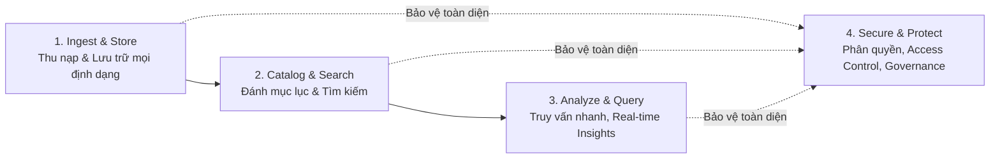

# Why Data Lakes? (Tại sao cần Data Lake?)

**Khóa học:** Course 3 - Building Data Lakes on AWS  
**Module:** Module 1 - Introduction to Data Lakes  
**Chủ đề:** Why Data Lakes?

---

## 1. Khái niệm Data Lake (What is a Data Lake?)

* **Định nghĩa:** Là một kho lưu trữ tập trung (**Central Repository**) cho phép lưu trữ tất cả các loại dữ liệu ở mọi quy mô (**Any Scale**).
* **Đa dạng định dạng dữ liệu (Data Formats):** Lưu trữ cả dữ liệu có cấu trúc (**Structured**), bán cấu trúc (**Semi-structured**) và phi cấu trúc (**Unstructured**) như văn bản (Text), hình ảnh, âm thanh, video, log files...
* **Khả năng mở rộng vô hạn:** Quy mô mở rộng linh hoạt theo dung lượng dữ liệu phát sinh mà không bị giới hạn cứng.

---

## 2. Tại sao không chỉ dùng Database hoặc Data Warehouse truyền thống?

| Tiêu chí | Database / Data Warehouse truyền thống | Data Lake |
| :--- | :--- | :--- |
| **Loại dữ liệu** | Chủ yếu là dữ liệu có cấu trúc, schema định nghĩa trước (Schema-on-Write). | Chứa mọi loại dữ liệu (thô, chưa qua xử lý, Schema-on-Read). |
| **Quy trình truy vấn** | Tạo rào cản phụ thuộc: Phải tạo ticket nhờ Data Team xử lý, thời gian chờ đợi lâu. | **Dân chủ hóa dữ liệu (Data Democratization):** Người dùng tự truy vấn trực tiếp (Self-service). |
| **Tốc độ phản hồi nghiệp vụ** | Chậm hơn khi dữ liệu thay đổi hoặc mở rộng cấu trúc mới. | Trả lời câu hỏi nghiệp vụ trong vài ngày, vài giờ hoặc **thời gian thực (Real-time)**. |

---

## 3. Thách thức lớn: Nguy cơ biến thành Data Swamp (Đầm lầy dữ liệu)

> [!WARNING]
> Nếu dữ liệu đổ về với khối lượng lớn (Volume) và tốc độ cao (Velocity) từ nhiều nguồn khác nhau mà thiếu kiểm soát, Data Lake sẽ biến thành **Data Swamp** (Đầm lầy dữ liệu) – nơi dữ liệu bị thất lạc, không thể tìm kiếm và không còn đáng tin cậy.

### Yêu cầu sống còn để tránh Data Swamp:
1. **Cataloging & Metadata:** Cơ chế gắn nhãn, phân loại, lập chỉ mục và quản lý siêu dữ liệu tập trung.
2. **Access Control & Governance:** Phân quyền và bảo mật chặt chẽ (ví von như dựng hàng rào kiên cố quanh hồ nước để kiểm soát ai được phép truy cập/bơi trong hồ).

---

## 4. Bốn trụ cột cốt lõi của một Data Lake (Core Pillars)

1. **Ingest & Store:** Tiếp nhận và lưu trữ toàn bộ dữ liệu thô cho đến khi xác định mục đích sử dụng.
2. **Catalog & Search:** Định danh, gán metadata để người dùng dễ dàng tìm kiếm thông tin.
3. **Ask & Speedy Answers:** Cho phép phân tích, ra quyết định nghiệp vụ nhanh chóng và chính xác.
4. **Secure & Protect:** Thiết lập quyền hạn, bảo vệ an toàn dữ liệu và tuân thủ chính sách bảo mật.
