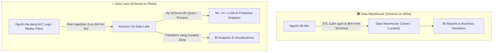

# Data Lake vs Data Warehouse: So sánh chi tiết

**Khóa học:** Course 3 - Building Data Lakes on AWS  
**Module:** Module 1 - Introduction to Data Lakes  
**Chủ đề:** Data Lake vs Data Warehouse

---

## 1. Bảng so sánh tổng quan (Core Differences)

| Tiêu chí | Data Warehouse (Kho dữ liệu) | Data Lake (Hồ dữ liệu) |
| :--- | :--- | :--- |
| **Bản chất lưu trữ** | Cơ sở dữ liệu quan hệ (**Relational Database**) quy mô lớn. | Bộ sưu tập lưu trữ phi quan hệ (**Non-relational**) trên Object Storage (S3). |
| **Loại dữ liệu** | Chỉ chứa dữ liệu có cấu trúc (**Structured Data**), tuân thủ định dạng nghiêm ngặt. | Chứa mọi loại dữ liệu: Có cấu trúc, bán cấu trúc, phi cấu trúc (IoT, Logs, Social, Media...). |
| **Cơ chế Schema** | **Schema-on-Write:** Thiết kế và ép khuôn cấu trúc (Schema) *trước khi nạp dữ liệu*. | **Schema-on-Read:** Lưu dữ liệu thô nguyên bản, chỉ áp cấu trúc *khi thực hiện truy vấn/phân tích*. |
| **Mô hình chi phí (Cost)** | Trả phí duy trì hệ thống online liên tục + chi phí storage hiệu năng cao (chi phí thường cao). | **Tách biệt Storage & Compute:** Lưu trữ S3 chi phí cực thấp, chỉ trả phí compute khi chạy truy vấn. |
| **Chất lượng dữ liệu** | Rất cao, sạch, đóng vai trò **Single Source of Truth** cho doanh nghiệp. | Dữ liệu thô đa dạng, cần cơ chế kiểm soát chất lượng chủ động để tránh ô nhiễm. |
| **Đối tượng sử dụng** | **Business Analysts (BA), BI Developers** | **Data Scientists, ML/AI Engineers, Data Engineers** (BA dùng phần curated data). |
| **Use Cases điển hình** | Báo cáo BI, Dashboard trực quan hóa, báo cáo tài chính, quản trị kinh doanh. | Machine Learning, LLMs/Chatbots, Phân tích dự báo (Predictive Analytics), Data Discovery. |

---

## 2. Kiến trúc & Cơ chế xử lý dữ liệu

---

## 3. Phân tích chuyên sâu từ góc độ Solutions Architect

### 🔹 Schema-on-Write vs Schema-on-Read
* **Schema-on-Write (Data Warehouse):** Tốn nhiều thời gian và công sức thiết kế mô hình dữ liệu ở giai đoạn đầu. Ưu điểm là dữ liệu đưa vào luôn đồng nhất, tốc độ truy vấn báo cáo nhanh và tin cậy.
* **Schema-on-Read (Data Lake):** Thu nạp dữ liệu cực nhanh với chi phí thấp mà không cần biết trước toàn bộ câu hỏi nghiệp vụ trong tương lai. Tính linh hoạt tối đa cho các thử nghiệm AI/ML.

### 🔹 Tối ưu hóa chi phí (Cost Optimization)
* Data Lake trên AWS tận dụng **Amazon S3** (với các tier S3 Standard, S3 Glacier...) kết hợp các dịch vụ tính toán Serverless như **Amazon Athena** hoặc **AWS Glue**, giúp chỉ phát sinh chi phí tính toán khi có truy vấn phát sinh thực tế.

### 🔹 Định vị kiến trúc (Architectural Positioning)
* Không có mô hình nào thay thế hoàn toàn mô hình nào. Trong kiến trúc hiện đại (Modern Data Architecture / Lakehouse), **Data Lake đóng vai trò là nền tảng lưu trữ trung tâm**, nạp toàn bộ dữ liệu thô, sau đó xử lý và chuyển các tập dữ liệu chuẩn hóa (Curated/Aggregated) sang **Data Warehouse** (như Amazon Redshift) để phục vụ báo cáo BI hiệu năng cao.
