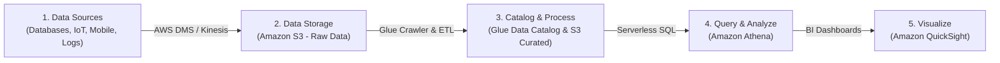
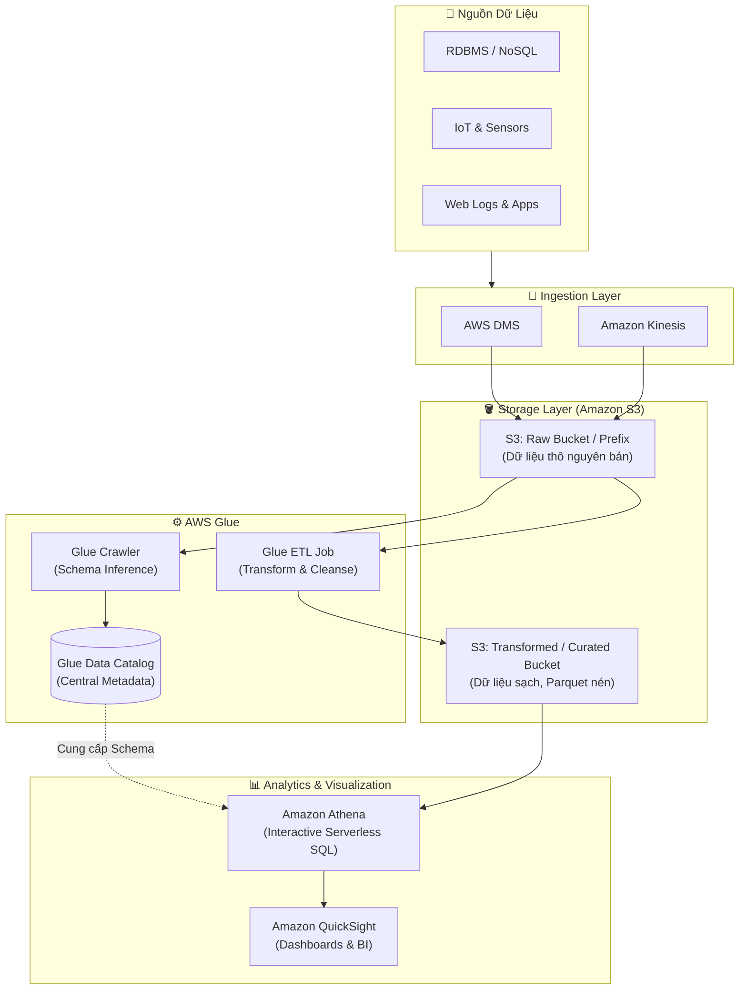

# Components and Architectures (Các thành phần và Kiến trúc Data Lake)

**Khóa học:** Course 3 - Building Data Lakes on AWS  
**Module:** Module 1 - Introduction to Data Lakes  
**Chủ đề:** Components and Architectures

---

## 1. Luồng dữ liệu tổng quan (End-to-End Data Pipeline)

Một Data Lake hoàn chỉnh trên AWS bao gồm 5 giai đoạn cốt lõi:

---

## 2. Chi tiết các thành phần và Dịch vụ AWS tương ứng

### 🔹 Giai đoạn 1: Thu nạp dữ liệu (Ingestion)
* **Nguồn phát sinh (Data Sources):** Database hiện hữu, thiết bị IoT, ứng dụng di động, máy chủ logs, social media...
* **Dịch vụ AWS Ingestion:**
  * **AWS DMS (Database Migration Service):** Di chuyển và đồng bộ dữ liệu theo lô (Batch) hoặc liên tục (CDC) từ cơ sở dữ liệu on-premise/cloud lên AWS.
  * **Amazon Kinesis:** Thu nạp và xử lý luồng dữ liệu thời gian thực (Real-time Streaming) từ IoT, clickstream, logs.

### 🔹 Giai đoạn 2: Lưu trữ (Storage)
* **Amazon S3 (Primary Storage):** Lựa chọn chuẩn cho Data Lake nhờ chi phí thấp, độ bền 99.999999999% (11 số 9), khả năng mở rộng vô hạn và hỗ trợ mọi định dạng (JSON, CSV, Parquet, Avro...).
* **Amazon Redshift:** Dành cho các tập dữ liệu có cấu trúc cần hiệu năng truy vấn phân tích DW chuyên sâu.

### 🔹 Giai đoạn 3: Đánh mục lục & Chuyển đổi (Cataloging & ETL)
* **Khái niệm Raw Data (Dữ liệu thô):** Dữ liệu nguyên bản từ nguồn, chưa qua chỉnh sửa hay lọc rửa.
* **AWS Glue Crawler:** Tự động quét qua các file trên S3, suy luận cấu trúc dữ liệu (**Schema Inference**) và tạo các bảng metadata.
* **AWS Glue Data Catalog:** Lưu trữ tập trung metadata, schema và phân vùng (partitions) phục vụ cơ chế **Schema-on-Read**.
* **AWS Glue ETL Jobs:** Thực hiện trích xuất, làm sạch, chuẩn hóa và chuyển đổi dữ liệu (ví dụ: chuyển CSV/JSON sang định dạng nén Parquet dạng cột).
* **Khái niệm Transformed Data (Dữ liệu đã qua xử lý):** Dữ liệu sạch, chuẩn hóa, được lưu trữ tại prefix/bucket S3 riêng biệt để sẵn sàng khai thác.

### 🔹 Giai đoạn 4: Truy vấn Serverless (Query & Analytics)
* **Amazon Athena:** Công cụ truy vấn SQL chuẩn tương tác trực tiếp trên dữ liệu S3 mà không cần khởi tạo hay quản lý hạ tầng (Serverless, tính phí dựa trên lượng dữ liệu được quét). Athena kết hợp chặt chẽ với AWS Glue Data Catalog.

### 🔹 Giai đoạn 5: Trực quan hóa & Báo cáo (Visualization)
* **Amazon QuickSight:** Dịch vụ BI trên đám mây kết nối trực tiếp với Athena/S3/Redshift để tạo dashboard, biểu đồ trực quan phục vụ ra quyết định kinh doanh.
* Hỗ trợ tích hợp công cụ bên thứ ba (Tableau, PowerBI...).

---

## 3. Kiến trúc cơ bản của Data Lake trên AWS (Basic Architecture)

---

## 4. Ghi nhớ cho Solutions Architect (Architectural Notes)

1. **Bắt đầu đơn giản (Keep it simple):** Một kiến trúc Data Lake chuẩn không nhất thiết phải quá phức tạp ban đầu. Mô hình `S3 Raw -> Glue Crawler/Catalog -> Glue ETL -> S3 Curated -> Athena -> QuickSight` là nền tảng chuẩn mực, dễ mở rộng và tối ưu chi phí.
2. **Phân tách Raw và Curated Zone:** Luôn phân chia rõ ràng giữa vùng dữ liệu thô (Raw) và vùng dữ liệu đã làm sạch (Curated/Processed) trong S3 bằng Bucket hoặc Prefix riêng biệt để quản lý vòng đời và phân quyền truy cập an toàn.
