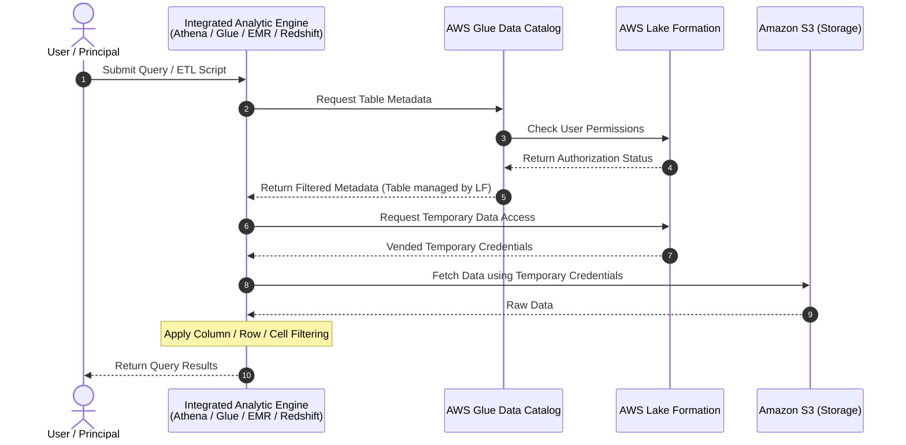

# Reading: AWS Lake Formation Basics

## 1. Tổng quan & Giá trị cốt lõi
- **AWS Lake Formation** giúp quản trị tập trung (centrally govern), bảo mật (secure) và chia sẻ dữ liệu toàn cầu (globally share data) phục vụ phân tích (analytics) và máy học (ML).
- Quản lý kiểm soát truy cập chi tiết (**fine-grained access control**) đối với:
  - Dữ liệu lưu trữ trên **Amazon S3**.
  - Metadata lưu trong **AWS Glue Data Catalog**.
- Xóa bỏ các rào cản dữ liệu rời rạc (**data silos**), tích hợp đa dạng dữ liệu có cấu trúc và phi cấu trúc từ S3, Relational DB, NoSQL DB vào kho tập trung.
- Hỗ trợ mô hình tự phục vụ an toàn (**secure self-service access**) thông qua các công cụ phân tích ưa thích của người dùng: Amazon Athena, QuickSight, Redshift Spectrum, EMR, AWS Glue.

---

## 2. Mô hình cấp quyền & Tính năng nổi bật
- **Bổ sung cho IAM (Augments IAM):** Lake Formation không thay thế hoàn toàn IAM mà hoạt động song song/bổ trợ. Mô hình cấp quyền tương tự RDBMS thông qua cơ chế GRANT / REVOKE đơn giản.
- **Granular Controls:** Kiểm soát chi tiết ở cấp độ **Column**, **Row**, và **Cell-level**.
- **Hybrid Access Mode (Chế độ truy cập kết hợp):**
  - Cho phép bảo mật và truy cập Catalog bằng cả **Lake Formation permissions** và **IAM policies** (trên S3/Glue).
  - Lợi ích: Quản trị viên có thể dịch chuyển và áp dụng Lake Formation từng bước (incrementally) theo từng use case mà không làm gián đoạn hệ thống cũ.
- **Cross-Account Data Sharing:**
  - Cho phép chia sẻ dữ liệu nội bộ và bên ngoài xuyên suốt nhiều AWS Accounts, AWS Organizations hoặc trực tiếp tới IAM Principals ở tài khoản khác với quyền hạn chi tiết.

---

## 3. Luồng hoạt động quản lý quyền (Permissions Management Workflow)
Quy trình từ lúc cấu hình đến khi thực thi truy vấn diễn ra qua các bước:

### Các bước chi tiết:
1. **Thiết lập trước (Prerequisites):** Data Lake Admin đăng ký đường dẫn S3 (
egister S3 location) và cấp quyền Lake Formation trên Database/Table cho user.
2. **Step 1 - Get metadata:** User gửi query từ công cụ phân tích (VD: Athena). Engine gửi yêu cầu lấy metadata tới Glue Data Catalog.
3. **Step 2 - Check permissions:** Data Catalog kiểm tra quyền của user với Lake Formation. Nếu hợp lệ, trả về metadata được phép xem.
4. **Step 3 - Get credentials (Credential Vending):**
   - Data Catalog báo cho Engine biết bảng có do Lake Formation quản lý hay không.
   - Nếu có, Engine gửi yêu cầu tới Lake Formation để xin cấp quyền truy cập tạm thời (**temporary credentials / temporary access**).
5. **Step 4 - Get data & Filtering:**
   - Dùng credentials tạm thời này, Engine đọc dữ liệu trực tiếp từ S3.
   - Engine áp dụng các bộ lọc phân quyền: lọc cột (**column filtering**), lọc dòng (**row filtering**) hoặc từng ô (**cell filtering**).
   - Trả kết quả cuối cùng về cho người dùng.

> **Trường hợp bảng không quản lý bởi Lake Formation:**
> Engine sẽ gọi trực tiếp sang Amazon S3, lúc này việc truy cập được đánh giá thuần túy qua **S3 Bucket Policy** và **IAM User Policy**.
