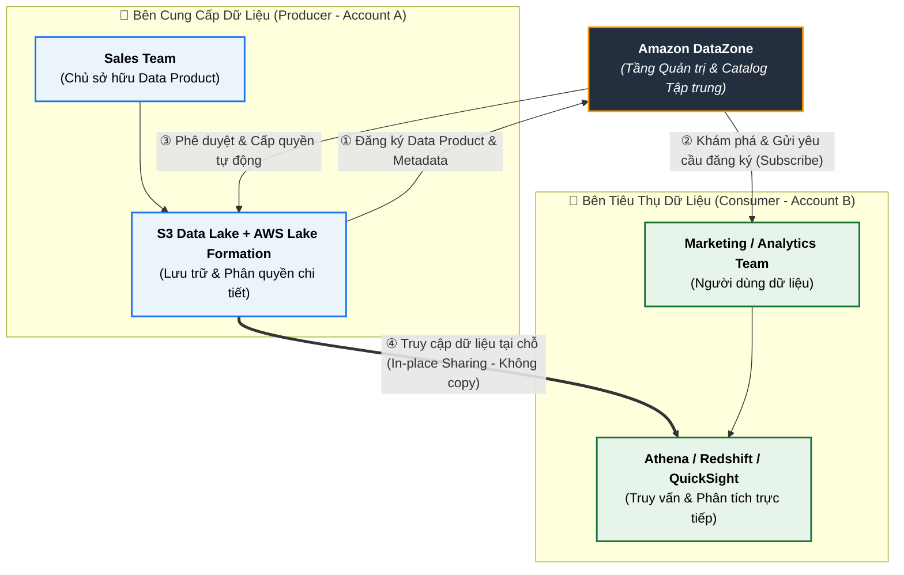

# Data Sharing Models & Data Mesh on AWS

**Khóa học:** Course 3 - Building Data Lakes on AWS  
**Module:** Module 6 - Modern data architecture on AWS  
**Chủ đề:** Data Sharing Models (Các mô hình chia sẻ dữ liệu & Data Mesh)

---

## 1. Nhu cầu Chia sẻ Dữ liệu Toàn diện (Data Sharing)

* **Thực trạng chia sẻ dữ liệu:**
  * **Trong nội bộ một phòng ban (Single Line of Business):** Dữ liệu được luân chuyển dễ dàng vì cùng mục tiêu, chung quy trình và ngữ cảnh nghiệp vụ.
  * **Xuyên suốt toàn bộ tổ chức (Cross-Team / Cross-Company):** Phá vỡ các "ốc đảo dữ liệu" (Data Silos) để tìm ra các góc nhìn phân tích tổng quan (*uncover holistic insights*) mà từng phòng ban riêng lẻ không thể thấy được.
* **Tư duy cốt lõi:** Chuyển đổi từ việc lưu trữ thụ động sang **Coi Dữ liệu là Sản phẩm (Data as a Product)**.

---

## 2. Mô hình "Data as a Product" (Dữ liệu như một sản phẩm)

Khi xem dữ liệu là một sản phẩm thương mại nội bộ, tổ chức cần xác định rõ các yếu tố:

1. **Tính sở hữu (Ownership & Accountability):**
   - Mỗi bộ phận kinh doanh/domain team trực tiếp làm chủ và chịu trách nhiệm toàn bộ vòng đời của sản phẩm dữ liệu: từ lúc thu thập, tạo mới, duy trì chất lượng đến khi ngưng sử dụng (*from creation to retirement*).
   - Đảm bảo dữ liệu luôn được cập nhật, làm sạch và cải tiến liên tục thay vì phó mặc cho một nhóm Data Engineering trung tâm.
2. **Cấu trúc phân phối:**
   - Bắt đầu từ một đơn vị kinh doanh chuẩn hóa các bộ dữ liệu thành "Data Product" phục vụ cho cả người tiêu dùng nội bộ (*internal consumers*) và bên ngoài (*external consumers*).
   - Mở rộng dần mô hình này sang toàn bộ các đơn vị kinh doanh khác trong doanh nghiệp.
3. **Quản trị & Tuân thủ (Governance & Compliance):**
   - Khi số lượng Data Product và các nhóm domain tăng lên, yêu cầu quản trị dữ liệu trở nên tối quan trọng.
   - Tập trung vào: Khả năng khám phá (*Discovery/Searchability*), Báo cáo & Kiểm toán (*Auditing*), và Đảm bảo chất lượng dữ liệu (*Data Quality*).

---

## 3. Kiến trúc Data Mesh (Lưới dữ liệu)

Khi việc quản trị phân tán và mô hình sản phẩm dữ liệu vận hành đồng bộ và trơn tru, doanh nghiệp đạt tới mô hình **Data Mesh**.

### 3 Trụ cột thiết kế của Data Mesh:
1. **Treating Data as a Product:** Xem dữ liệu là sản phẩm có SLA, tài liệu hướng dẫn, API truy cập và người sở hữu rõ ràng.
2. **Federated Data Governance:** Quản trị dữ liệu liên kết tập trung (đặt ra các chính sách chung, chuẩn bảo mật chung nhưng trao quyền quản lý cho từng domain).
3. **Self-serve / Common Data Access:** Cung cấp nền tảng hạ tầng tự phục vụ, giúp người tiêu dùng dễ dàng tìm kiếm và truy cập dữ liệu an toàn.

---

## 4. Hiện thực hóa Data Mesh với Amazon DataZone

Để triển khai mô hình Data Mesh và quản trị chia sẻ dữ liệu trên AWS, dịch vụ then chốt là **Amazon DataZone**.

* **Amazon DataZone là gì?**  
  Là dịch vụ quản lý dữ liệu (Data Management Service) cho phép lập danh mục (Catalog), khám phá (Discover), chia sẻ (Share) và quản trị (Govern) dữ liệu trải rộng trên AWS, On-premises và các nguồn bên thứ ba.
* **Khả năng tích hợp sâu:**
  - **AWS Lake Formation:** Quản lý quyền truy cập chi tiết (Fine-grained access control) xuyên tài khoản.
  - **Amazon Athena:** Truy vấn tương tác dữ liệu được chia sẻ.
  - **AWS Glue Data Catalog:** Quản lý siêu dữ liệu (Metadata).
  - **Amazon QuickSight:** Trực quan hóa và xây dựng Dashboard từ Data Products.
  - **Amazon Redshift:** Chia sẻ dữ liệu kho (Redshift Data Sharing).
* **Chiến lược Đa tài khoản & Đa vùng (Multi-Account & Multi-Region Strategy):**
  - Phân tách môi trường: Mỗi Domain/Line of Business sở hữu một tài khoản AWS độc lập (Multi-Account) với Data Lake riêng biệt để phân lập chi phí và ranh giới bảo mật.
  - **Data Federation:** Kết nối và chia sẻ siêu dữ liệu xuyên suốt các tài khoản AWS, các AWS Regions hoặc thậm chí môi trường Multi-Cloud một cách an toàn và nhất quán.
