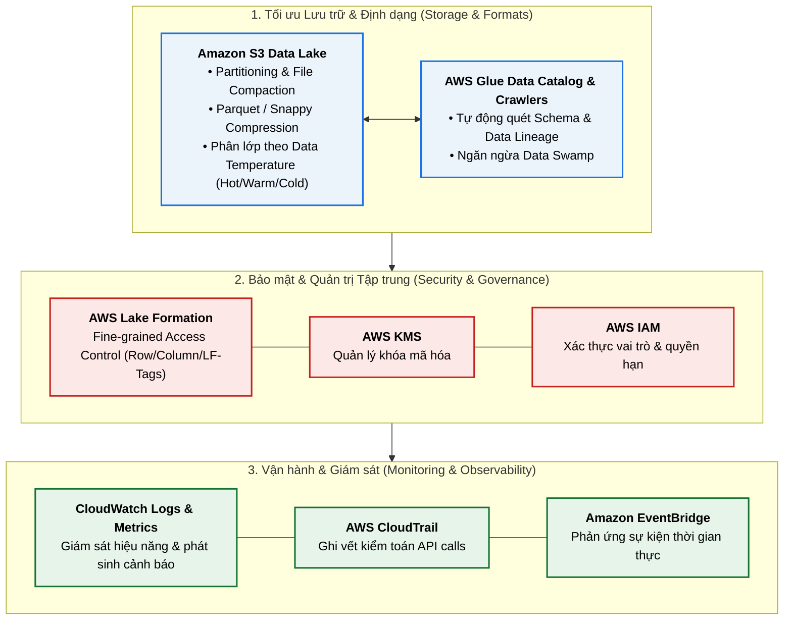

# Course Recap & Key Takeaways

**Khóa học:** Course 3 - Building Data Lakes on AWS  
**Module:** Module 6 - Modern data architecture on AWS  
**Chủ đề:** Course Recap & Best Practices từ AWS Well-Architected Framework (Data Analytics Lens)

---

## 1. AWS Well-Architected Framework (WAF) & Data Analytics Lens

* **AWS Well-Architected Framework (WAF):** Bộ nguyên tắc hướng dẫn và các thực tiễn tốt nhất (*best practices*) để thiết kế, vận hành hệ thống đám mây an toàn, hiệu năng cao và tối ưu chi phí trên AWS.
* **6 Trụ cột của WAF:**
  1. **Operational Excellence** (Vận hành xuất sắc)
  2. **Security** (Bảo mật)
  3. **Reliability** (Độ tin cậy)
  4. **Performance Efficiency** (Hiệu quả hiệu năng)
  5. **Cost Optimization** (Tối ưu hóa chi phí)
  6. **Sustainability** (Tính bền vững)
* **Well-Architected Data Analytics Lens:** Tài liệu chuyên biệt mở rộng từ WAF, tập trung cung cấp các khuyến nghị và kiến trúc chuẩn dành riêng cho các khối lượng công việc phân tích dữ liệu (*Data Analytics Workloads*).

---

## 2. Các Khuyến nghị Trọng tâm từ Data Analytics Lens

### 1. Trọng lực dữ liệu (Data Gravity & Data Location)
* **Khái niệm Data Gravity:** Dữ liệu có khối lượng lớn sẽ "hút" ứng dụng và dịch vụ về gần nó, bởi việc di chuyển ứng dụng (đặc biệt khi dùng Container/Docker) đơn giản và rẻ hơn nhiều so với việc luân chuyển terabytes/petabytes dữ liệu qua mạng.
* **Khuyến nghị:** Triển khai compute/application càng gần nơi dữ liệu lưu trữ càng tốt để giảm độ trễ mạng (*low latency*) và tối ưu hiệu năng.

### 2. Tổ chức lưu trữ & Tối ưu hiệu năng (Storage & Performance Optimization)
* **Data Partitioning trên Amazon S3:** Phân vùng dữ liệu thông minh (theo ngày/tháng/năm, khu vực) giúp giảm tối đa dung lượng quét đĩa.
* **File Sizing & File Compaction:** 
  * Quản lý kích thước file hợp lý; tránh vấn đề "hàng triệu file nhỏ" (*small file problem*).
  * Lên lịch định kỳ chạy **file compaction** để gộp các file nhỏ thành các file lớn tối ưu (128MB - 512MB).
* **Columnar Formats & Compression:** Chuyển đổi dữ liệu sang định dạng cột (**Apache Parquet, ORC**) kết hợp nén (**Snappy, GZIP, ZSTD**) giúp tiết kiệm chi phí lưu trữ S3 và tăng tốc độ truy vấn gấp nhiều lần.
* **Data Temperature & Storage Tiers:** Lựa chọn đúng phân lớp lưu trữ S3 (S3 Standard, S3 Standard-IA, S3 Glacier) dựa trên "nhiệt độ" của dữ liệu (Hot, Warm, Cold) để tối ưu chi phí dài hạn.

### 3. Ngăn ngừa Data Swamp & Quản trị dữ liệu (Governance)
* **AWS Glue Crawlers:** Tự động khám phá dữ liệu mới, suy luận lược đồ (schema inference), lập danh mục siêu dữ liệu (Data Catalog), theo dõi nguồn gốc dữ liệu (*data lineage*) để tránh biến Data Lake thành **Data Swamp** (vũng lầy dữ liệu vô thừa nhận).
* **Tập trung hóa dữ liệu (In-place Querying):** Giữ dữ liệu tập trung tại Data Lake và cho phép người tiêu dùng truy cập trực tiếp tại chỗ (*in-place*), hạn chế tối đa việc tạo các bản sao lưu trùng lặp (*avoid redundant data copying*).

### 4. Bảo mật toàn diện (Security & Access Control)
* **AWS Lake Formation:** Quản lý quyền truy cập tập trung, mịn đến từng bảng, hàng, cột (Fine-grained access control) bằng thẻ tag (**LF-Tags**).
* **AWS IAM:** Quản lý danh tính và phân quyền cấp dịch vụ/vai trò (*roles & policies*).
* **AWS KMS (Key Management Service):** Quản lý và xoay vòng khóa mã hóa dữ liệu khi nghỉ (Data at Rest) và trong khi truyền (Data in Transit).

### 5. Giám sát & Cảnh báo tự động (Monitoring & Observability)
* **Amazon CloudWatch Events / EventBridge:** Thu thập và phản ứng với các luồng sự kiện hệ thống theo thời gian thực.
* **Amazon CloudWatch Logs & Alarms:** Quản lý tập trung log hệ thống và thiết lập cảnh báo tự động khi có sự cố phát sinh.
* **AWS CloudTrail:** Ghi vết kiểm toán (Audit Logging) toàn bộ các lệnh gọi API truy cập dữ liệu trong Data Lake.

---

## 3. Sơ đồ Tổng quan Kiến trúc Data Analytics Lens

