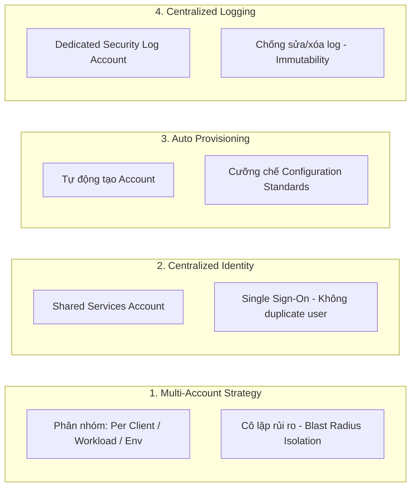

# Customer #4: Requirements Breakdown (Phân tích Chi tiết Yêu cầu Kiến trúc)

**Khóa học:** Course 4 - Exam Prep - AWS Certified Solutions Architect - Associate  
**Chủ đề:** Customer #4: Requirements Breakdown  
**Diễn giả:** Raf (Principal Cloud Technologist @ AWS)

---

## 1. Góc nhìn của Solutions Architect (The SA Mindset & Role)

* **Thực trạng tâm lý khách hàng:** Khách hàng không chuyên về Cloud (như Marketing Agency) thường phát triển hạ tầng một cách tự phát (bắt đầu từ 1 tài khoản đơn lẻ, dùng root user). Khi mở rộng, họ cảm thấy bất an, mất kiểm soát và *"không biết những gì mình chưa biết"* (*they don't know what they don't know*).
* **Trách nhiệm của SA / Consultant:** Khách hàng hiếm khi có sẵn yêu cầu kỹ thuật chuẩn xác. Vai trò cốt lõi của SA là lắng nghe nỗi đau (pain points), phát hiện các lỗ hổng kiến trúc và giúp khách hàng định hình bộ yêu cầu dựa trên **AWS Well-Architected Framework** và Best Practices.

---

## 2. Phân tích chi tiết 4 Trụ cột Yêu cầu (Detailed Requirements Breakdown)

### 1. Chiến lược Đa tài khoản (Multi-Account Strategy)
* Không có một mô hình cố định duy nhất ("No one best strategy").
* Các tiêu chí phân chia tài khoản phổ biến:
  - **Theo Môi trường:** Dev, QA, Staging, Prod.
  - **Theo Khách hàng (Per Client):** Phù hợp với mô hình Agency/Multi-tenant để minh bạch hóa chi phí và cô lập dữ liệu.
  - **Theo Khối lượng công việc (Per Workload):** Dành cho các ứng dụng có tính chất đặc thù hoặc yêu cầu compliance riêng biệt.

### 2. Quản trị Danh tính Tập trung (Centralized Identity & Shared Services)
* Thiết lập **Shared Services Account** làm cổng đăng nhập tập trung cho đội ngũ quản trị và kỹ sư.
* Sử dụng cơ chế **Single Sign-On (SSO)** để truy cập chéo sang các Workload Accounts.
* **Lợi ích:** Loại bỏ hoàn toàn việc tạo và quản lý IAM Users/Access Keys thủ công trên từng tài khoản con.

### 3. Tự động hóa Cấp phát & Rào chắn Tiêu chuẩn (Automatic Provisioning & Guardrails)
* Tự động hóa toàn bộ chu trình tạo tài khoản mới thay vì cấu hình tay.
* Tự động gắn các chuẩn cấu hình an ninh, chính sách mạng và phân bổ thẻ (Tagging) ngay khi tài khoản vừa được khởi tạo (baseline configuration).

### 4. Tập trung hóa Nhật ký Bảo mật (Centralized Logging & Immutability)
* Thiết lập tài khoản lưu trữ log chuyên biệt (Dedicated Logging Account).
* Áp dụng các chính sách bảo vệ nâng cao:
  - Ngăn chặn quyền xóa log (kể cả admin cấp account cũng không thể xóa log audit).
  - Đảm bảo tính bất biến (Immutability) phục vụ kiểm toán và điều tra sự cố bảo mật.
