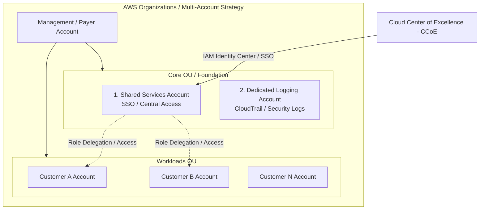

# Customer #4: Use Case and Requirements (Khảo sát Hiện trạng & Yêu cầu Kiến trúc)

**Khóa học:** Course 4 - Exam Prep - AWS Certified Solutions Architect - Associate  
**Chủ đề:** Customer #4: Use Case and Requirements  
**Nhân vật:** Raf (AWS Solutions Architect) & Morgan (Lead Tech / Khách hàng - Marketing Agency)

---

## 1. Hiện trạng & Vấn đề tồn đọng (Current Status & Pain Points)

Morgan đại diện cho một Marketing Agency chuyên xây dựng website cho nhiều khách hàng khác nhau (sử dụng đa dạng kiến trúc: EC2 + RDS, Serverless, Containers).

| Vấn đề | Chi tiết hiện trạng | Rủi ro & Tác động |
| :--- | :--- | :--- |
| **Kiến trúc tài khoản đơn (Single Account)** | Tất cả dự án và toàn bộ khách hàng chạy chung trong 1 AWS Account duy nhất (tên gọi "prod"). | **Blast Radius cực lớn**: Thao tác nhầm trên một dự án/stack có thể đánh sập dịch vụ của khách hàng khác. |
| **Bảo mật & Quản trị danh tính yếu kém** | • Morgan dùng **Root Account** (email cá nhân) để làm việc hàng ngày. • Developers được tạo IAM User trực tiếp trong account, bảo mật dựa trên cam kết cá nhân ("hứa cẩn thận"). | Vi phạm nghiêm trọng AWS Security Best Practices. Không thể kiểm soát quyền tối thiểu (Least Privilege). |
| **Quản lý chi phí & Tagging** | Gắn tag thủ công, không đầy đủ, không có cơ chế cưỡng chế (enforce). | Báo cáo chi phí (Billing Reports) cho từng khách hàng bị thiếu chính xác, khó phân bổ chi phí. |
| **Nút thắt quản trị (Operational Bottleneck)** | Morgan là người duy nhất nắm hạ tầng từ giai đoạn đầu, nay không thể quản lý xuể khi team mở rộng. | Quá tải vận hành, chậm tiến độ cấp phát tài nguyên cho developers mới. |

---

## 2. 5 Yêu cầu Kiến trúc Mục tiêu (5 Core Architecture Requirements)

Raf đã tổng hợp 5 yêu cầu chính để chuyển đổi từ mô hình "Single Account hỗn loạn" sang kiến trúc doanh nghiệp chuẩn AWS:

1. **Multi-Account Strategy & Automatic Provisioning:**
   - Phân tách môi trường và khách hàng thành các AWS Account độc lập để thu hẹp phạm vi ảnh hưởng (isolate blast radius).
   - Tự động hóa quá trình cấp phát tài khoản (sử dụng AWS Control Tower / Account Factory).
2. **Shared Services Account:**
   - Tạo tài khoản chuyên dụng chứa các dịch vụ dùng chung làm điểm kết nối ban đầu cho đội ngũ kỹ thuật.
3. **Centralized Identity & Single Sign-On (SSO):**
   - Triển khai **AWS IAM Identity Center (AWS Single Sign-On)** để xác thực tập trung, tránh việc tạo user trùng lặp trên từng account.
4. **Security Guardrails & Governance:**
   - Thiết lập rào chắn an ninh tự động qua **Service Control Policies (SCPs)** và **AWS Config Rules**.
   - Cưỡng chế quy chuẩn gắn Tag (Tag Policies) bắt buộc khi khởi tạo tài nguyên phục vụ Cost Allocation.
5. **Dedicated Log Archive Account:**
   - Tài khoản chuyên biệt lưu trữ tập trung logs bảo mật và audit trail (CloudTrail, VPC Flow Logs) nhằm đảm bảo tính toàn vẹn và tuân thủ.

---

## 3. Khái niệm bổ trợ (Key Concept)

* **Cloud Center of Excellence (CCoE):** Đội ngũ kỹ sư nòng cốt chịu trách nhiệm chuẩn hóa kiến trúc, thiết lập chính sách quản trị, bảo mật và hỗ trợ các nhóm dự án triển khai cloud an toàn.
