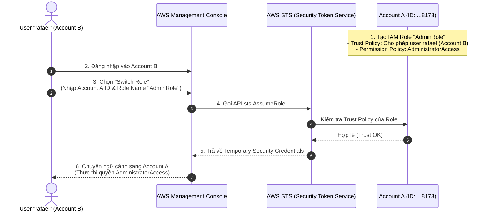

# IAM Roles: Cơ Chế Xác Thực Cốt Lõi Trên AWS (The Authentication Core Mechanism)

**Khóa học:** Course 4 - Exam Prep - AWS Certified Solutions Architect - Associate  
**Chủ đề:** IAM Roles - The AWS Authentication Core Mechanism  
**Diễn giả:** Raf (Principal Cloud Technologist @ AWS)

---

## 1. Khái niệm Căn bản về IAM Entities

AWS Identity and Access Management (IAM) quản lý quyền truy cập thông qua 3 thực thể chính:

| Thực thể IAM | Đặc điểm xác thực | Mục đích sử dụng |
| :--- | :--- | :--- |
| **IAM User** | Thông tin xác thực **vĩnh viễn** (*permanent credentials* - password, access keys). | Người dùng cá nhân thao tác đơn lẻ. |
| **IAM Group** | Tập hợp các IAM Users. | Gán quyền hàng loạt cho nhiều user cùng vai trò. |
| **IAM Role** | Cung cấp thông tin xác thực **tạm thời** (*temporary credentials*) qua API `AssumeRole`. | Cấp quyền cho Service (EC2, Lambda), Federated Users, hoặc **Cross-Account Access**. |

> [!IMPORTANT]
> Trong chiến lược **Multi-Account**, IAM Role là cốt lõi của **Centralized Credentialing** nhằm loại bỏ hoàn toàn việc phải tạo và nhân bản cùng một IAM User trên từng tài khoản con.

---

## 2. Cấu trúc 2 Thành phần Bắt buộc của một IAM Role

Mỗi IAM Role luôn bao gồm 2 chính sách (Policies) riêng biệt:
1. **Trust Policy (Trust Relationship):** Định nghĩa **AI** được phép đảm nhận (assume) role này (*"Who can assume this role?"* - Account ID, IAM User ARN, EC2, Lambda, Web Identity).
2. **Permissions Policy:** Định nghĩa role này **ĐƯỢC PHÉP LÀM GÌ** sau khi đã assume thành công (*"What can this role do?"* - Administrator, Read-Only, Custom permissions).

---

## 3. Luồng Hoạt động Cross-Account Assume Role (Demo Workflow)



### Các bước cấu hình chi tiết:

1. **Tại Target Account (Account A - `developer-account-a`, ID: `...8173`):**
   - Vào IAM Console $\rightarrow$ **Roles** $\rightarrow$ **Create role**.
   - Chọn Trusted entity type: **AWS account** $\rightarrow$ Nhập Account ID của Account B.
   - Gắn Permissions Policy: `AdministratorAccess` (hoặc ReadOnly nếu là Auditor).
   - Đặt tên Role: `AdminRole`.
   - Cập nhật **Trust Relationship** cụ thể cho user (thay vì toàn bộ root của Account B):
     ```json
     {
       "Version": "2012-10-17",
       "Statement": [
         {
           "Effect": "Allow",
           "Principal": {
             "AWS": "arn:aws:iam::<Account_B_ID>:user/rafael"
           },
           "Action": "sts:AssumeRole"
         }
       ]
     }
     ```

2. **Tại Identity Account (Account B):**
   - Đăng nhập bằng IAM User `rafael`.
   - Click menu tài khoản góc trên bên phải $\rightarrow$ Chọn **Switch Role**.
   - Điền thông tin:
     - **Account:** `<Account_A_ID>` (`...8173`)
     - **Role:** `AdminRole`
   - Nhấn **Switch Role** $\rightarrow$ AWS STS cấp phát temporary credentials và chuyển console sang Account A.

---

## 4. Giá trị cốt lõi trong Kiến trúc Doanh nghiệp

* **Zero Duplication:** Quản lý danh tính tập trung tại 1 tài khoản (Identity / Shared Services Account).
* **Least Privilege & Audit:** Giới hạn quyền chính xác theo từng vai trò (Admin, Developer, Auditor) thông qua từng role riêng biệt.
* **Tự động hóa (Automation Ready):** Các dịch vụ quản trị như AWS Organizations / AWS Control Tower tự động tạo sẵn các cross-account roles chuẩn hóa khi cấp phát tài khoản mới.
