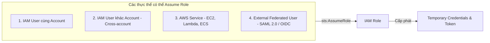

# IAM Roles, Trust Relationships, and Permissions (Phân tích Chuyên sâu IAM Roles)

**Khóa học:** Course 4 - Exam Prep - AWS Certified Solutions Architect - Associate  
**Chủ đề:** IAM Roles, Trust Relationships, and Permissions  
**Tài liệu tham khảo:** [IAM Roles Terms and Concepts (AWS Documentation)](https://docs.aws.amazon.com/IAM/latest/UserGuide/id_roles_terms-and-concepts.html)

---

## 1. Bản chất & Các Thực thể Sử dụng IAM Role

IAM Role là một danh tính AWS được cấp quyền hạn cụ thể và cung cấp **thông tin xác thực tạm thời (temporary security credentials)** thay vì thông tin cố định (như password hay access key).

---

## 2. Phân biệt Service Role vs. Service-Linked Role

| Tiêu chí | AWS Service Role | AWS Service-Linked Role |
| :--- | :--- | :--- |
| **Định nghĩa** | Role được người dùng tạo để cho phép một AWS Service thay mặt thực thi hành động trong account. | Loại service role đặc biệt được liên kết và định nghĩa sẵn trực tiếp bởi một dịch vụ AWS cụ thể. |
| **Quyền hạn (Permissions)** | Người dùng tự tùy chỉnh và chọn các chính sách cấp phép (Permissions Policies). | Quyền hạn được thiết lập cố định bởi chính dịch vụ đó (Predefined permissions). |
| **Quản trị vòng đời** | Tạo, sửa đổi và xóa thủ công trong IAM Console/CLI. | Được dịch vụ tự động tạo/xóa hoặc tạo thông qua trình hướng dẫn (wizard) của dịch vụ. |
| **Permissions Boundary** | Có thể áp dụng Permissions Boundary. | **KHÔNG** thể áp dụng Permissions Boundary. |

---

## 3. Cơ chế Ủy quyền Truy cập (Delegation) & Cross-Account Trust

Ủy quyền (**Delegation**) là việc cấp phép truy cập tài nguyên giữa hai tài khoản:
* **Trusting Account (Tài khoản tin cậy / Sở hữu tài nguyên):** Nơi tài nguyên tồn tại.
* **Trusted Account (Tài khoản được tin cậy / Chứa người dùng):** Nơi người dùng xuất phát.

```mermaid
sequenceDiagram
    autonumber
    participant User as IAM User (Trusted Account)
    participant TrustingAcc as Role (Trusting Account)
    participant Resource as Target Resource (S3, DB, ...)

    Note over TrustingAcc: 1. Trust Policy: Chỉ định Trusted Account/User<br/>2. Permissions Policy: Cấp quyền thao tác Resource
    Note over User: 3. User Identity Policy: Cho phép sts:AssumeRole
    User->>TrustingAcc: Gọi sts:AssumeRole
    TrustingAcc-->>User: Cấp Temporary Credentials (User tạm gác quyền cũ, nhận quyền của Role)
    User->>Resource: Thao tác tài nguyên theo quyền của Role
```

### ⚠️ Các quy tắc bất di bất dịch trong Delegation:
1. **Quy tắc 2 nửa quyền (Two-halves of permissions):**
   - **Nửa 1 (Trusting Account):** Gắn *Trust Policy* cho phép Trusted Account/User assume role.
   - **Nửa 2 (Trusted Account):** User ở Trusted Account phải có policy cho phép hành động `sts:AssumeRole` vào ARN của role bên Trusting Account.
2. **Quy tắc Wildcard:** Trong **Trust Policy**, bạn **TUYỆT ĐỐI KHÔNG ĐƯỢC** dùng ký tự đại diện `*` làm `Principal` (`"Principal": { "AWS": "*" }` là không hợp lệ cho trust an toàn).
3. **External ID:** Sử dụng tham số `External ID` trong Trust Policy khi cấp quyền cho bên thứ ba (khác tổ chức) để ngăn chặn lỗ hổng ủy quyền nhầm (**Confused Deputy Problem**).

---

## 4. Định danh Liên kết (Federation & Federated Users)

* **Federated Users:** Người dùng xác thực thông qua hệ thống danh tính bên ngoài thay vì tạo IAM User cục bộ trên AWS.
* **SAML 2.0 Federation:** Kết nối hệ thống định danh doanh nghiệp (Enterprise IdP) như Microsoft Active Directory (AD FS), Okta, Ping Identity.
* **OIDC / Web Identity Federation:** Kết nối các nhà cung cấp định danh OpenID Connect và mạng xã hội (Login with Amazon, Google, Facebook, Apple).
* Khi đăng nhập thành công qua IdP, người dùng được map vào một **IAM Role** và nhận temporary credentials để thao tác trên AWS.

---

## 5. Thuật ngữ Cốt lõi Cần Nhớ cho Bài thi SAA-C03

* **Principal:** Thực thể có thể thực hiện hành động trên AWS (Root user, IAM user, IAM role, AWS service).
* **Trust Policy:** Chính sách dạng tài nguyên (Resource-based policy) bằng JSON gắn trực tiếp vào Role, định nghĩa các `Principals` được tin tưởng để assume role.
* **Permissions Boundary:** Rào chắn an ninh nâng cao giới hạn **mức quyền tối đa (Maximum Available Permissions)** mà một identity-based policy có thể cấp cho User/Role (không áp dụng được cho Service-Linked Role).
