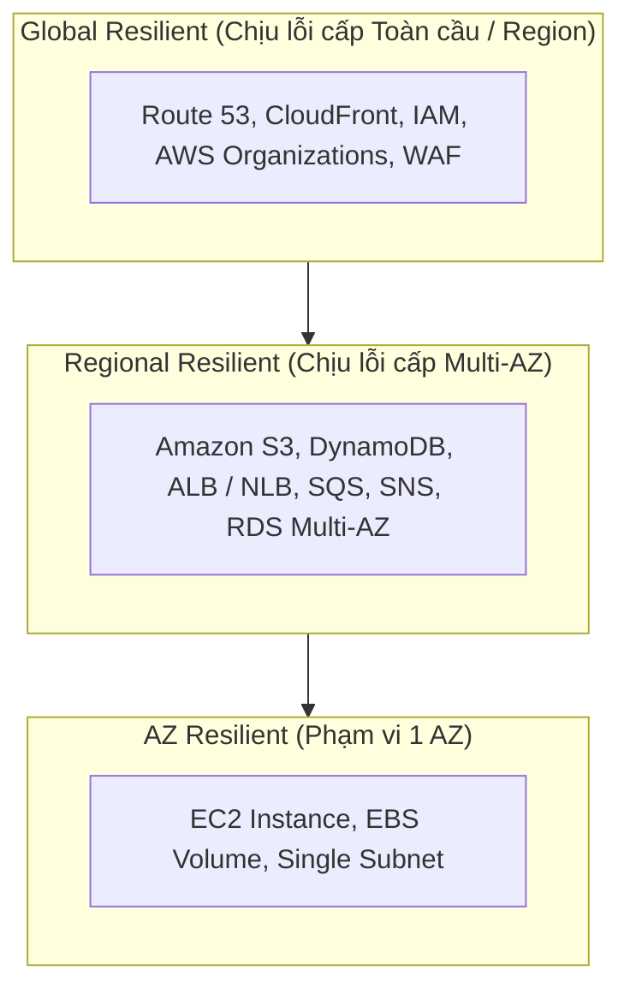

# Fundamentals - AWS Certified Solutions Architect - Associate

## 1. Triết lý Thiết kế Kiến trúc trên AWS
- **Nguyên lý cốt lõi:** *"Everything fails all the time"* (Mọi thứ đều có thể gặp sự cố bất cứ lúc nào).
- **Mục tiêu của Solutions Architect:** Không phải cố gắng ngăn ngừa 100% phần cứng/hạ tầng bị lỗi, mà là thiết kế hệ thống có khả năng **chịu lỗi (fault-tolerant)**, **tự phục hồi (self-healing)** và **hoạt động liên tục (resilient)** khi các thành phần bên dưới gặp sự cố.

---

## 2. Các Cấp độ Chống Chịu Sự Cố (Resilience Levels) trong AWS Global Infrastructure

| Cấp độ Resilience | Phạm vi dịch vụ | Cơ chế chịu lỗi & Best Practices |
| :--- | :--- | :--- |
| **AZ-Resilient** | EC2 Instance, EBS Volume | Gắn chặt với 1 Availability Zone cụ thể. Nếu AZ bị sự cố, tài nguyên sẽ bị ảnh hưởng.  -> *Cần dùng Auto Scaling Group qua nhiều AZs, snapshot EBS, hoặc Multi-AZ.* |
| **Regional Resilient** | Amazon S3, DynamoDB, ALB, SQS, SNS, RDS Multi-AZ | Dữ liệu/tài nguyên được tự động nhân bản qua tối thiểu 3 AZs trong cùng 1 Region. Sẵn sàng hoạt động bình thường ngay cả khi 1 AZ gặp sự cố hoàn toàn. |
| **Global Resilient** | Amazon Route 53, CloudFront, IAM, AWS Organizations | Phân tán trên toàn cầu (Edge Locations & Global Control Planes). Có khả năng chịu được thảm họa ở quy mô Region. |

---

## 3. Mô hình Trách nhiệm Chung (Shared Responsibility Model)

| Phân tầng | Trách nhiệm của AWS (*Security OF the Cloud*) | Trách nhiệm của Khách hàng (*Security IN the Cloud*) |
| :--- | :--- | :--- |
| **Hạ tầng vật lý & Mạng** | Data centers vật lý, nguồn điện, phần cứng máy chủ, hạ tầng mạng toàn cầu | Cấu hình tường lửa mạng (Security Groups, NACLs, Route Tables) |
| **Ảo hóa & Nền tảng** | Hypervisor, phần cứng lưu trữ, managed runtime (Lambda, RDS platform) | Cập nhật hệ điều hành (OS patching) trên EC2, cấu hình runtime môi trường |
| **Dữ liệu & Quyền truy cập** | Cung cấp công cụ mã hóa (KMS, CloudHSM) và cơ chế IAM | Quản lý dữ liệu người dùng, cấu hình quyền truy cập (IAM Policies), bật mã hóa at-rest & in-transit |

---

## 4. Hệ sinh thái AWS Well-Architected Framework

### 4.1. 6 Trụ cột Thiết kế (Pillars)
1. **Operational Excellence:** Vận hành, tự động hóa bằng code (IaC), giám sát và phản hồi sự cố.
2. **Security:** Least privilege, bảo mật nhiều lớp (defense-in-depth), bảo vệ dữ liệu.
3. **Reliability:** Phục hồi sau thảm họa (DR), kiến trúc loosely-coupled, Auto Scaling.
4. **Performance Efficiency:** Tối ưu serverless, caching đa tầng, lựa chọn compute/storage đúng mục đích.
5. **Cost Optimization:** Right-sizing, phân tầng lưu trữ, sử dụng Spot/Savings Plans.
6. **Sustainability (Trụ cột mới):** Tối ưu sử dụng năng lượng/tài nguyên phần cứng, ưu tiên Managed/Serverless services và chip ARM Graviton.

### 4.2. Bộ công cụ & Tài nguyên thực hành
- **AWS Well-Architected Documentation:** Bộ tài liệu đặc tả nguyên lý và câu hỏi kiến trúc chuẩn.
- **AWS Well-Architected Tool:** Công cụ tích hợp sẵn trên AWS Management Console để đánh giá và chấm điểm mức độ tuân thủ kiến trúc của workload.
- **AWS Well-Architected Labs:** Kho bài tập hands-on thực hành áp dụng các best practices vào môi trường thực tế.

---

## 5. Kiến thức IT & Cloud Nền tảng Cần Thiết (IT Fundamentals)

- **Networking:** Hiểu rõ dải IP (CIDR block), Subnetting, Định tuyến (Routing), Cổng mạng (NAT, IGW), Giao thức (TCP/IP, HTTP/HTTPS, SSL/TLS), DNS & DNSSEC.
- **Virtualization & Compute:** Hypervisor, Containers (Docker, Pods), Serverless compute execution models.
- **Storage:** Phân biệt rõ Block Storage (EBS), File Storage (EFS), Object Storage (S3), Ephemeral Storage (Instance Store).
- **Security & Encryption:** Symmetric vs Asymmetric Encryption, Envelope Encryption, Key Rotation, Identity Federation (SAML 2.0, OIDC).
- **Databases:** Relational (ACID, Multi-AZ vs Read Replicas), NoSQL (Key-Value, Document), In-Memory Caching (Redis, Memcached).